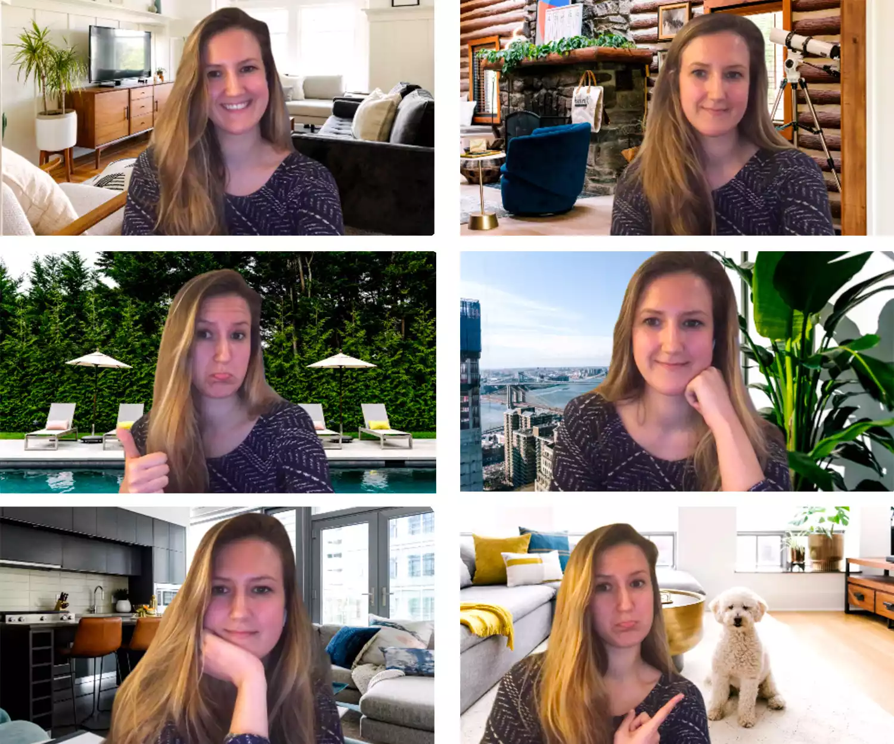
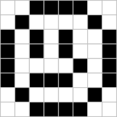
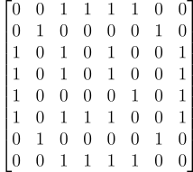
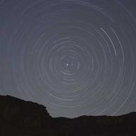
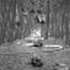
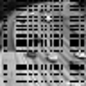
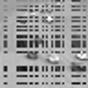
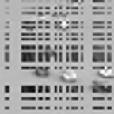

## Introduction

Given that you've survived through the Covid-19 pandemic, chances are that you've probably used video communication features of Skype, WhatsApp, Zoom, Google Meet, Microsoft Teams, etc. Specifically for Zoom and Google Meet, they provide a very interesting feature: you can change the background of your video to basically anything, from the beach of Hawaii to a waterfall inside a dense forest in Mount Fuji. And however you move, the background almost instantly matches your movement, making sure your video remains more or less consistent. Ever wondered how this is done? In this post, I am going to describe the math[^1] behind this and how it works in depth.

Here's an example zoom background filters that you can use, taken from a [post](https://people.com/home/the-best-zoom-backgrounds-for-every-type-of-video-call/) by Sophie Dodd.



To give you a bit of context, my PhD research work focuses on a field of robust matrix factorization which has a bit of application in the aforementioned problem. Recently, I went to IMS Asia Pacific Rim Meeting Conference 2024 in Melbourne, Australia, where I presented some of my work. So this post is just a similar presentation, but for a general audience, with a lot of introductory material.

## How to Represent a Video

Before solving the problem, let us first understand how we can represent a video using numbers (since, you know, maths only cares about numbers :unamused:, nothing else matters to it!). Well, a video is basically a series of images, each changing little by little, and shown to you in a very rapid speed. For example, in movies, the standard rate is 24FPS (24 frames or images are shown per second), while when you play some high definition games, you set your resolution to 60FPS (i.e., 60 images are bombarded to you in every second). Now, the information in these images come to your brain through your eyes and optical nerve, finally your brain combines them into a moving continuous video, even though the original video is a set of fine-grained series of images.

So a video is mathematically represented by $(I_1, I_2, \dots I_T)$, where each $I_t$ is an image (or frame). The video is $T$ time length long.




Let's now focus on an image. In digital image (i.e., images that you see on the computer), it is shown through a rectangular grid, you have a series of rows and columns (think of like a spreadsheet grid you see in Excel) and each cell has a number, denoting the intensity of light in it as a number between 0 and 1. The number $0$ means there is no light absorption, so cell looks like white since every light is reflected back. On the other end, $1$ implies there is absolute absorption, so no light comes back, and it looks black.

To see one example, consider a $8\times 8$ grid like chessboard, but all cells are coloured white. Now, you start colouring some cells to black, and then you would be able to generate some pictures with tons of block like artefacts. The following example from [logicalzero.com](http://logicalzero.com/gamby/reference/image_formats.html) shows such a smiley face just colouring a 8x8 grid. As mentioned before, this colouring procedure would also generate an arrangement of rows and columns (like a matrix).

<div class="p-4 grid grid-cols-1 md:grid-cols-2 gap-4">
    </img>
    </img>
</div>

A smiley was okay, but it was not very appealing. However, if we wish to create more complicated images, we need a bigger grid. For instance, when you look at a $720 \times 640$ pixels wide image, that means there are $720$ columns and $640$ rows in the matrix, that represent the image.

So combining all the discussion as above, we can represent a video like a 3-dimensional matrix. There are $h$ rows, $w$ columns and $T$ time-steps. Each slice of time represents an image or frame, with $h$ pixels tall and $w$ pixels wide. Note that, here we are considering grayscale videos of only for now, I shall explain about colour videos at the very end.

Let us now see how we can read a video using a python programme and store the information as a 3-dimensional array of numbers (these are usually called tensors in mathematics).

```python
import cv2    # this is the opencv library, you can install using pip install opencv-python
import numpy as np
# function that takes the name of the video file and read it into a numpy array and return back
def read_video_to_array(fname, grayscale = True):
  cap = cv2.VideoCapture(fname)
  frameCount = int(cap.get(cv2.CAP_PROP_FRAME_COUNT))
  frameWidth = int(cap.get(cv2.CAP_PROP_FRAME_WIDTH))
  frameHeight = int(cap.get(cv2.CAP_PROP_FRAME_HEIGHT))
  buf = np.empty((frameCount, frameHeight, frameWidth, 3), np.dtype('uint8'))
  fc = 0
  ret = True
  while (fc < frameCount  and ret):
      ret, buf[fc] = cap.read()
      fc += 1
  cap.release()  # release capturing of video
  print(f"Found {frameCount} many image frames in the video {fname}")

  if grayscale:
    return buf[:, :, :, 0].astype(np.float64) / 255   # make pixel values between 0 and 1
  else:
    return buf.astype(np.float64) / 255  # make pixel values between 0 and 1
```

In the above code, we use the `cv2` library in python to start a video capturing. Then we initiate a buffer in the memory to read the image. Every time a new frame in the video appears, that is converted into numpy array and stored into the buffer. OpenCV by default stores the pixel values as an 8-bit unsigned integer, but we divide it by 255 to make sure the values are represented as light intensities, between 0 and 1, as described above.

Here is a [demo video](https://github.com/andrewssobral/lrslibrary/blob/master/dataset/demo.avi) from `LRSLibrary` package[^2] of MATLAB. The video contains surveillance camera footage of a highway, each frame contains the road and the cars on it. We shall be using this for illustration purpose.



```python
vid = read_video_to_array('./data/demo.avi')
vid.shape
```

```cmd
Found 51 many image frames in the video ./data/demo.avi
(51, 48, 48)
```

Now we also need another function to view the image for a particular frame of the video.


```python
from IPython.display import display
from PIL import Image
# image display function
def display_image(arr, scale_factor = 1):
  # ensure that the image scales to 0 to 255, so do a linear transformation
  arr_min = arr.min()
  arr_max = arr.max()
  if arr_min < 0:
    arr2 = (arr - arr_min)/(arr_max - arr_min) * 255
  elif arr_max > 255:
    arr2 = arr/arr_max * 255
  else:
    arr2 = arr * 255
  im = Image.fromarray(np.ceil(arr2).astype(np.uint8))
  w, h = im.size
  display(im.resize((scale_factor * w,  scale_factor * h)))
```

Note that, since the given array can be arbitrary, its maximum and minimum value can be well beyond the permissible range of 0 to 1. For this case, we scale the values in the array by a linear transformation so that the new array `arr2` remains within the range $[0, 1]$. Finally, we use the `PIL` library to convert the numpy array to image, but before that convert it to the range $[0, 255]$ and round to the nearest integer above. This ensures that `PIL` library receives an array in 8-bit unsigned integer format so that it can be processed properly.

Here is the image of $41$-th frame of the video shown with a zoom factor of 3x.

```python
display_image(vid[40], scale_factor = 3)
```




## Background and Foreground Extraction

### The Transformation

Before performing the background substitution that we want to do, we need to extract the background and the foreground content first from the video frames. How do to that? :thinking: Let's take a step back and try to understand what is meant by the background or the foreground of a video. The background is usually the part of the video that remains constant over time, i.e., it does not change or changes very little from one frame to another. On the other hand, the foreground is the part of the video which is left out after background is taken out, things or objects in the video that are in constant motion.

Let us now try to transform the video tensor ($T \times h \times w$) into a mathematical object where the above interpretation can prove useful. Let's pick the very first frame of the video, which is an image of size $h \times w$, and we write all its $hw$ many pixel values in a single column. That means, if you have a $3 \times 3$ image of a cross 

$$
\begin{bmatrix}
  1 & 0 & 1\\\\
  0 & 1 & 0 \\\\
  1 & 0 & 1
\end{bmatrix},
$$

it is written as a $9$ length vector as $(1, 0, 1, 0, 1, 0, 1, 0, 1)$. For our demo video, $48\times 48$ size images get converted to $2304$ length vector. Now, we do the same for each frame of the video and stack these vectors in rows.



Call this big matrix $X = L + S$, where $L$ and $S$ are respectively the background and the foreground part. Okay, now this is the key idea: **Notice that, since the background does not change from one frame to another, the columns of $L$ matrix should be very close to each other, since the columns of $L$ are simply reorganization of background content of the video frames of different timepoints.** If you know a bit about linear algebra, this matrix $L$ should be of very low rank (rank 1 or 2). Therefore, to extract the background and the foreground content, it is enough to look at a rank factorization of the $X$ matrix and use that to recover $L$. We do the same using a technique called **Singular Value Decomposition (SVD)**[^3].

### Singular Value Decomposition (SVD)

What SVD does is that it takes in a matrix $X$ and decomposes it into three parts $X = UDV^t$, where $U$ and $V$ are unitary or orthogonal matrix, and $D$ is a diagonal matrix. The matrices $U$ and $V$ contains the left and right singular vectors and the diagonal entries of the matrix $D$ contains only the singular values, in a decreasing order. The first few singular values and corresponding vectors are the ones we are interested in, they recover the $L$ matrix. 

If you are not sure about what this is, do not worry, the key takeaway is as follows: If we perform this decomposition SVD and take first few columns from each of the three matrices, they can be used to recover the background content $L$. We will now see that in action.

```python
X = vid.reshape((vid.shape[0], -1)).T   # rowwise pixels, columnwise time,  do the transformation to get X matrix
U, s, Vt = np.linalg.svd(X, full_matrices = False)  # do the SVD
rank = 1
L = U[:, :rank].reshape(-1, rank) @ np.diag(s[:rank]).reshape(rank, rank) @ Vt[:rank, :].reshape(rank, -1)
S = X - L  # do the L + S decomposition
vidbg = L.T.reshape(vid.shape)   # now that we have L, we convert it back to 3d-array format for the background video is seen
vidfg = S.T.reshape(vid.shape)   # do the same for S, the foreground
```

Here's how the extracted background and foreground of $41$-th frame looks like.

```python
display_image(vidbg[40], scale_factor = 3)
display_image(vidfg[40], scale_factor = 3)
```

<div class="p-4 py-2 my-0 grid grid-cols-1 md:grid-cols-3 gap-4">
  <div class="mx-auto">
    </img>
    <p>True Frame</p>
  </div>
  <div class="mx-auto">
    </img>
    <p>Estimated Background</p>
  </div>
  <div class="mx-auto">
    </img>
    <p>Estimated Foreground</p>
  </div>
</div>

It's pretty cool :sunglasses:, isn't it?

### Adding back the background

Now, in order to perform background substitution like Zoom does, we can simply replace the background content $L$ by our choice of background image. Here are a few random images from [Lorem Picsum](https://picsum.photos/) website.

<div class="p-4 py-2 my-0 grid grid-cols-1 md:grid-cols-4 gap-2">
  <div class="mx-auto">
    </img>
  </div>
  <div class="mx-auto">
    </img>
  </div>
  <div class="mx-auto">
    </img>
  </div>
  <div class="mx-auto">
    </img>
  </div>
</div>

So we read the image, transform it into the matrix, and add it to the foreground $S$ to create the new video matrix $X'$.

```python
bg1 = cv2.imread(f'./data/{bgname}.jpg')   # choose here the background image file path
bg1 = cv2.resize(bg1, (0, 0), fx = 0.25, fy = 0.25)   # since the images are of size 192 x 192, we rescale it to 48x48
bg1 = (bg1.astype(np.float64) / 255).mean(axis = 2)
newbg = (L[:, 0].mean() + L[:, 0].std() * (bg1 - bg1.mean()) / bg1.std()).reshape(-1)
newvid = (S + newbg[:, np.newaxis]).T.reshape(vid.shape)
```
Notice that, only something special we are doing in line 4 of the above code. What it does is that it rescales the background image into the proper range of original background $L$ matrix. So, in that way, the light intensity of your foreground content $S$ closely matches with the new background $L$ matrix. To understand this, think of the following situation: Imagine the video you are doing right now does not have lots of lights, but the image you want to substitute is a sunny beach of Hawaii. Clearly, even if you change the background, it won't look right, because the amount of light and shadows are varying. This simply transformation, adjusts that.

Here's how it would look after the substitution with above 4 background.


<div class="p-4 my-0 py-2 grid grid-cols-1 md:grid-cols-3 gap-4">
  <div class="mx-auto">
    </img>
    <p>Original Video</p>
  </div>
  <div class="mx-auto">
    </img>
    <p>Estimated Foreground</p>
  </div>
  <div class="mx-auto">
    </img>
    <p>New Video with Background 1</p>
  </div>
</div>


<div class="p-4 my-0 py-2 grid grid-cols-1 md:grid-cols-3 gap-4">
  <div class="mx-auto">
    </img>
    <p>New Video with Background 2</p>
  </div>
  <div class="mx-auto">
    </img>
    <p>New Video with Background 3</p>
  </div>
  <div class="mx-auto">
    </img>
    <p>New Video with Background 4</p>
  </div>
</div>


### Problem with Camera Tampering

Now my PhD thesis concerns about the effect of camera tampering on this algorithm. Turns out that, even if **only a few frames** of the video is corrupted, this process ends up affecting all frames of the video, irrespective of the time when tampering occurred. For instance, I tamper some random pixels from frame 5 to frame 10 by setting them equal to 0 (i.e., pure black).

```python
vid2 = vid.copy()
tamper_size = 30
vid2[np.ix_(range(5, 10), np.random.choice(47, size = tamper_size), np.random.choice(47, size = tamper_size))] = 0
```
Here are some of the frames of the new video after tampering.

<div class="p-4 py-2 my-0 grid grid-cols-1 md:grid-cols-3 gap-4">
  <div class="mx-auto">
    </img>
    <p>1st Frame</p>
  </div>
  <div class="mx-auto">
    </img>
    <p>7th Frame</p>
  </div>
  <div class="mx-auto">
    </img>
    <p>15th Frame</p>
  </div>
</div>


We apply the same technique as before and take a look at the 15th frame, its estimated background and foreground.

<div class="p-4 py-2 my-0 grid grid-cols-1 md:grid-cols-3 gap-4">
  <div class="mx-auto">
    </img>
    <p>True Frame 15</p>
  </div>
  <div class="mx-auto">
    </img>
    <p>Estimated Background</p>
  </div>
  <div class="mx-auto">
    </img>
    <p>Estimated Foreground</p>
  </div>
</div>

Clearly, the estimated background and the estimated foreground has these artefacts or noises present in the image, whereas the original image frame was free from tampering. This is bad, since the noise in a single frame corrupts the entire video :worried: .

Turns out, one needs to use a robust version of SVD in this case, and this is what me and my supervisors (Prof. Ayanendranath Basu and Dr. Abhik Ghosh) developed together in this [paper](https://arxiv.org/abs/2109.10680) [^4]. This algorithm is now available as 

* `rsvddpd` package [^5] in CRAN R repository, GitHub link [here](https://github.com/subroy13/rsvddpd). 

* `decompy` package [^6] in PyPi repository as a python package, GitHub link [here](https://github.com/subroy13/decompy), with documentation link [here](https://subroy13.github.io/decompy/index.html).

Here we use the `decompy` library to perform our algorithm rSVDdpd as a robust SVD technique for background modelling. The `decompy` library also contains several other matrix factorization techniques (about 15 algorithms now, I am aiming for about 100 algorithms here, :sweat_smile:), you are welcome to try out the library, its functionalities and contribute in any way possible. Since the library is in a nascent stage, the documentation is not great, but a working documentation is hosted [here](https://subroy13.github.io/decompy/index.html) for you to check it out!

Now that I have done enough marketing, let's get going. 

```python
from decompy.matrix_factorization import RobustSVDDensityPowerDivergence
# do the transformation X matrix
X = vid2.reshape((vid2.shape[0], -1)).T   # rowwise pixels, columnwise time
rank = 1
ss = RobustSVDDensityPowerDivergence(alpha = 0.5).decompose(X, rank = rank)   # here we apply our robust svd algorithm
s2 = ss.singular_values(False)
U2, V2 = ss.singular_vectors('both')
L2 = U2[:, :rank].reshape(-1, rank) @ np.diag(s2[:rank]).reshape(rank, rank) @ V2.T[:rank, :].reshape(rank, -1)
S2 = X - L2  # do the L + S decomposition
vidbg2 = L2.T.reshape(vid2.shape)  # transform L2 and S2 back to video content
vidfg2 = S2.T.reshape(vid2.shape)
```

Here are the results :smirk: .

<div class="p-4 py-2 my-0 grid grid-cols-1 md:grid-cols-3 gap-4">
  <div class="mx-auto">
    </img>
    <p>True Frame 15</p>
  </div>
  <div class="mx-auto">
    </img>
    <p>Estimated Background</p>
  </div>
  <div class="mx-auto">
    </img>
    <p>Estimated Foreground</p>
  </div>
</div>

As you can see now the background and the foreground of the non-tampered true frame, i.e., 15th frame remain unaffected, which is what we wanted. However, the originally tampered frame will still remain tampered in its foreground, and can be used to detect changes in video surveillance.

<div class="p-4 py-2 my-0 grid grid-cols-1 md:grid-cols-3 gap-4">
  <div class="mx-auto">
    </img>
    <p>True Frame 7</p>
  </div>
  <div class="mx-auto">
    </img>
    <p>Estimated Background</p>
  </div>
  <div class="mx-auto">
    </img>
    <p>Estimated Foreground</p>
  </div>
</div>

## Conclusion

I mentioned before that I will talk about colour videos as well. Well, a colour video is represented much like a grayscale video, but instead of one 3d tensor, you have 3 different 3d tensors, one for each primary colour. Every colour video consists of three primary colour channels, Red, Green and Blue (RGB) and by matching their intensities and mixing these colours, you can create a colour video. You can read more about it [here](https://en.wikipedia.org/wiki/RGB_color_model) [^7]. 

So, once you have three 3d tensors for the colour video, one for each channel, you can pretty much apply the above algorithm to all 3 channels separately, and finally combine the results. Here's one sample of how it would look like:

<div class="p-4 py-2 my-0 grid grid-cols-1 md:grid-cols-2 gap-4">
  <div class="mx-auto">
    </img>
    <p>True Video 7</p>
  </div>
  <div class="mx-auto">
    </img>
    <p>Changed Background</p>
  </div>
</div>

This is done using classical SVD, so you can see some noisy artefacts coming up. If you use our algorithm `rsvdpd`, such noisy artefacts are much mitigated. For more details, you can check out our paper at [paper](https://arxiv.org/abs/2109.10680) [^4], which has more similar examples of background subtraction and background substitution.

And finally, if this looks kind of interesting to you, or you want to collaborate in writing the `decompy` python package, feel free to drop a comment or reach out to me.


## References 


[^1]: Background Subtraction Website - https://sites.google.com/site/backgroundsubtraction/Home

[^2]: Low rank and sparse tools for background modelling (LRS Library) in MATLAB - https://github.com/andrewssobral/lrslibrary

[^3]: Singular Value Decomposition (Wikipedia) - https://en.wikipedia.org/wiki/Singular_value_decomposition

[^4]: Roy, Subhrajyoty, Ayanendranath Basu, and Abhik Ghosh. "A New Robust Scalable Singular Value Decomposition Algorithm for Video Surveillance Background Modelling." arXiv preprint arXiv:2109.10680 (2021).

[^5]: rSVDdpd Package in R, CRAN Repository - https://cran.r-project.org/web/packages/rsvddpd/index.html

[^6]: `decompy` package for Python in PyPI repository - https://pypi.org/project/decompy/, Documentation Link: https://subroy13.github.io/decompy/index.html

[^7]: RGB Colour Model (Wikipedia) - https://en.wikipedia.org/wiki/RGB_color_model