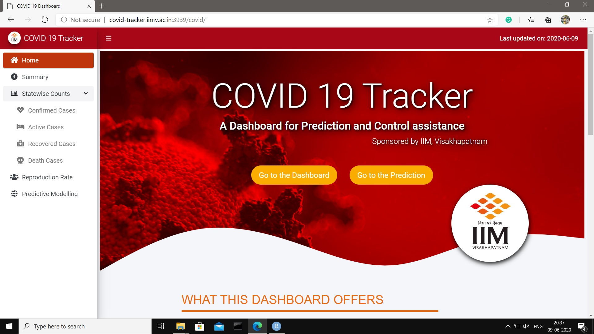
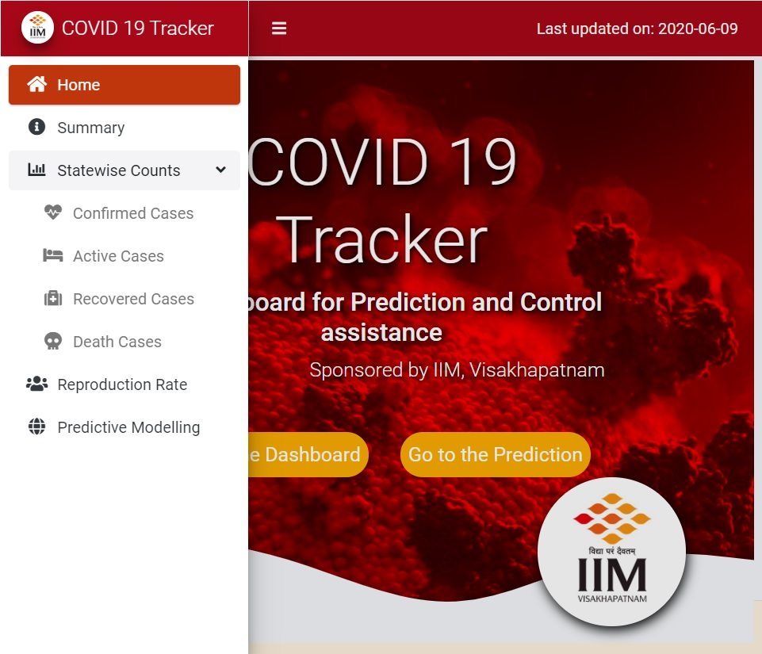
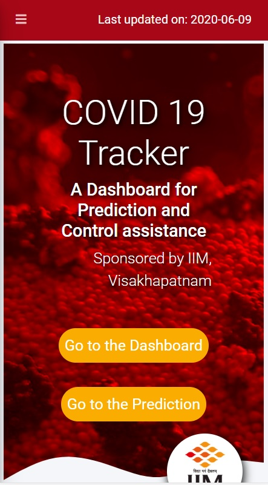

# Introduction

'COVID-19 Tracker' is a web application (dashboard) to visualize COVID-19 situations across different states and districts of India, and is primarily focused on developing prediction for the infected and recovered people under different hypothetical scenarios.

'COVID - 19 Tracker' primarily helps predicting the spread of COVID based on a modified extended e-SIR model. It analyzes districts and state levels and represents a prediction of COVID-19 spread for various scenarios with different possible dates of lockdown relaxation, followed by varying degrees of social distancing guidelines that may be adopted post-lockdown. It also proposes possible strategies to contain the COVID-19 spread in each district depending on fraction of the population that will be infected at the peak. That can help to manage the medical supply chain management.

The dashboard is availble [here](http://covid-tracker.iimv.ac.in:3939/covid/)

# Features

1. It is the second dashboard to talk about prediction of COVID-19 situation for India, after PRAKRITI (developed by IIT Delhi).

2. It delivers dynamically updating reproduction rate (the average number of secondary people infected by an infectious person before he/she either recovers or dies) at the district level.

3. It delivers a prediction at a district level which more closely resembles to the assumptions taken by epidemiological models due to similar demographical characteristics.

4. The estimate of the date when infection is at peak is also given. It also warns about a second wave of COVID cases if there is one.

# Demo

## Desktop View

## Tablet View

## Mobile View

## Demo Video

This video shows an introductory demonstration about how to use the web application (dashboard) and introduces its various components.



**Note:** This video does not contain any sound.

# Acknowledgements

1. I thank my mentors Prof. Anirban Ghatak, and Prof. Shivshanker Singh Patel, both of them are currently faculty at IIMV for their useful guidance.

2. I thank my friend Soham Bonnerjee, who was a constant technical support to make it happen.

3. I thank Indian Institute of Management, Vishakhapatnam for their monetary support and their technical support to set up the necessary server to host the application.

4. I thank Prof. Diganta Mukherjee of ISI, Kolkata to introduce me to these amazing mentors.

