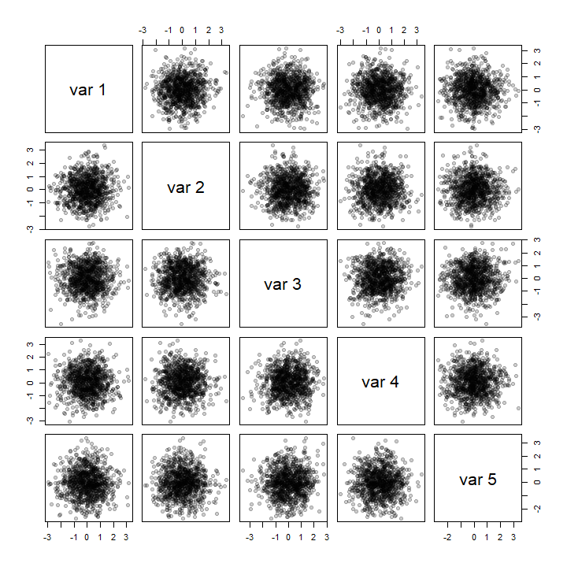
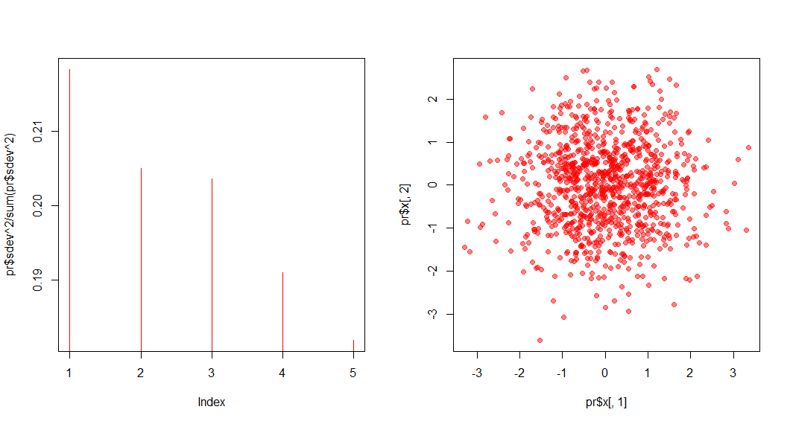
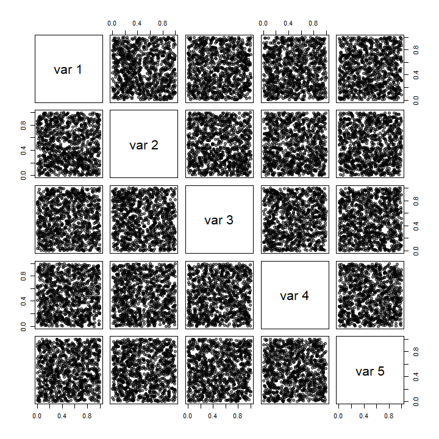
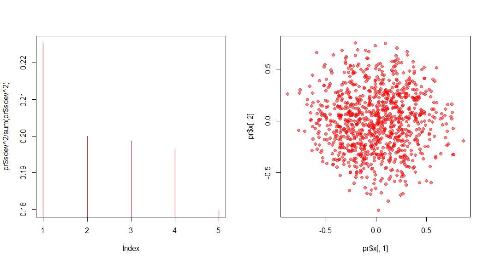

# Brief Description

Different unsupervised models for dimensionality reduction like PCA, LLE, Shannon’s mapping, tSNE, UMAP, etc. work on different principles, hence, they are difficult to compare on the same ground. Although they are usually good for visualisation purposes, they can produce spurious patterns that are not present in the original data, losing its trustability (or credibility). On the other hand, information about some response variable (or knowledge of class labels) allows us to do supervised dimensionality reduction such as SIR, SAVE, etc. which work to reduce the data dimension without hampering its ability to explain the particular response at hand. Therefore, the reduced dataset cannot be used to further analyze its relationship with some other kind of responses, i.e., it loses its generalizability.

To demonstrate this effect for classical PCA, I consider two situations.

1. In first simulation, 1000 datapoints are generated from $N(0, I_5)$. From the data, the first two principal component directions were estimated, and then the projection onto them is obtained. As shown in the following Figure, the algorithm outputs a 2-dimensional Gaussian data as best embedding of the original 5-dimensional data. This was expected, since the linear combination of Gaussian random variables should turn out to be Gaussian.

2. In the second simulation, 1000 datapoints are generated from the unit 5-dimensional hypercube, where each of the variables are i.i.d. uniform $(0, 1)$. Again, the first two principal components are extracted and plotted as follows. The output again looks similar to a Gaussian distribution.

Therefore, despite the original data being very different, the reduction outputted by PCA is similar, resulting in similar inference about the data. This is because, the usual analysis steps with high dimensional data first performs a dimensionality reduction with PCA (or some other techniques) and then analyzes the data of reduced dimensionality.

To make a better dimensionality reduction algorithm with a better balance between these two, we shall formally describe the mathematical model used by dimensionality reduction algorithms and provide two indices to measure these intuitive concepts such as trustability and generalizability. Then, we propose Localized Skeletonization and Dimensionality Reduction (LSDR) algorithm which approximately achieves optimality in both these indices to some extent. The proposed algorithm has been compared with the state of the art algorithms such as tSNE and UMAP and is found to be better overall in preserving global structure while retaining useful local information as well. We also propose some of the possible extensions of LSDR which could make this algorithm universally applicable for various types of data similar to tSNE and UMAP.

