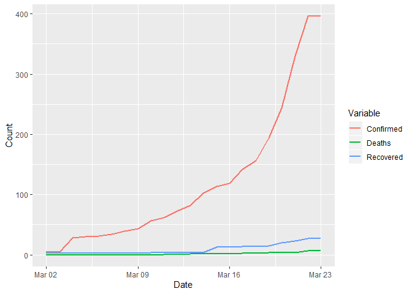
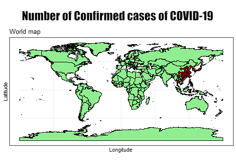
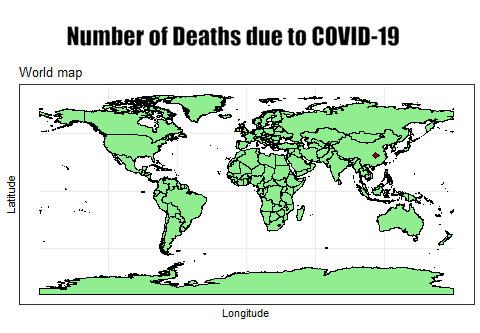
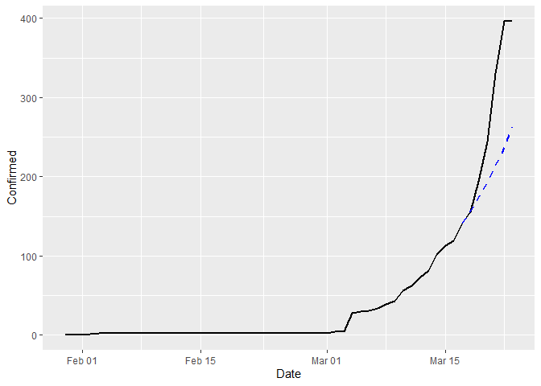
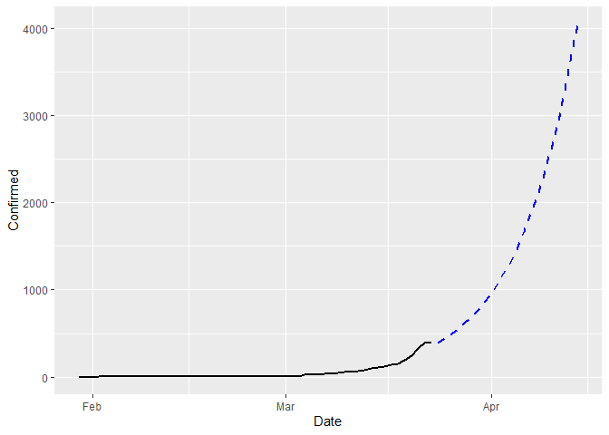
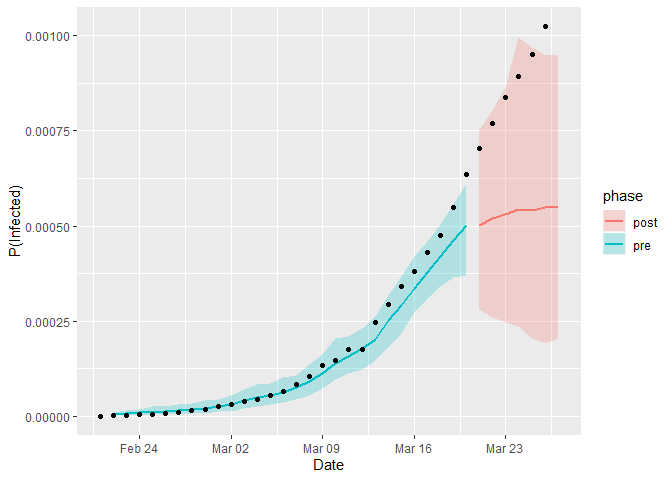
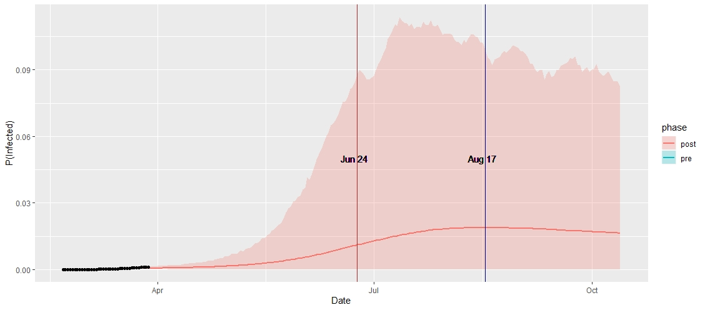
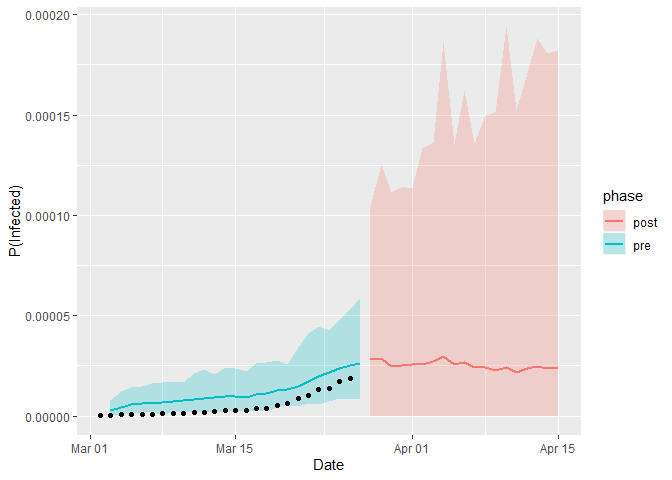
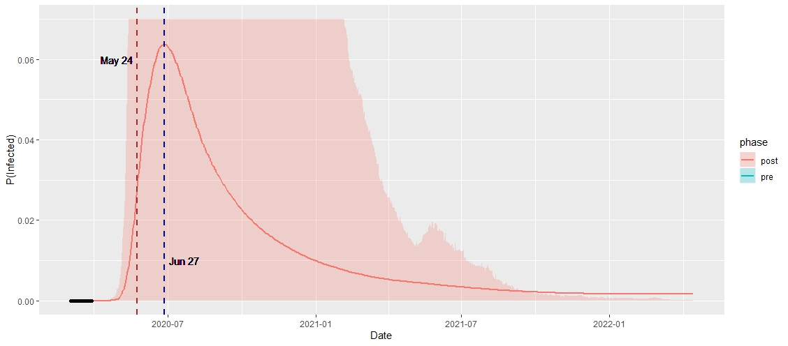

# PART 1: SIR Modelling

## The Current Global Scenario

At the end of December 2019, a cluster of an unknown pneumonia like cases were reported in Wuhan, a city in the Hubei province, China. They quickly identified that the source of the infection was a novel coronavirus belonging to the coronavirus family, which includes the virus related to the outbreaks of  Severe Acute Respiratory Syndrome (SARS) from 2002-2004 and Middle East Respiratory Syndrome (MERS) in 2012. It  spread through and outside of Wuhan, resulting in an rapidly escalating and deadly contagious epidemic throughout China, followed by an increasing number of cases in other countries throughout the world.  
On January 30, the WHO declared coronavirus a global emergency  as the death toll in China jumped to 170, with 7,711 cases reported in the country, where the virus had spread to all 31 provinces.  In mid-February WHO announced that the new coronavirus would be called "COVID-19".

China's bold approach to contain the rapid spread of this new respiratory pathogen  by massive lockdowns and electronic surveillance measures has changed the changed the course of the epidemic . The number of new infections reported in China has been declining gradually. With over 422,915 reported cases and more than 18,543 recorded deaths worldwide , the outbreak of COVID-19 has surpassed the toll of the 2002-2003 SARS outbreak, which also originated in China and is expected to continue to increase.  Although the infection originated in China, now the epicenter of the pandemic is Europe, which now has more cases reported each day than China did at the height of its outbreak.  In Italy alone the COVID-19 has infected more than 69,000 people and killed at least 6,800. There is an increasing number of cases in several EU/EEA countries without epidemiological links to explain the source of transmission. The speed with which COVID-19 can cause nationally incapacitating epidemics once transmission within the community is established indicates that it is likely that in a few weeks or even days, similar situations to those seen in China and Italy may be seen in other EU/EEA countries or the UK, as more countries report evidence of community transmission.
The COVID-19 virus spreads primarily through droplets of saliva or discharge from the nose when an infected person coughs or sneezes.  At the time of this writing, there are no specific vaccines or treatments for COVID-19 which is generally accepted.  


## Introduction

This is a project to give ourselves a basic understanding of statistical modelling of epidemiology. In past few days of Shelter-in-place lockdown situation in Kolkata (and throughout the whole India from today onwards), me and one of my ingenious friend [Soham Bonnerjee](https://soham01.netlify.com/), was reading about different epidemiological models available in the literature and using it to generate projections for the number of infected people in India. In this first part, we shall explore the performance of deterministic SIR model which to be fitted using a least squares procedure. Then, we shall use it to generate projections for the epidemic situation in India, till the end of this lockdown, which is currently annouced to be remain till April 14, 2020, about 3 weeks from today.


## Exploratory Analysis

Before proceeding with introducing the SIR model, let us first read the data into `R` (which is what we are going to use through out), and perform some exploratory analysis. We shall be using the [tidyverse](https://www.tidyverse.org/) library, which is a collection of some very useful packages for data proprocessing and exploratory analysis.


```r
library(readr)
library(dplyr)
library(tidyr)
library(lubridate)
library(ggplot2)
```

For the related coronavirus, there are may different sources available. Many international organizations like WHO (World Health Organization), ECDC (European Centre for Disease Prevention and Control) and many national governments are releasing day to day basis publicly available data. As well as different news agencies are also collecting and compileing data from the hospitals and different other sources on a regular basis. John Hopkins University (JHU) CSSE department has also released a dataset compiled from the collection of these sources in a github repository [here](https://github.com/CSSEGISandData/COVID-19).

The datasets are being updated on a daily basis. We shall use this data provided by [JHU CSSE](https://github.com/CSSEGISandData/COVID-19).


```r
confirmed.dat <- read_csv('./datasets/time_series_19-covid-Confirmed.csv')
deaths.dat <- read_csv('./datasets/time_series_19-covid-Deaths.csv')
recovered.dat <- read_csv('./datasets/time_series_19-covid-Recovered.csv')

confirmed.dat <- confirmed.dat %>%
    rename( State = `Province/State`, Country = `Country/Region` ) %>% 
    gather(key = "Date", value = "Confirmed", -c(1:4) ) %>%
    mutate(Date = mdy(Date))
    

deaths.dat <- deaths.dat %>%
    rename( State = `Province/State`, Country = `Country/Region` ) %>% 
    gather(key = "Date", value = "Deaths", -c(1:4) ) %>% 
    mutate(Date = mdy(Date))

recovered.dat <- recovered.dat %>%
    rename( State = `Province/State`, Country = `Country/Region` ) %>% 
    gather(key = "Date", value = "Recovered", -c(1:4) ) %>%
    mutate(Date = mdy(Date))


# merge all of them together
dat <- Reduce(merge, list(confirmed.dat, deaths.dat, recovered.dat))
dat <- as_tibble(dat)

knitr::kable(head(dat, 5))
```


| State     |  Country  |   Lat    |   Long    | Date       |  Confirmed |  Deaths |  Recovered |
|-----------|-----------|----------|-----------|------------|------------|---------|------------|
| Adams, IN |  US       |  39.8522 |  -77.2865 | 2020-01-22 |       0    |    0    |    0       |
| Adams, IN |  US       |  39.8522 |  -77.2865 | 2020-01-23 |       0    |    0    |    0       |
| Adams, IN |  US       |  39.8522 |  -77.2865 | 2020-01-24 |       0    |    0    |    0       |
| Adams, IN |  US       |  39.8522 |  -77.2865 | 2020-01-25 |       0    |    0    |    0       |
| Adams, IN |  US       |  39.8522 |  -77.2865 | 2020-01-26 |       0    |    0    |    0       |


Now we shall try to see how the total number of Confirmed, deaths and recovered people changed across the globe.


```r
temp <- dat %>% group_by(Date) %>% 
    summarise(Confirmed = sum(Confirmed), Deaths = sum(Deaths), Recovered = sum(Recovered)) %>%
    gather(key = "Variable", value = "Count", -Date)

ggplot(temp, aes(x = Date, y = Count, color = Variable)) + geom_line(size = 1)
```


The situation is very severe, as the current trend in exponentially increasing in terms of confirmed cases, and the growth rate of recovered is sufficiently slow. If we particular focus on the situation of India, (after 1st March, 2020),




As of now, there are very less number of recoveries, some deaths, and a lot of (about 400) affected people. We have also compiled how these changes occurs spatially in different countries. They are shown below.






## SIR Model Description

The SIR model is one of the compartmental models in epidemiology which is used to mathematically model the spread of an infectious disease. This model was firstly introduced by William Ogilvy Kermack and A. G. McKendrick, and named as **Kermack-McKendrick Model.** However, with time, this model has obtained several variants, each being better than the one before.

SIR modelling starts with defining 3 different compartments, of states in which a person can be. The states are as follows:


graph LR;
    S(Susceptible) --> I(Infected);
    I(Infected) --> R(Recovered / Removed);



**Susceptibles** are the general population, who is susceptible to get the disease from an infectious person. **Infected** state reperesents the persons who have the symptoms of the infection and is able to spread it. And finally, **Recovered** or **Removed** is the state when a person is recovered from the disease and gain immunity to it, or is dead. Let, $Y_t^S, Y_t^I, Y_t^R$ dentoes the number of people in these states respectively at the time $t$. The corresponding proportions are denoted by $\theta_t^S, \theta_t^I$ and $\theta_t^R$, where the proportion is defined as the number of people in a state divided by the total number of people, i.e. the population count. Note that, since these three states are assumed to be exhaustive, hence $Y_t^S + Y_t^I + Y_t^R = N$, where $N$ is the total population of the particular region under study.

The mathematical relations between these quantities are defined as follows:

$$
\begin{align}
\dfrac{d\theta\_t^S}{dt} & = -\beta \theta\_t^S \theta\_t^I\\\\\\
& \\\\\\
\dfrac{d\theta\_t^I}{dt} & = \beta \theta\_t^S \theta\_t^I - \gamma \theta\_t^I\\\\\\
& \\\\\\
\dfrac{d\theta\_t^R}{dt} & = \gamma \theta\_t^I\\\\\\
\end{align}
$$


Note that, since $Y_t^S + Y_t^I + Y_t^R = N$, we have $\theta_t^S + \theta_t^I + \theta_t^R = 1$, which is constant. Hence, we must have, 

$$ \dfrac{d\theta_t^S}{dt} + \dfrac{d\theta_t^I}{dt} + \dfrac{d\theta_t^R}{dt} = 0 $$

which is satisfied by the mathematical formulation. In this, $\beta, \gamma$ are unknown parameters which is to be estimated from the data. 

These mathematical equations did not drop from the sky. Let us understand how these mathematical formula emerges from an intuitive points of view.

1. We consider the third equation first. It models the change in the number of recovered people. Now, the change in the number (or proportion) of recovered people can occur only when an infectious person, gets treatment, which happens with rate $\gamma$, which can be interpreted as the recovery rate of an infectious person. Therefore, it changes by the amount $\gamma \theta_t^I$.

2. Now we consider the first equation. It models the change in the number of susceptible population. The change in susceptible population occurs, when an infectious person comes in contact with a susceptible person, and the infection spreads. Now, there are $Y_t^I Y_t^S$ many interactions possible, and each interaction would spread the virus with rate $\beta$ say. Considering proportions, we have the change being equal to $-\beta\theta_t^I\theta_t^S$, with the negative sign showing that number of susceptibles can only decrease.

3. Due to the restriction, $\dfrac{d\theta_t^S}{dt} + \dfrac{d\theta_t^I}{dt} + \dfrac{d\theta_t^R}{dt} = 0$, the choice of $\dfrac{d\theta_t^I}{dt}$ can be justfied from previous points.


A very important measure in this model is the quantity;

$$R_0 = \dfrac{\beta}{\gamma}$$

This basically interprets as the average number of people an infectious person infects before recovering or dying. So, if $R_0 < 1$, then an infectious person infects less than one person in average before recovering, which means the infection pandemic will eventually die out. Whereas, if $R_0 > 1$, then an infectious person infects more than one person in average before recovering, hence the number of infected would increase exponentially and eventually all of the population will become infected.

## Estimation of SIR Model

There are two possible ways of estimation of the parameters of an SIR model.

1. A deterministic estimation.

2. A stochastic estimation.


A deterministic estimation does not require any other assumptions on the model parameters, as well as the data. It basically works simply on the basis of solution to the above differential equations. However, a stochastic estimation requires specifications of the distributional assumptions on the data, as well as model parameters. In this post, we are going to use only a deterministic setup of the model as explained in the mathematical formulation, nothing more. 

For this reason, we shall use [Runge Kutta methods](https://en.wikipedia.org/wiki/Runge%E2%80%93Kutta_methods) of numerically solving a system of differential equations, under some particular choice of the model parameters $\beta, \gamma$. However, as we solve the differential equations, we shall be able to obtain estimates $\hat{Y}_t^S, \hat{Y}_t^I$ and $\hat{Y}_t^R$. Then, we can use a Least Squares approach to solve this problem, to estimate $\beta, \gamma$ as;

$$
(\hat{\beta}, \hat{\gamma}) = \min_{\beta, \gamma} \sum_t \left[ \left(Y_t^S - \hat{Y}_t^S\right)^2 + \left(Y_t^I - \hat{Y}_t^I\right)^2 + \left(Y_t^R - \hat{Y}_t^R\right)^2 \right]
$$


To this end, we write the function `pred.SIR` and `LS.SIR` which performs the prediction given the initial value and parameters, and computes the value of the objective function written above by tallying it with the observed data.


```r
pred.SIR <- function(n_time, beta, gamma, init.theta) {
    theta <- matrix(0, nrow = n_time, ncol = 3)
    theta[1, ] <- init.theta / sum(init.theta)
    
    for (t in 2:n_time) {
        # for each time, create the Runge Kutta approximation
        Km <- numeric(12)   # 12 coefficients are needed
        
        # computes coefficients of runge kutta
        Km[1] <- - beta * theta[t-1,1] * theta[t-1,2]
        Km[9] <- gamma * theta[t-1,2]
        Km[5] <- -Km[1]-Km[9]
        
        Km[2] <- - beta * (theta[t-1,1]+ 0.5*Km[1]) * (theta[t-1,2]+0.5*Km[5])
        Km[10] <- gamma*(theta[t-1,2]+0.5*Km[5])
        Km[6] <- -Km[2]-Km[10]
        
        Km[3] <- -beta*(theta[t-1,1]+0.5*Km[2])*(theta[t-1,2]+0.5*Km[6])
        Km[11] <- gamma*(theta[t-1,2]+0.5*Km[6])
        Km[7] <- -Km[3]-Km[11]
      
        Km[4] <- -beta*(theta[t-1,1]+Km[3])*(theta[t-1,2]+Km[7])
        Km[12] <- gamma*(theta[t-1,2]+Km[7])
        Km[8] <- -Km[4]-Km[12]
        
        innov.S <- ( Km[1] + 2 *Km[2] + 2*Km[3] + Km[4])/6
        innov.I <- ( Km[5] + 2 *Km[6] + 2*Km[7] + Km[8])/6
        innov.R <- ( Km[9] + 2 *Km[10] + 2*Km[11] + Km[12])/6
        
        theta[t, ] <- theta[(t-1), ] + c(innov.S, innov.I, innov.R)
        theta[t, ] <- theta[t, ]/sum(theta[t, ])
    }
    
    return(theta)
}
LS.SIR <- function(params, Y) {
    beta <- params[1]
    gamma <- params[2]
    n_time <- nrow(Y)
    N <- sum(Y[1, ])
    
    init.theta <- Y[1, ] / N
    preds <- pred.SIR(n_time, beta, gamma, init.theta)
    
    return( sum((Y - preds * N )^2) ) 
}
```

## Performance of SIR model

### Estimation for Hong Kong, China

We choose the Hong Kong province in China to see how SIR model performs. According to World Bank data, the province Hong Kong is home to about $73.9$ lakhs people. Therefore, we have $N = 73.9\times 10^5$, in our model.


```r
N <- 73.9e5   # population of Hong Kong
temp  <- dat %>% filter(Country == "China" & State == "Hong Kong") %>% 
    mutate(Removed = Deaths + Recovered, Susceptible = N - Removed - Confirmed) %>% 
    select(Date, Susceptible, Confirmed, Removed)

knitr::kable(head(temp))
```

| Date        |  Susceptible |  Confirmed |  Removed |
|-------------|--------------|------------|----------|
| 2020-01-22  |      7390000 |          0 |        0 |
| 2020-01-23  |      7389998 |          2 |        0 |
| 2020-01-24  |      7389998 |          2 |        0 |
| 2020-01-25  |      7389995 |          5 |        0 |
| 2020-01-26  |      7389992 |          8 |        0 |
| 2020-01-27  |      7389992 |          8 |        0 |


As you can see, the first appearence of Coronavirus in Hong Kong is on 23rd of Janurary, 2020. So, we should use the data from 2nd row onwards to fit into SIR model. We shall be using the data corresponding to $61$ days, i.e. till 23rd of May, 2020. Among this, we shall be training the model using data of first $47$ days, and then we build the prediction for next $14$ days, to see the performance of the fitted model. We shall be using `optim` function of `R` to optimize our objective function in order to find Least Sqaures estimate.


```r
Y <- as.matrix(temp[2:48, 2:4])
ops <- optim(par = c(1e-2, 1e-5), fn = LS.SIR, method = "BFGS", Y = Y, control = list(trace = 1))
```

```
initial  value 552556.538521 
iter  10 value 68951.183015
final  value 65031.692121 
converged
```

```r
ops$par[1] / ops$par[2]   # R0
```

```
[1] 3.149289
```

Now that we have the estimated parameters, we can simply generate predictions for last $14$ days, using this `pred.SIR` method. Before that, estimate of $R_0$ turns out to be higher than 1, thereby showing the seriousness of the COVID-19 epidemic situation.


```r
# since predictions are proportions, we multiply with the population to get the count estimates

preds <- pred.SIR(14, ops$par[1], ops$par[2], as.matrix(temp[49, 2:4])) * N
pred.dat <- tibble(Date = temp$Date[49:62], Pred.Confirmed = preds[, 2], Pred.Removed = preds[, 3])
pred.dat <- left_join(temp, pred.dat, by = c("Date" = "Date"))  # create a full dataset containing predicted data as well

ggplot( pred.dat , aes(x = Date) ) +
    geom_line(aes(y = Confirmed), color = "black", size = 1) +
    geom_line(aes(y = Pred.Confirmed), color = "blue", size = 1, linetype = "dashed")
```


Therefore, we see that SIR model overestimates the true number by about $75$ people at the last day. Nevertheless, this is simple model, which performs fairly good. However, it would have been nice if we could give a confidence interval around that estimate.


### Performance for India

We perform the same exercise for India as well. For India, the population is huge (about $131$ crores) and there is lesser amount of data available, although the first confirmed case of COVID-19 was identified in 30th January, 2020. We have data on $54$ days, among which we shall use all the data before last week, and generate predictions for last week, to visualize its performance.


The $R_0$ coefficient turns out to be 12.4850813, which is severe as it is a lot more than $1$. 


```r
preds <- pred.SIR(7, ops$par[1], ops$par[2], as.matrix(temp[48, 2:4])) * N
pred.dat <- tibble(Date = temp$Date[48:54], Pred.Confirmed = preds[, 2], Pred.Removed = preds[, 3])
pred.dat <- left_join(temp, pred.dat, by = c("Date" = "Date"))  # create a full dataset containing predicted data as well

ggplot( pred.dat , aes(x = Date) ) +
    geom_line(aes(y = Confirmed), color = "black", size = 1) +
    geom_line(aes(y = Pred.Confirmed), color = "blue", size = 1, linetype = "dashed")
```



Yet in this case, the SIR model does a underestimation in determining the number of confirmed cases by about $100$ cases. Therefore, the seriousness of the pandemic situation is even worse than what is depicted by the number $R_0$, i.e. 12.4850813, it is enitrely possible that the true $R_0$ value is even more at the last week, thereby showing on average an infectious person is infecting more than $12$ persons, which is bad, seriously bad.


### Predictions till the end of the Lockdown

To make this prediction, we use all the available datapoints for estimation of the parameters. So, we refit the model.


```r
Y <- as.matrix(temp[, 2:4])
ops <- optim(par = c(1e-2, 1e-5), fn = LS.SIR, method = "BFGS", Y = Y)

preds <- pred.SIR(22, ops$par[1], ops$par[2], as.matrix(temp[54, 2:4])) * N
pred.dat <- tibble(Date = temp$Date[54] + 1:22, 
                   Pred.Confirmed = preds[, 2], Pred.Removed = preds[, 3])
pred.dat <- full_join(temp, pred.dat, by = c("Date" = "Date"))  # create a full dataset containing predicted data as well

ggplot( pred.dat , aes(x = Date) ) +
    geom_line(aes(y = Confirmed), color = "black", size = 1) +
    geom_line(aes(y = Pred.Confirmed), color = "blue", size = 1, linetype = "dashed")
```



So, if there was no lockdown happening, the prediction of confirmed cases in India by middle of April would have be about $4000$. 


# PART 2: eSIR Modelling

## Introduction

Note that SIR is the best-case scenario, hence this is an underestimate. Thus without any quarantining intervention, the situation looks grim; But all hope is not lost, as we'll show how different measures of quarantining, including lockdown, help decrease the rate of increase in confirmed cases. Taking cue from global powerhouses failing catastrophically to contain the onslaught on life that's been lunched by Covid-19, Prime Minister of India Shri Narendra Modi issued instructions for a nationwide *Lockdown* starting from 25 March'20 to 14 April'20, wth possible plans for further extension. The decision have been welcomed and lauded by various researchers and scientists alike, esopecially after countries like USA and Italy acted too late to a possibly aggravated situation. But why this praise? In this post, we'll find out how lockdown and other forms of quarantining helps contain the infection. But before that, a reminder of what we are up against: till date, Covid-19 virus has affected $722$ people in India, and $486702$ people worldwide and has claimed $16$ lives in India till now.


## Loading the Packages and the Dataset

We are using the same dataset source as before, except that we have updated it to include some of the current observations. Similar to before, we shall be using `dplyr` for data manipulation and summarization, `lubridate` for handling dates and times, and `ggplot2` for plotting.

However, due to some Monte Carlo simulation later, we shall be needing `rjags` and we shall use `gtools` for specification of some useful probability distributions.


```r
library(readr)
library(dplyr)
library(lubridate)
library(ggplot2)
library(rjags)
library(gtools)
```

Now, finally we load the updated dataset, which I have already downloaded from [JHU CSSE](https://github.com/CSSEGISandData/COVID-19), and manipulated to get the required form of data using the code discussed in my previous post [here](https://subroy13.github.io/post/post6/). We shall take a look at the last few columns to see how much we have updated.


```r
dat <- read_csv('./datasets/covid-19-data.csv')
knitr::kable(tail(dat, 3))
```

| State    |  Country  |      Lat  |     Long | Date    |  Confirmed |  Deaths |  Recovered |
|--------- | -------- | -------- | --------- | ----------- | ---------- | ------- | ----------|
| Zhejiang |  China  |    29.1832 |  120.0934 | 2020-03-24 |     1240   |     1   |     1221  |
| Zhejiang |  China  |    29.1832 |  120.0934 | 2020-03-25 |     1241   |     1   |     1221  |
| Zhejiang |  China  |    29.1832 |  120.0934 | 2020-03-26 |     1243   |     1   |     1222  |

## Description of eSIR Model

The eSIR (Extended SIR) model is really similar to the SIR model, except for the fact that it includes  a function that parametrizes the quarantining effects. As with SIR modelling, it has 3 different compartments, of states in which a person can be. This model has been developed very recently by [Wang et al.](https://www.medrxiv.org/content/10.1101/2020.02.29.20029421v1.full.pdf) The states are as follows:


  graph LR;
    A(Susceptible) -->|"&#946&#960(t)"| B(Infected);
    B -->|&#947| C(Removed);



As described in part 1, **Susceptibles** are the general population, who is susceptible to get the disease from an infectious person. **Infected** state reperesents the persons who have the symptoms of the infection and is able to spread it. And finally, **Recovered / Removed** is the state when a person is recovered from the disease and gain immunity to it, or is dead. Let, $Y_t^S, Y_t^I, Y_t^R$ denotes the proportion of people in these states respectively at the time $t$. Note that $Y_t^S + Y_t^I + Y_t^R = 1$.  $\pi(t)$ denotes the proportion of people transiting from **Susceptible** to **Infected** state at time $t$, with the *proportion* being commensurate to the proportion of people transiting from **Susceptible** to **Infected** state at time $t$ in the original SIR modelling. Thus We can vary $\pi(t)$ from time to time to perfectly capture the effect of quarantining. In other words, the rate at which a susceptible person becomes infected is not a time varying proportion, namely $\beta \pi(t)$, where $\beta$ is the usual rate of transmission of the disease, while $\pi(t)$ is the quarantining effect which might restrict movements of general public in order to make the effective transmission rate lower than the usual quantity $\beta$.

Let $\theta_t=(\theta_t^S, \theta_t^I, \theta_t^R)^T$ be the vector of underlying prevalence of the population in these three states. Since $Y_t^S, Y_t^I, Y_t^R$ are proportions, we model them via Beta distribution: 

$$\begin{align}
Y\_t^I \mid \theta_t, \tau \sim \text{Beta}(\lambda^I\theta\_t^I,\lambda^I(1-\theta\_t^I))\\\\\\
& \\\\\\
Y\_t^R \mid \theta_t, \tau \sim \text{Beta}(\lambda^R\theta\_t^R,\lambda^R(1-\theta\_t^R))\\\\\\
\end{align}$$

where $\tau=(\beta, \gamma, \theta_0^T, \kappa, \lambda^I, \lambda^R)^T$, $\beta$, $\gamma$ are as in SIR model; $\kappa$, $\lambda^I, \lambda^R$ are parameters governing the latent process we'll define soon.

Since $\theta_t$ is a probability, we specify a Dirichlet model for it:

$$\theta\_t \mid \theta\_{t-1}, \tau \sim \text{Dirichlet} (k f(\theta\_{t-1}, \beta, \gamma))$$

These together is called a Beta-Dirichlet State Space Model. 

Here $f(\cdot)$ is the solution of the system of ODEs:

$$\begin{align}
\dfrac{d\theta\_t^S}{dt} & = -\pi(t)\beta \theta\_t^S \theta\_t^I\\\\\\
& \\\\\\
\dfrac{d\theta\_t^I}{dt} & = \pi(t)\beta \theta\_t^S \theta\_t^I - \gamma \theta\_t^I\\\\\\
& \\\\\\
\dfrac{d\theta\_t^R}{dt} & = \gamma \theta\_t^I\\\\\\
\end{align}$$

and this is exactly where the SIR modelling takes place. We solve this system of ODEs via *Runge-Kutta*(RK4) approximation.

To implement the Markov Chain Monte Carlo method, we need to specify prior for the hyperparameters $\tau=(\beta, \gamma, \theta\_0^T, \kappa, \lambda^I, \lambda^R)^{\top}$. We do that as follows:

We initialize $\theta_0$ via a distribution that uses the observed data:

$$\begin{align}
\theta\_0^I \sim \text{Beta}(1, \dfrac{1}{Y\_1^I})\\\\\\
& \\\\\\
\theta\_0^R \sim \text{Beta}(1, \dfrac{1}{Y\_1^R})\\\\\\
& \\\\\\
\theta\_0^S= 1-\theta\_0^I-\theta\_0^R\\\\\\
\end{align}$$

We specify the other hyperparameters according to the [SARS data](https://arxiv.org/pdf/1007.0908.pdf) in Hong-Kong. 

$$\begin{align}
R\_0= \dfrac{\beta}{\gamma} \sim \text{Log}\mathbb{N}(1.099,0.096) \implies \mathbb{E}(R\_0)=3.15, \mathbb{V}(R\_0)=1 \\\\\\
& \\\\\\
\gamma \sim \text{Log}\mathbb{N}(-2.955,0.910) \implies \mathbb{E}(\gamma)=0.0117, \mathbb{V}(\gamma)=0.01 \\\\\\
& \\\\\\
k \sim \text{Gamma}(2, 0.0001)\\\\\\
&  \\\\\\
\lambda^I \sim \text{Gamma}(2, 0.0001)\\\\\\
& \\\\\\
\lambda^R \sim \text{Gamma}(2, 0.0001)\\\\\\
\end{align}$$

Now suppose , data upto time point $t_0$ are observed: $(Y\_1, \cdots Y\_{t\_0})$. We want to predict upto time point $T$. To this end, we generate $M$ MCMC samples, such that for $m \in \{1,\cdots, M\}$, $(Y\_{t\_0+1}^{(m)}, \cdots, Y\_T)$ is a draw from $Y\_t \mid \theta\_t, \tau$. The algorihm is described below:


**Algorithm:**

for $m$ in $1, \cdots, M$

$\qquad$  for $t$ in $t_0+1,\cdots, T$,

$\qquad \qquad$  Draw $\theta_t^{(m)}$ from $[\theta\_t \mid \theta\_{t-1}^{(m)}, \tau^{(m)}]$

$\qquad \qquad$  Draw $Y_t^{(m)}$ from $[Y\_t \mid \theta\_{t}^{(m)}, \tau^{(m)} ]$


Finally for each time point $t$, $t= t\_0+1,\cdots, T$ estimate $Y\_t$ by $\hat{Y}\_t=\dfrac{1}{M}\displaystyle \sum\_{m=1}^M Y\_t^{(m)}$.        


## Estimation of eSIR Model

### Initialization

Note that, we wish to have a lognormal distribution $R_0 \sim LogN(\mu, \sigma^2)$, such that, $E(R_0), Var(R_0)$ is at a specified value. The specific reason is that, $R_0 = \beta_0 / \gamma_0$, which is a positive quantity, hence is better modelled by a gamma or lognormal distribution than a normal distribution, which has support as the whole of real line. Therefore, given $E(R_0) = a$, and $Var(R_0) = b$, we wish to figure out $\mu, \sigma$, the parmeters of the lognormal distribution. This can be obtained through the following simple formula and is implemented in the following function.

$$\sigma^2 = \log\left( \dfrac{Var(R_0)}{E(R_0)^2} +1 \right) \qquad \qquad \mu = \log(E(R_0)) - \dfrac{\sigma^2}{2}$$


```r
lognorm.param<-function(mu0,var0){
  var <- log(var0/mu0^2+1)
  mu <- log(mu0)-var/2
  return(round(c(mu,var),3))
}
```


Now, we specify some control parameters, which specifies the initial $E(R_0), Var(R_0)$ and some other parameters, as well as the parameters for the markov chain (like the length of the chain, the number of parallel chains to construct in order to speed up the process, number of samples to define burn in period etc.) You may want to skip these technical details for now.


```r
init.params <- list(R0 = 3.15, R0_sd = 1, gamma0 = 0.0117, gamma0_sd = 0.1)
control.params <- list(nchain=4, nadapt=1e4, ndraw=5e2, thin=10, nburnin=2e2)
control.params$mclen <- round(control.params$ndraw / control.params$thin) * control.params$nchain    #number of MCMC draws in total
```

### Performing MCMC

Now, we shall be creating a function called `do.MCMC` which takes the observed proportion of Infected (I), Removed ( R ), then the value of the function $\pi(t)$ till the observed time period (and the control parameters). Then, it shall perform the MCMC step by generating the posterior sampels, and it shall output that posterior samples, which we shall later use to generate predictions, as well as get estimates.

### Defining the JAGS Code

The very first thing to implement MCMC or any Bayesian Computation in `rjags` is the specification of a JAGS code. JAGS is the acronym for [**Just Another Gibbs Sampler**](http://mcmc-jags.sourceforge.net/), which is a program for simulation from Bayesian hierarchical models using Markov chain Monte Carlo (MCMC), developed by Martyn Plummer.

JAGS code is mainly created based on two simple operations.

1. An assignment operator "<-" is used to denote a deterministic relation.

2. A tilde operator "~" is used to denote a stochastic relation. In this case, we have a probability distribution on right hand side, according to which the left hand side variable is being generated. 


Based on the above operations, the following JAGS code creates the Bayesian model described above.


```r
model.string <- paste0("
             model{
                   for(t in 2:(T_obs+1)){
                   Km[t-1,1] <- -beta*pi[t-1]*theta[t-1,1]*theta[t-1,2]
                   Km[t-1,9] <- gamma*theta[t-1,2]
                   Km[t-1,5] <- -Km[t-1,1]-Km[t-1,9]
                   Km[t-1,2] <- -beta*pi[t-1]*(theta[t-1,1]+0.5*Km[t-1,1])*(theta[t-1,2]+0.5*Km[t-1,5])
                   Km[t-1,10] <- gamma*(theta[t-1,2]+0.5*Km[t-1,5])
                   Km[t-1,6] <- -Km[t-1,2]-Km[t-1,10]
                   Km[t-1,3] <- -beta*pi[t-1]*(theta[t-1,1]+0.5*Km[t-1,2])*(theta[t-1,2]+0.5*Km[t-1,6])
                   Km[t-1,11] <- gamma*(theta[t-1,2]+0.5*Km[t-1,6])
                   Km[t-1,7] <- -Km[t-1,3]-Km[t-1,11]
                   Km[t-1,4] <- -beta*pi[t-1]*(theta[t-1,1]+Km[t-1,3])*(theta[t-1,2]+Km[t-1,7])
                   Km[t-1,12] <- gamma*(theta[t-1,2]+Km[t-1,7])
                   Km[t-1,8] <- -Km[t-1,4]-Km[t-1,12]
                   alpha[t-1,1] <- theta[t-1,1]+(Km[t-1,1]+2*Km[t-1,2]+2*Km[t-1,3]+Km[t-1,4])/6
                   alpha[t-1,2] <- theta[t-1,2]+(Km[t-1,5]+2*Km[t-1,6]+2*Km[t-1,7]+Km[t-1,8])/6
                   alpha[t-1,3] <- theta[t-1,3]+(Km[t-1,9]+2*Km[t-1,10]+2*Km[t-1,11]+Km[t-1,12])/6
                   theta[t,1:3] ~ ddirch(k*alpha[t-1,1:3])
                   I[t-1] ~ dbeta(lambdaI*theta[t,2],lambdaI*(1-theta[t,2]))
                   R[t-1] ~ dbeta(lambdaR*theta[t,3],lambdaR*(1-theta[t,3]))
                  }
                  theta[1,1] <-  1- theta[1,2]- theta[1,3]
                  theta[1,2] ~ dbeta(",1,",",1/I[1],")
                  theta[1,3] ~ dbeta(",1,",",1/R[1],")
                  gamma ~  dlnorm(",lognorm_gamma_param[1],",",1/lognorm_gamma_param[2],")
                  R0 ~ dlnorm(",lognorm_R0_param[1],",",1/lognorm_R0_param[2],")
                  beta <- R0*gamma
                  k ~  dgamma(2,0.0001)
                  lambdaI ~ dgamma(2,0.0001)
                  lambdaR ~ dgamma(2,0.0001)
               }
            ")
```


Here, `init.params` are to be passed accordingly in `lognorm.param` function to obtain the `lognorm_gamma_param` and `lognorm_R0_param` variables.

### Performing MCMC

Now, once we have the `model.string` containing the JAGS code, we need to open a connection object to that string. Because, `rjags` expect the JAGS code to be written in a file, a connection object can gimick the behavior of a file, just based on that string. Once we have the JAGS code ready, passing the data nodes in the JAGS model helps us in creating the posterior model.


```r
model.spec <- textConnection(model.string)
posterior <- jags.model(model.spec, data=list('I'=I,'R'=R,'T_obs'=T_obs,'pi'=pi), 
                    n.chains =control.params$nchain, n.adapt = control.params$nadapt)
```


Now, we first update the posterior for the burn-in period. In this time, the posterior generates samples are not close to the original sample, and hence we need to discard them. Typically, we set burn-in to be about $2000$ iterations. After that, we pass


```r
update(posterior, control.params$nburnin) # update the posterior for burn in times, for this time, do not monitor anything
jags_sample <- jags.samples(posterior, c('theta','gamma','R0','beta','I','lambdaI','lambdaR','k'),
                        n.iter = control.params$ndraw * control.params$nchain,
                        thin = control.params$thin)
```


So, we combine these into a function called `do.MCMC` which we shall use later.


### Forecasting using eSIR model

Now, since we have the MCMC samples obtained as the output of `do.MCMC` function, we can extend the chain using the exact simulation of the process described by the model above, and then, we can obtain the estimates of the proportion of infected and recovered people, as well as the confidence interval for that proportion.

Again, we shall create `forecast.SIR` function which takes in the output of `do.MCMC`, and then run the simulation chains starting from the MCMC samples. Finally, it computes the estimates and confidence intervals for the estimates of proportion of infected and removed from the samples from all the chains.


### Extract components of MCMC samples

Here, we extract the components of MCMC samples from the output of `do.MCMC` function.


```r
# extract components from mcmc samples 
theta_pre <- array(as.mcmc.list(mcmc_sample$theta)[[1]], dim = c(control.params$mclen, T_obs+1, 3))
R0_pre <- as.mcmc.list(mcmc_sample$R0)[[1]]
gamma_pre <- as.mcmc.list(mcmc_sample$gamma)[[1]]
beta_pre <- as.mcmc.list(mcmc_sample$beta)[[1]]
lambdaI_pre <- as.mcmc.list(mcmc_sample$lambdaI)[[1]]
lambdaR_pre <- as.mcmc.list(mcmc_sample$lambdaR)[[1]]
k_pre <- as.mcmc.list(mcmc_sample$k)[[1]]
```

We also initialize blank arrays to store the future forecasts. Here, `T_new` is the number of time points for which new forecasting is to be done.


```r
theta_post <- array(0, dim=c(control.params$mclen, T_new, 3))
I_post <- matrix(NA, nrow=control.params$mclen, ncol=T_new)
R_post <- matrix(NA, nrow=control.params$mclen, ncol=T_new)
```


### Peform Forecasting

The following piece of code basically performs the forecasting starting from the last obtained posterior samples as obtained by MCMC. Now, let us go through the code step by step.


```r
for(l in 1:control.params$mclen){
    
    thetalt1 <- theta_pre[l, T_obs+1, 1]
    thetalt2 <- theta_pre[l, T_obs+1, 2]
    thetalt3 <- theta_pre[l, T_obs+1, 3]
    betal <- beta_pre[l]
    gammal <- gamma_pre[l]
    kt <- k_pre[l]
    lambdaIl <- lambdaI_pre[l]
    lambdaRl <- lambdaR_pre[l]
    if (betal<0 | gammal<0 | thetalt1<0 | thetalt2<0 |thetalt3<0) { 
      next 
    }
    
    
    for(t in 1:T_new ){
      # perform runge kutta
      Km <- numeric(12)
      alpha_post <- numeric(3)
      
      Km[1] <- -betal*pi_new[t]*thetalt1*thetalt2
      Km[9] <- gammal*thetalt2
      Km[5] <- -Km[1]-Km[9]
      
      Km[2] <- -betal*pi_new[t]*(thetalt1+0.5*Km[1])*(thetalt2+0.5*Km[5])
      Km[10] <- gammal*(thetalt2+0.5*Km[5])
      Km[6] <- -Km[2]-Km[10]
      
      Km[3] <- -betal*pi_new[t]*(thetalt1+0.5*Km[2])*(thetalt2+0.5*Km[6])
      Km[11] <- gammal*(thetalt2+0.5*Km[6])
      Km[7] <- -Km[3]-Km[11]
      
      Km[4] <- -betal*pi_new[t]*(thetalt1+Km[3])*(thetalt2+Km[7])
      Km[12] <- gammal*(thetalt2+Km[7])
      Km[8] <- -Km[4]-Km[12]
      
      alpha_post[1] <- thetalt1+(Km[1]+2*Km[2]+2*Km[3]+Km[4])/6
      alpha_post[2] <- thetalt2+(Km[5]+2*Km[6]+2*Km[7]+Km[8])/6
      alpha_post[3] <- thetalt3+(Km[9]+2*Km[10]+2*Km[11]+Km[12])/6
      
      thetalt_tmp <- rdirichlet(1, kt* abs(alpha_post))
      thetalt1 <- theta_post[l,t,1] <- thetalt_tmp[1]
      thetalt2 <- theta_post[l,t,2] <- thetalt_tmp[2]
      thetalt3 <- theta_post[l,t,3] <- thetalt_tmp[3]
      
      I_post[l,t] <- rbeta(1,lambdaIl*thetalt2,lambdaIl*(1-thetalt2))
      R_post[l,t] <- rbeta(1,lambdaRl*thetalt3,lambdaRl*(1-thetalt3))
      
    }
    
  }
```


1. The outer loop runs for each of the MCMC chains generated by `mcmc_output`.

2. If any of $\beta, \gamma, \theta^S,\theta^I, \theta^R$ turns out to be less than $0$, the chain is stopped and is not proceeded further.

3. In the inner loop, for each new timepoint, we perform the [Runge Kutta methods](https://en.wikipedia.org/wiki/Runge%E2%80%93Kutta_methods) of numerically solving the differential equations, 

4. At the end of the loop, we have all the estimates for proportion of Infected and Removed, as well as the three latent proportion parameters $\theta$ which accords with the underlying mathematical model of SIR.

5. Here, `pi_new[t] = pi[T_obs + t]`.


### Derivation of 3 important dates

Associated with the estimation of eSIR model, there are three important dates, which we should output from our algorithm. 

1. The date when $\dfrac{d^2 \theta^I_t}{dt^2} = 0$. This date is the time, when the rate of change in the proportion of infected people starts to be decreasing, so we are in a hopeful scenario that the number of new infected cases is going to be decreasing over time.

2. The date when $\dfrac{d \theta^I_t}{dt} = 0$, i.e. the date from when the number of new recovered cases starts to exceed the number of new infected cases. From this time onwards, the epidemic nature of the disease vanishes.

3. The date when $\theta^I_t = 0$. However, it is impossible to have this proportion equal to $0$, in finite times. Therefore, we shall be looking for a date, when $\theta^I_t < \epsilon$, where $\epsilon$ is a very small quantity, which can be treated readily at any time.

To simplify the calculation of derivative, we track the quantity $(\beta \pi(t) \theta^S\_t\theta^I\_t - \gamma \theta^I\_t)$ over time, which is equal to the derivative due to SIR modelling.


The following picture taken from the [paper](https://www.medrxiv.org/content/10.1101/2020.02.29.20029421v1.full.pdf) by Wang et al. shows the concept clearly.


```r
theta_diff_pre <- theta_pre[, 1:T_obs, 2] * sweep(beta_pre %*% t(pi[1:T_obs]) * theta_pre[, 1:T_obs, 1], MARGIN = 1, STATS = gamma_pre)
theta_diff_post <- theta_post[, , 2] * sweep(beta_pre %*% t(pi[(T_obs+1):(T_obs+T_new)]) * theta_post[, , 1], MARGIN = 1, STATS = gamma_pre)
theta_diff <- cbind(theta_diff_pre, theta_diff_post)
```

Now, we find the maximum of each row of `theta_diff` and locate the timepoints, where `theta_diff` is changing its signs. They should give up the required first and second important dates.


```r
first_dates <- apply(theta_diff, 1, which.max)
second_dates <- apply(theta_diff, 1, function(x) { length(x) + 1 - which(cumprod(rev(x <= 0)) == 0)[1] } )    # the first time it becomes negative and stays negative throughout
```

Now, that we have the dates for each chain, let us take the mean, median, and quantiles, which would give us estimates and confidence intervals for such dates.


```r
conf.quant <- c(conf.level/2, 0.5, 1-conf.level/2)    # conf.level is the confidence coefficients for the confidence interval
first_date_summary <- c( mean(first_dates, na.rm = T), quantile(first_dates, probs = conf.quant, na.rm = T) )
second_date_summary <- c( mean(second_dates, na.rm = T), quantile(second_dates, probs = conf.quant, na.rm = T) )
```


### Summarising the forecast outputs

Once we have perform forecasting for each and every chain of the MCMC samples, we can aggregated them to obtain the mean, median, and quantiles, which would give us estimates for the proportion of people in state infected and removed, as well as the confidence interval for those estimates.


```r
# till the observed time points
thetaI_band <- t(apply(theta_pre[,-1,2] , 2, quantile, probs=conf.quant, na.rm=T))   
thetaR_band<- t(apply(theta_pre[,-1,3] , 2, quantile, probs=conf.quant, na.rm=T))
thetaI_mean <- colMeans(theta_pre[, -1, 2], na.rm = T)
thetaR_mean <- colMeans(theta_pre[, -1, 3], na.rm = T)

# for the new time points
YI_band <- t(apply(I_post , 2, quantile, probs=conf.quant, na.rm=T))   
YR_band<- t(apply(R_post , 2, quantile, probs=conf.quant, na.rm=T))
YI_mean <- colMeans(I_post, na.rm = T)
YR_mean <- colMeans(R_post, na.rm = T)

# combine into a data frame
infected.dat <- data.frame( rbind( cbind(thetaI_mean, thetaI_band, rep("pre", T_obs) ), cbind(YI_mean, YI_band, rep("post", T_new) ) ) )
removed.dat <- data.frame( rbind( cbind(thetaR_mean, thetaR_band, rep("pre", T_obs) ), cbind(YR_mean, YR_band, rep("post", T_new) ) ) )

colnames(infected.dat) <- c("mean", "lower", "median", "upper")
colnames(removed.dat) <- c("mean", "lower", "median", "upper")
```

Then, we can return a list comprising of these two datasets, as well as the summary corresponding to the first and second date obtained earlier. This whole piece of code, is compressed into a function called `forecast.SIR`, which we shall call later.


## Checking Performance of eSIR

Now, we shall be using the data for `Italy`, in order to figure out how our `eSIR` model performs for this data.

### Performance for Italy

According to [Worldometers](https://www.worldometers.info/world-population/italy-population/) sources, the projected population for Italy is about 6 crores. Based on that, we compute the observed proportion of the infected and removed (including deaths and recovered), and fit the eSIR model. The following code calls the `do.MCMC` function and performs the MCMC fitting. Here, we use 4 weeks of data, of the available 5 weeks of data, and we shall try to forecast for the last week, to see how the model performed.

Also, the $\pi(t)$ function choosen for Italy is as follows;

$$\pi(t) = \begin{cases}
1 & \text{ if } t < \text{4th March, 2020}\\\\\\
0.25 & \text{ if } t > \text{9th March, 2020}\\\\\\
0.5 & \text{ otherwise }\\\\\\
\end{cases}$$


```r
subdat <- dat %>% mutate(Removed = Deaths + Recovered) %>% filter(Country == "Italy" & Removed > 0)

N <- 60550075
R <- subdat$Removed / N
I <- subdat$Confirmed/N - R
pi0 <- ifelse(subdat$Date < as.Date('2020-03-04'), 1, 
              ifelse(subdat$Date > as.Date('2020-03-09'), 0.25, 0.5))

init.params <- list(R0 = 3.15, R0_sd = 1, gamma0 = 0.0117, gamma0_sd = 0.1)
control.params <- list(nchain=4, nadapt=1e4, ndraw=5e2, thin=10, nburnin=2e2)
control.params$mclen <- round(control.params$ndraw / control.params$thin) * control.params$nchain 

mcmc_samples <- do.MCMC(I[1:28], R[1:28], pi0[1:28], init.params, control.params)
```

You should see something like this, which tells you that the JAGS code for MCMC is running properly.

```
Compiling model graph
   Resolving undeclared variables
   Allocating nodes
Graph information:
   Observed stochastic nodes: 56
   Unobserved stochastic nodes: 35
   Total graph size: 1591

Initializing model
```

As we see from the following plot, the predictions for the last week is underestimating the true proportions. However, the observed proportions lie within the bound of $95\%$ confidence band.


```r
preds <- forecast.SIR(7, 28, mcmc_samples, pi = pi0, control.params = control.params, start.date = "2020-02-21")
ggplot(preds$infected, aes(x = date)) + 
    geom_ribbon(aes(ymin = lower, ymax = upper, fill = phase), alpha = 0.25) +
    geom_line(aes(y = mean, color = phase), size = 1) +
    labs(x = "Date", y = "P(Infected)") +
    geom_point(data = subdat, aes(x = Date, y = (Confirmed - Removed)/N), color = "black")
```



However, if we assume that, the Italy government maintains the current lockdown indefinitely, then $\pi(t) = 0.25$ will continue to remain. In such case, the important dates (as mentioned above) for change in the rate of newly infected can be obtained, as shown in the following plot.


```r
pi0 <- c(pi0, rep(0.25, 200))
preds <- forecast.SIR(7+200, 28, mcmc_samples, pi = pi0, control.params = control.params, start.date = "2020-02-21")
ggplot(preds$infected, aes(x = date)) + 
    geom_ribbon(aes(ymin = lower, ymax = upper, fill = phase), alpha = 0.25) +
    geom_line(aes(y = mean, color = phase), size = 1) +
    geom_vline(xintercept = preds$first.date[1], color = "brown") + 
    geom_vline(xintercept = preds$second.date[1], color = "blue4") +
    labs(x = "Date", y = "P(Infected)") +
    geom_point(data = subdat, aes(x = Date, y = (Confirmed - Removed)/N), color = "black") +
    geom_text(x = preds$first.date[1] - 1, y = 0, label = format(preds$first.date[1], "%b %d"), size = 4 ) +
    geom_text(x = preds$second.date[1] - 1, y = 0, label = format(preds$second.date[1], "%b %d"), size = 4 )
```



Therefore, in Italy, at about June 24, we should see decreasing increments of newly infected persons, and from August 17 onwards, the proportion of infected people should start to decline.


### Estimation for India

However, our main concern is to find out the situation of India based on this eSIR modelling. Here, we shall use the $\pi(t)$ function as follows, as per various decision taken by the Government, like restriction on international flights, Janta Curfew and full scale lockdowns etc.

$$\pi(t) = \begin{cases}
1 & \text{ if } t < \text{15th March, 2020}\\\\\\
0.95 & \text{ if } \text{15th March, 2020} < t < \text{19th March, 2020}\\\\\\
0.9 & \text{ if } \text{19th March, 2020} < t < \text{22th March, 2020}\\\\\\
0.5 & \text{ if } \text{22th March, 2020} < t < \text{25th March, 2020}\\\\\\
0.1 & \text{ if } t > \text{25th March, 2020}\\\\\\
\end{cases}$$


Also, note that in India, many places are rural in nature, while most of the urban population and neighbourhood areas are more susceptible to get the disease than others, due to availablity of metro cities and international airports. So, rather than using the whole population size i.e. $131$ crores as $N$, we shall use about $350$ lakhs as the adjusted population size.


```r
subdat <- dat %>% mutate(Removed = Deaths + Recovered, Infected = Confirmed - Removed) %>%
    filter(Country == "India" & Removed > 0 & Infected > 0)

N <- 350e5   # adjusted population for metro cities and neighbourhood areas

R <- subdat$Removed / N
I <- subdat$Infected/N

pi0 <- ifelse(subdat$Date < as.Date('2020-03-15'), 1, 
              ifelse(subdat$Date < as.Date('2020-03-19'), 0.9, 
                     ifelse(subdat$Date < as.Date('2020-03-22'), 0.8, 
                            ifelse(subdat$Date < as.Date('2020-03-25'), 0.5, 0.1)) ))

init.params <- list(R0 = 12.48, R0_sd = 1, gamma0 = 0.117, gamma0_sd = 1)
control.params <- list(nchain=4, nadapt=1e4, ndraw=5e2, thin=5, nburnin=2e2)
control.params$mclen <- round(control.params$ndraw / control.params$thin) * control.params$nchain 

mcmc_samples <- do.MCMC(I, R, pi0, init.params, control.params)
```

And finally, we perform the prediction till the end of the lockdown, i.e. till $14$-th April, to see the effect of quarantining.

```r
pi1 <- c(pi0, rep(0.1, 19))   # from 27th March, it is 19 days of lockdown left 
preds <- forecast.SIR(19, 25, mcmc_samples, pi = pi1, control.params = control.params, start.date = "2020-03-02")
ggplot(preds$infected, aes(x = date)) + 
    geom_ribbon(aes(ymin = lower, ymax = upper, fill = phase), alpha = 0.25) +
    geom_line(aes(y = mean, color = phase), size = 1) +
    labs(x = "Date", y = "P(Infected)") +
    geom_point(data = subdat, aes(x = Date, y = Infected/N), color = "black")
```




Although it seems that the mean proportion is overestimated during the ovserved period, however the effect of quanting seems to work to a moderate extent, as the estimated proportion stays more or less at the same level. The exact count of the infected people at the end of lockdown, provided that it is maintained properly, should be about $1571$ many infected persons, and about $2114$ confirmed cases of COVID-19.

Similar to Italy, if we extend its forecast for some more days, and keep the same level of quarantining, the model predictions are given in the following plot.


```r
pi2 <- c(pi0, rep(0.1, 200)) 
preds <- forecast.SIR(200, 25, mcmc_samples, pi = pi2, control.params = control.params, start.date = "2020-03-02")
ggplot(preds$infected, aes(x = date)) + 
    geom_ribbon(aes(ymin = lower, ymax = upper, fill = phase), alpha = 0.25) +
    geom_line(aes(y = mean, color = phase), size = 1) +
    geom_vline(xintercept = preds$first.date[1], color = "brown", size = 1, linetype = "dashed") + 
    geom_vline(xintercept = preds$second.date[1], color = "blue4", size = 1, linetype = "dashed") +
    labs(x = "Date", y = "P(Infected)") +
    geom_point(data = subdat, aes(x = Date, y = (Confirmed - Removed)/N), color = "black") +
    geom_text(x = preds$first.date[1] - 7, y = 2e-4, label = format(preds$first.date[1], "%b %d"), size = 4 ) +
    geom_text(x = preds$second.date[1] + 7, y = 3e-4, label = format(preds$second.date[1], "%b %d"), size = 4 )
```


Therefore, as it seems, if we keep the lockdown (as it is now), based on the data, it might take till October to have the proportion of infected people becoming insignificant, provided we keep the same level of quanranting effect. However, from March 17, we should see a decrease in the rate of increment in the number of infected, and from March 29 onwards, we should be at a position from where the number of newly infected persons per day starts to decrease gradually.

Since, it is very economically and physically dissatisfying to be in a lockdown (or state of home quarantine till October, where Durga Puja festival is going to occur), we might want to go outside. In that case, assuming $\pi(t)$ increases to $0.5$, which is indeed less than 1, due to our increasing awareness of the scenario, then, the predicted situation would look like this.


```r
pi3 <- c(pi0, rep(0.1, 19), rep(0.5, 2 * 365)) 
preds <- forecast.SIR(2 * 365 + 19, 25, mcmc_samples, pi = pi3, control.params = control.params, start.date = "2020-03-02")
preds$infected$upper_new <- pmin(preds$infected$upper, 0.05)   # just for visual purpose
ggplot(preds$infected, aes(x = date)) + 
    geom_ribbon(aes(ymin = lower, ymax = upper_new, fill = phase), alpha = 0.25) +
    geom_line(aes(y = mean, color = phase), size = 1) +
    geom_vline(xintercept = preds$first.date[1], color = "brown", size = 1, linetype = "dashed") + 
    geom_vline(xintercept = preds$second.date[1], color = "blue4", size = 1, linetype = "dashed") +
    labs(x = "Date", y = "P(Infected)") +
    geom_point(data = subdat, aes(x = Date, y = (Confirmed - Removed)/N), color = "black") +
    geom_text(x = preds$first.date[1] - 7, y = 2e-4, label = format(preds$first.date[1], "%b %d"), size = 4 ) +
    geom_text(x = preds$second.date[1] + 7, y = 3e-4, label = format(preds$second.date[1], "%b %d"), size = 4 )
```



This scenario would be very severe for us, since it would affect about $6\%$ of the urban population on about June 27, and then it would start to decrease gradually. However, it would take almost 2 years, to make this epidemic insignificant, provided there would be no generally accepted antiviral medicine for COVID-19 till then.

Hence, we must avoid such situation at all costs, and to counter it, we must stay home, at a shelter in place home quarantining atmosphere.

## Conclusion

This **eSIR model is not perfect.** No statistical model is. But the main idea and examples that we are seeing currently all over the world, should give us a hint about what is to come.

There are several backdrops in **eSIR** model.

1. It does not talk about underreporting. When you are in a place like India, underreporting is a major issue, as there might be some people who are affected by coronavirus, but lightly takes their symptoms as seasonal cold.

2. In the basis of SIR model, we assume the existence of only 3 states. To incorporate the effect of quarantining, we only considering the people in Infected state. However, there might be people who are infected, and can spread the disease, yet they do not have the symptoms, and hence does not fall under the effect of quarantining.


**WHO Guidelines to STAY SAFE:**

- The best way to prevent and slow down transmission is be well informed about the COVID-19 virus, the disease it causes and how it spreads.

- Wash your hands frequently with an alcohol based rub or soap.

- Maintain social distancing.

- Avoid touching eyes, nose and mouth.

- Practice respiratory hygiene.

- If you have fever, cough and difficulty breathing, seek medical care early.

- Stay informed and follow advice given by your healthcare provider.

- Protect yourselves and protect others.


