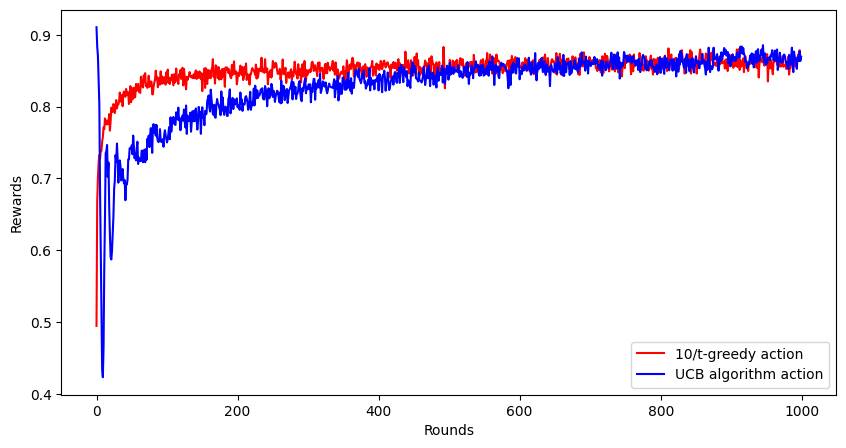
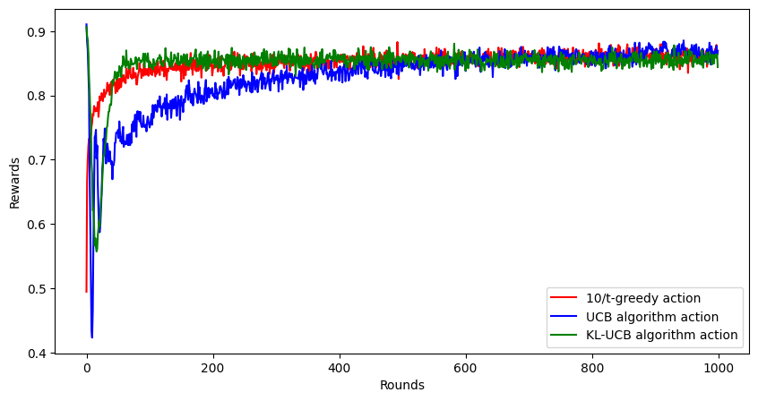
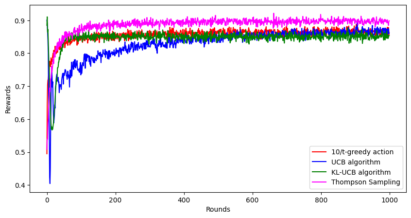

## Introduction

This is a continuation of my previous post where I explore $\epsilon$-greedy methods to solve the $k$-arm bandit problem. If you are not yet familiar with these terms, please check out my previous post [here](https://www.statwizard.in/posts/k-arm-bandit/).

In the last post, we saw how $\epsilon$-greedy method, which does a bit more exploration with exploitation can outperform the greedy approach in the long run. We also saw how changing this exploration parameter $\epsilon$ can be decreasing over time to obtain an even better result. But we ended up with a question: What kind of functions of the number of rounds we need to choose? Should it be $10/t$ or $0.1/t$ or may be even $(1000-t)$ or something else?

### A Bit of Change in the Problem

In the [previous post](https://www.statwizard.in/posts/k-arm-bandit/) we considered $10$ arms, each arm giving a random reward according to a normally distributed random variable. If you want to learn more about normal distribution, check out this [awesome video by 3Blue1Brown](https://www.3blue1brown.com/lessons/gaussian-convolution). One problem with this normal distribution is that, the generated random variable may even come as negative. This is a bit weird for the reward distribution, as negative rewards looks more like a punishment. Another problem is that the reward can potentially be extremely large and unbounded; however, almost all practical materialistic resources are limited, hence bounded.

For this post, 

* We will have $5$ arms instead of $10$ arms.
* Each arm $a$ has a coin inside it, which turns up head with probability $p_a$. 
* When you pull the arm, it tosses the coin. If it is head, it gives a reward of $1$, and if it is tail, there is no reward.
* We will still have $1000$ such rounds.
* The goal is still the same, it is to maximize the total reward.

Here is a bit of python code that now implements this reward function.

```python
rewards = np.array([0.1, 0.25, 0.5, 0.75, 0.9])

def k_arm_bandit_reward(arm_k):
  if arm_k < 0 or arm_k > 4:
    raise ValueError("Invalid arm")
  else:
    return 1 if np.random.random() > rewards[arm_k] else 0
```


## Upper Confidence Band Algorithm

Upper Confidence Band (UCB) algorithm is one of the solution to this problem, which lets us dynamically adjusting the exploration-exploitation balance to get to the best result. It was independently proposed by Agarwal[^1] and Katehakis and Robbins[^2], after the seminal work by Lai and Robbins[^3] which proves some optimality property about an algorithm that maintains a score which can provide the best return in the long run. (*I won't go more mathematical than this, but if you want to know more, let me know in the comments, I'll make a post about it.*)

Assume that you are currently at round $t$. So, till this round, you have been maintaining your best estimate abour $p_a$ for each action, let us call that $\widehat{p}_a(t)$. Also, you have choosen arm $a$ for $N_a(t)$ number of times. Then, there are three things at play here.

1. If $\widehat{p}_a(t)$ is high for an arm $a$, then that arm probably give higher reward. So, you would like to exploit it more.
2. If $N_a(t)$ is very low for an arm $a$, then there is not enough certainty about the estimate $\widehat{p}_a(t)$, since you have very little observations about the reward distribution of that arm. So, you would like to explore it more.
3. If the index of the current round $t$ is high, then it means you must be nearing the end of your chances. In such case, you should explore less and exploit more. As an extreme example, imagine there are $1000$ rounds and you are at the last round. It clearly does not make sense to explore in this round as you cannot use that new information you have gained by exploring in future.


Combining this, we have an algorithm which maintains an "optimistic" score of the rewards for each arm, and chooses the arm that maximize this optimistic UCB score. 

$$
UCB_t(a) = \widehat{p}_a(t) + \sqrt{\dfrac{2\log(t)}{N_a(t)}}
$$

Note that, if $\widehat{p}_a(t)$ is high, we are more likely to choose that arm. However, even when $N_a(t)$ is low, this score can become high leading to exploring that particular arm as it has less number of observations.

Here, we write a python code as before to simulate the performance of UCB algorithm for $2000$ such bandit problems.

```python
ucb_rewards = np.zeros((2000, 1000))
for b in range(2000):
   avg_rewards = np.zeros(5)
   action_counts = np.zeros(5)
   for t in range(1000):
      action_k = np.argmax(avg_rewards + (2 * np.log(1 + t) / (action_counts + 1) )**0.5)  # take maximum of UCB band
      reward = k_arm_bandit_reward(action_k)
      # update the average
      avg_rewards[action_k] = (avg_rewards[action_k] * action_counts[action_k] + reward) / (action_counts[action_k] + 1)
      action_counts[action_k] += 1
      # update ucb_rewards
      ucb_rewards[b, t] = reward
ucb_rewards = ucb_rewards.mean(axis = 0)

```

Again, we plot the average reward obtained as a function of the number of rounds, for both the cases with $10/t$-greedy algorithm as well as UCB algorithm. The UCB algorithm learns more slowly than the $10/t$-greedy algorithm, but on the long turn, it reaches the level of same performance (or may be slightly better).



## UCB Variant - KLUCB Algorithm

There are many variants of the UCB algorithm which have been proposed over last two decades.  Here, we shall describe one variant of the algorithm called KL-UCB algorithm, proposed by Garivier and Cappe[^4]. 

Here, the choice of upper confidence bound (UCB) score is given by

$$
\max\{ q: KL(\widehat{p}_a(t), q) \leq \log(t)/N_a(t) \}
$$

where $KL(p, q)$ denotes the Kullback Leibler divergence between the probabilities $p$ and $q$, which is
$$
KL(p, q) = p\log(p/q) + (1-p)\log((1-p)/(1-q))
$$

Note that, unlike the UCB algorithm, here the upper confidence bound is provided implicitly and must be obtained through some numerical procedure. Once this UCB score is obtained, again we choose the arm $a$ which have the maximum UCB score as before.

The following code implements this KL-UCB algorithm.

```python
klucb_rewards = np.zeros((2000, 1000))
for b in range(2000):
   avg_rewards = np.zeros(5)
   action_counts = np.zeros(5)
   for t in range(1000):
      # find q using simple search
      qa_vals = np.zeros(5)
      rhs_vals = (np.log(t + 1) + c * np.log(1 + np.log(1 + t))) / (action_counts + 1) + 0.1
      for a in range(5):
          qs = np.arange(0.01, 0.99, 0.01)
          lhs_vals = avg_rewards[a] * np.log(avg_rewards[a] / qs) + (1 - avg_rewards[a]) * np.log((1 - avg_rewards[a]) / (1 - qs))
          tmp = np.where(lhs_vals <= rhs_vals[a])[0]
          if len(tmp) > 0:
              qa_vals[a] = qs[tmp[0]]
          else:
              qa_vals[a] = 0.5
      action_k = np.argmax(qa_vals)  # take maximum of UCB band
      reward = k_arm_bandit_reward(action_k)
      # update the average
      avg_rewards[action_k] = (avg_rewards[action_k] * action_counts[action_k] + reward) / (action_counts[action_k] + 1)
      action_counts[action_k] += 1
      # update ucb_rewards
      klucb_rewards[b, t] = reward

klucb_rewards = klucb_rewards.mean(axis = 0)
```

Again we plot its performance over $1000$ rounds.



Clearly, it is much better than the simple UCB algorithm, it is quite close to the $10/t$-greedy approach during the initial rounds, which means this algorithm very quickly learns the optimal action.

## Thompson Sampling - A Bayesian Touch

### The Mathematical Concepts

If you carefully look at what we have been doing so far, there are 2 main things.

1. Based on whatever knowlegde we have, we take some action like pulling a particular arm.
2. That arm gives us a reward, we observe that, and then we update our knowledge (or estimates) to incorporate that new information about the reward.

This is very similar to the concept of Bayesian paradigm in statistics, where one starts with a prior belief about the unknown values (called parameters), he (she) observe the data, and then he (she) updates his (her) belief about these values in the light of data, which is called posterior belief. This entire field is based on [Bayes theorem](https://en.wikipedia.org/wiki/Bayes%27_theorem) which came from an essay by Thomas Bayes in 1763. Here's a quick [video](https://www.youtube.com/watch?v=9wCnvr7Xw4E) by StatQuest which provides a decent introduction to Bayes' theorem.

Thompson sampling is an algorithm based on this Bayes theorem, tuned to the particular case of reinforcement learning. Here, we start by assuming that every unknown $p_a$ (the probability of getting a reward when pulling arm $a$) follows a prior distribution with density
$$
\pi(p_a) = \dfrac{\Gamma(\alpha_a + \beta_a)}{\Gamma(\alpha_a)\Gamma(\beta_a)} p_a^{\alpha_a - 1} (1-p_a)^{\beta_a - 1}, \ p_a \in [0, 1]
$$

This is actually a [Beta distribution](https://en.wikipedia.org/wiki/Beta_distribution) with parameters $\alpha_a, \beta_a$. You can read more about it on [Wikipedia](https://en.wikipedia.org/wiki/Beta_distribution), but here's the fundamental thing that we will need.

* Higher value of $\alpha_a$ means it is more likely that $p_a$ is higher than $1/2$. Higher values of $\beta_a$ means $p_a$ will usually be lower than $1/2$.

* The expectation (i.e., the mean) of this distribution is $\alpha_a/(\alpha_a + \beta_a)$.

* As $\alpha_a$ or $\beta_a$ increases, the distribution becomes more and more concentrated near its mean (or expectation).

Now for every arm $a$ that we pull, we observe a reward $r_a(t)$ at round $t$, then $r_a(t)$ actually has a [Bernoulli distribution](https://en.wikipedia.org/wiki/Bernoulli_distribution) which has a probability mass function 

$$
P(r_a(t)) = p_a^{r_a(t)} (1 - p_a)^{(1-r_a(t))}, \ r_a(t) = 0, 1
$$

To verify this, you can simply put the values $r_a(t) = 0$ or $r_a(t) = 1$ and work out that the probability that $r_a(t) = 1$ turns out to be exactly $p_a$ as expected.

### The Algorithm

Now we are ready with all the mathematical insights that we need to understand Thompson sampling. Let's say we are at $t$-th round. We pull an arm $a$.

1. If the arm gave a reward of $1$, then we should increase our estimate $\widehat{p}_a(t)$ a bit. Since $\mathbb{E}(p_a) = \alpha_a / (\alpha_a + \beta_a)$ (i.e., the expectation of the prior distribution is $\alpha_a / (\alpha_a + \beta_a)$), it can be achieved by increasing $\alpha_a$, so we add 1 to the value of $\alpha_a$ for this particular arm.

2. If the arm gave a reward of $0$, then we need to decrease our estimate. Similar as before, we can increase $\beta_a$ by 1.

3. In both cases, either $\alpha_a$ or $\beta_a$ increases, so in a way, uncertainty decreases, as the beta distribution becomes a little bit more concentrated around $\alpha_a / (\alpha_a + \beta_a)$.

4. One can also show that this is the posterior distribution of $p_a$ given the observed reward $r_a(t)$, the reward at time $t$. Applying Bayes theorem, the posterior becomes

$$
\pi(p_a \mid r_a(t)) \propto \pi(p_a) P(r_a(t) \mid p_a) \propto p_a^{r_a(t) + \alpha_a - 1} (1 - p_a)^{1- r_a(t) + \beta_a - 1}
$$

which is again a Beta distribution but with new parameters $r_a(t) + \alpha_a$ and $(1 - r_a(t)) + \beta_a$ as the alpha and beta parameters. 


5. Finally, once we have the posterior distribution (i.e., the updated $\alpha_a$ and $\beta_a$), we can use this to simulate a future observation of the $p_a$ values. This basically means simulating one possible $k$-arm bandit game which have been consistent with the reward observations so far. Once we have simulated the $p_a$ values, clearly the best possible arm would to be take the one with the highest $p_a$ value (i.e., the highest probability of giving a reward). 

This entire algorithm is called **Thompson Sampling**, proposed by William R. Thompson in 1993[^5]. Note that, in contrast to the greedy method where we find the best arm based on whatever knowledge we have so far, in Thompson sampling, we try to predict the multi-arm bandit game itself using the knowledge and use the best arm in the predicted game. You may want to check out this nice tutorial paper by Russo et al. on Thompson sampling[^6].

Here's a bit of python code that implements this Thompson sampling algorithm.

```python
# perform the thompson sampling algorithm
thompson_rewards = np.zeros((2000, 1000))
for b in range(2000):
   alphas = np.ones(5)   # initially all alpha and beta are 1, hence uniform prior
   betas = np.ones(5)
   for t in range(1000):
      # generate the probs
      pa_vals = np.random.beta(a = alphas, b = betas)
      action_k = np.argmax(pa_vals)  # take maximum of simulated posterior probs
      reward = k_arm_bandit_reward(action_k)
      # calculate posterior and update parameters
      if reward == 1:
          alphas[action_k] += 1
      else:
          betas[action_k] += 1
      # update thompson_rewards
      thompson_rewards[b, t] = reward

thompson_rewards = thompson_rewards.mean(axis = 0)
```

And here's the plot for the experienced rewards by this strategy.



Wow! It looks like the Thompson sampling is a clear winner here. This is because instead of focusing on the short run and the future rewards, Thompson sampling focuses on the long run by guessing the multi-arm bandit game instead of the next possible rewards. Since the reward distributions of the arms don't change from time to time, Thompson sampling can leverage the this by sticking to the best arm of the most probable $k$-arm bandit game given the information collected so far.


## Some Questions to think about

Same as the previous post, here's some questions to explore.

1. Thompson sampling gives good performance since the reward distributions do not change from time to time. What happens if the reward distributions change? For instance, if a slot machine gives you a jackpot reward at round $t$, it is very unlikely that it will also give you a jackpot reward at round $(t+1)$, since most of its rewards have been taken out by the previous jackpot. 

2. How do we model this situation mathematically, i.e., when the reward itself is changing the attributes of the slot machine?

I shall answer both of these questions in my next post of this series. Till then, feel free to explore (or exploit) the answers to these questions and let me know in the comments. 


## References

[^1]: Agrawal, R. (1995). Sample Mean Based Index Policies with O(log n) Regret for the Multi-Armed Bandit Problem. Advances in Applied Probability, 27(4), 1054–1078. https://doi.org/10.2307/1427934.

[^2]: Katehakis, M. N., & Robbins, H. (1995). Sequential choice from several populations. Proceedings of the National Academy of Sciences of the United States of America, 92(19), 8584–8585. https://doi.org/10.1073/pnas.92.19.8584.

[^3]: Lai, T.L., & Robbins, H. (1985). Asymptotically efficient adaptive allocation rules.  Advances in Applied Mathematics, 6(1), 4-22. https://doi.org/10.1016/0196-8858(85)90002-8.

[^4]: Garivier, A., & Cappé, O. (2011, December). The KL-UCB algorithm for bounded stochastic bandits and beyond. In Proceedings of the 24th annual conference on learning theory (pp. 359-376). JMLR Workshop and Conference Proceedings.

[^5]: Thompson, W. R. (1933). On the Likelihood that One Unknown Probability Exceeds Another in View of the Evidence of Two Samples. Biometrika, 25(3/4), 285–294. https://doi.org/10.2307/2332286.

[^6]: Russo, D. J., Van Roy, B., Kazerouni, A., Osband, I., & Wen, Z. (2018). A tutorial on thompson sampling. Foundations and Trends® in Machine Learning, 11(1), 1-96. https://arxiv.org/abs/1707.02038.