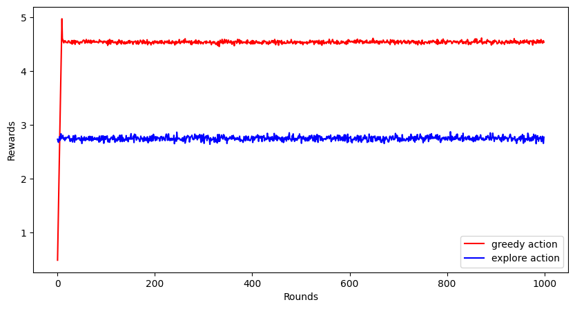
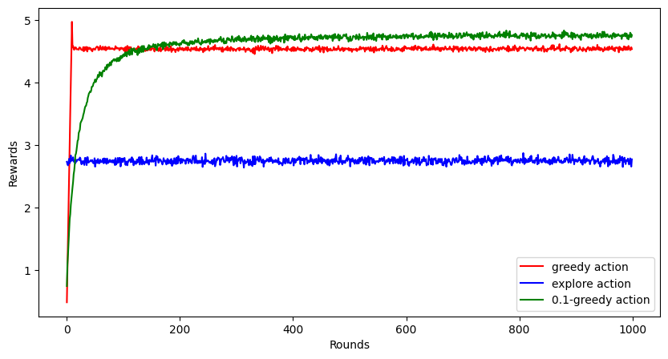
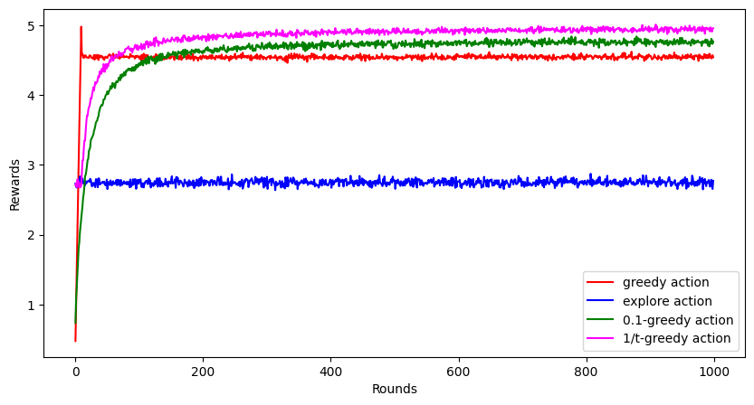
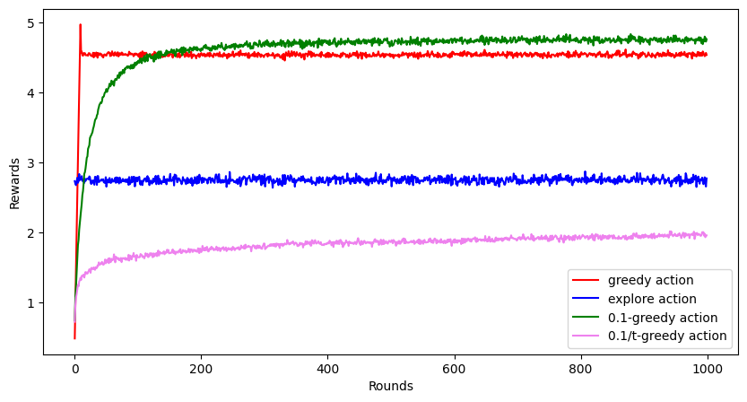

## Why Reinforcement Learning

In recent times, we've witnessed an explosion of interest in Artificial Intelligence, particularly with the emergence of powerful Large Language Model (LLM) and AI tools like [ChatGPT](https://chat.openai.com/). Businesses and individuals are increasingly embracing this technology in various aspects of life, seeking to benefit from its impressive accuracy and extensive capabilities.

However, amid this excitement, there's a crucial concern often overlooked – the impact of these AI models beyond their neural networks to the real world. Let me illustrate with an example. Imagine you create a restaurant recommendation app using AI, which considers people's ratings, comments, and food quality of the restaurants to make suggestions. After releasing the app, it quickly gains 100 sign-ups on the first day – impressive, right? But here's the catch: the app keeps recommending only one restaurant as the best in town due to its high rating. As a result, that particular restaurant becomes overcrowded, leading to longer waiting times and, ultimately, a drop in its ratings.

The problem here is that if your AI model remains static and is trained only once, it cannot learn from new information and adjust its behavior accordingly. However, with reinforcement learning, the model can continuously integrate feedback and improve itself day by day.


## Introduction

Reinforcement Learning is one of the many paradigms of Machine Learning. Machine Learning, as the name suggests, means to enable a machine learn how to solve a particular kind of problem. To understand the paradigms in machine learning, let me again draw an analogy. Imagine you are preparing for an exam. 

1. You start by creating a cheatsheet for some question-answer pairs. If the same question comes in exam, you can answer, otherwise you cannot. This is **logic**.

2. You write another cheatsheet, but this time, with only formulas. If a question comes where the formula directly gives the answer, you can do it. Otherwise, you can't. This is an **algorithm**.

3. Now imagine yourself going to a teacher to learn about the concepts in the subject. When you make mistakes, the teacher is there is help you by providing the correct solution. This is **Supervised Learning**.

4. Now suppose, you have studied similar topics before but not this one the exam is about. So when a question is asked, you try to relate it to one of the concepts you studied before. This does not let you answer questions, but understand relevance of the question. This is **Unsupervised Learning**.

5. Here, instead of learning about the topic, you just give plenty of mock tests. By giving so many tests and seeing their results, you start to understand what kind of questions require what kind of answers. This is **Reinforcement Learning**.

### History of Reinforcement Learning

Here's a bit of historical timeline of our reinforcement learning evolved over time, and if history bores you, feel free to skip to next section.[^1]

1. **Psychology and Behaviorism (Early 1900s - 1950s)**:
   The concept of reinforcement and learning through rewards and punishments can be traced back to the early works of behaviorist psychologists such as Ivan Pavlov and B.F. Skinner. Their experiments with animals laid the groundwork for understanding how behavior can be shaped and modified through reinforcement.

2. **Control Theory and Cybernetics (1940s - 1960s)**:
   Researchers in control theory and cybernetics, like Norbert Wiener and Richard Bellman, developed mathematical models to describe systems that adjust their behavior based on feedback from the environment. These early theories laid the foundation for formalizing reinforcement learning as a field of study.

3. **Dynamic Programming (1950s - 1960s)**:
   In the 1950s, Richard Bellman's work on dynamic programming provided a powerful framework for solving problems involving sequential decision-making. 

4. **Temporal Difference Learning (1980s)**:
   In the 1980s, researchers like Richard Sutton and Andrew Barto made significant contributions to reinforcement learning with their work on temporal difference (TD) learning. 

5. **Q-Learning (1989)**:
   Gerald Tesauro introduced Q-learning, a model-free reinforcement learning algorithm, which sprouted some individual researches about solving games using reinforcement learning.   

6. **Neural Networks and Deep Learning (2000s - 2010s)**:
   The development of powerful computational resources and deep learning techniques revolutionized reinforcement learning. Researchers began combining deep neural networks with reinforcement learning algorithms, leading to the emergence of Deep Reinforcement Learning (DRL). Notable examples include Deep Q Networks (DQNs) by Volodymyr Mnih et al., and AlphaGo by DeepMind, which achieved remarkable success in playing complex games like Atari and Go.

7. **Recent Advancements (2010s - present)**:
   In recent years, reinforcement learning has seen incredible progress with innovations like Proximal Policy Optimization (PPO), Trust Region Policy Optimization (TRPO), and Soft Actor-Critic (SAC). Reinforcement learning is now being applied to a wide range of real-world problems, such as robotics, autonomous vehicles, finance, and healthcare.

Today, reinforcement learning continues to evolve rapidly, with ongoing research, new algorithms, and applications that promise to shape the future of AI and machine learning.


## A Puzzling Toy Problem

### Multi-armed Bandit

**Multi-armed Bandit** is one of the most popular problem to motivate reinforcement learning. Imagine you are in a casino, and there is a slot machine in front of you with $k$ many arms. Each arm, if turned, gives a random reward. However, on average, some handles give more rewards than others. With the money that you have with you, you can only make use of the slot machine $1000$ times, and within that, you wish to accumulate as much reward as possible.

### Exploitation vs Exploration

There are two extreme strategies you can take up with this.

1. **Exploit** the greedy action to get the best possible reward based on whatever estimates about the stochastic behaviour you have on all arms of the slot machine.

2. **Explore** a non-greedy action to learn more about its stochastic behaviour and refine your estimates.

Clearly, with every turn of the arm, you can either choose to exploit or explore. You cannot do both. 

Let us try to see the performance of these two approaches. To compare the performance, we will generate $2000$ such $10$-arm bandit problem.

```python
import numpy as np
import matplotlib.pyplot as plt
rewards = np.arange(1, 11) / 2  # these are expected reward, maximum reward is 5
```

```python
def k_arm_bandit_reward(arm_k):
   if arm_k < 0 or arm_k > 9:
      raise ValueError("Invalid arm")
   else:
      return np.random.randn(1) + rewards[arm_k]   # the reward will be a normally distributed random variable, with mean of that arm and variance 1
```


Now, here's a bit of python code that uses the first $10$ rounds to get an initial estimate of the rewards of the arms, and then it continues to take greedy action with respect to the observed rewards.

```python
greedy_rewards = np.zeros((2000, 1000))  # store rewards for a greedy policy
for b in range(2000):
  rvals = [k_arm_bandit_reward(k) for k in range(10)]
  max_k = np.argmax(rvals)
  greedy_rewards[b, :10] = rvals
  for t in range(10, 1000):
    greedy_rewards[b, t] = k_arm_bandit_reward(max_k) # keep taking the greedy action

greedy_rewards = greedy_rewards.mean(axis = 0)  # finally take average reward over all 2000 problems
```

Now we do the same for an extreme strategy that does only exploration.

```python
explore_rewards = np.zeros((2000, 1000))
for b in range(2000):
  for t in range(1000):
    action_k = np.random.randint(0, 10)
    explore_rewards[b, t] = k_arm_bandit_reward(action_k)

explore_rewards = explore_rewards.mean(axis = 0)
```

Here's there plot for the average rewards obtained by these two strategies over $1000$ rounds.



Clearly, the greedy method performs much better than complete exploration at random. But notice that the greedy method cannot achieve the highest possible reward, i.e., $5$ in this problem.

### $\epsilon$-greedy strategy

Looks like the greedy method does better, but it is not still optimal and there are rooms for improvement. This is because, often the reward from $8$-th or $9$-th arm turns out to better than the reward for the $10$-th arm at the first $10$ rounds, and hence the exploitation strategy continues to take the suboptimal action throughout. It looks like we can do better if we explore sometimes to gather more information about the other arms.

So here's another strategy. You toss a biased coin with probability of heads turning up as $(1-\epsilon)$ at each round. If it turns up head, you exploit based on whatever information you have. If it turns up tail, you explore randomly by turning one of the $10$ arms, and then update the estimates for reward.

Here's a simulation by employing this strategy with $\epsilon = 0.1$.

```python
eps = 0.1
eps1_rewards = np.zeros((2000, 1000))
for b in range(2000):
   avg_rewards = np.zeros(10)
   action_counts = np.zeros(10)
   for t in range(1000):
      max_k = np.argmax(avg_rewards)
      action_k = np.random.randint(0, 10) if np.random.rand(1) < eps else max_k
      reward = k_arm_bandit_reward(action_k)      
      avg_rewards[action_k] = (avg_rewards[action_k] * action_counts[action_k] + reward) / (action_counts[action_k] + 1)  # update the average
      action_counts[action_k] += 1
      eps1_rewards[b, t] = reward  # record the reward

eps1_rewards = eps1_rewards.mean(axis = 0)
```

Turns out, this performs even better than the greedy method. It achieves a higher reward closer to $5$, but not exactly $5$ even after $1000$ rounds.



### So, can we do better?

Since the $0.1$-greedy strategy still does not always hit the target of $5$, can we make it even better. Note that, the $0.1$-greedy strategy always explores $10\%$ of the time, even in the late rounds when the estimates of the reward distribution of the arms is known with high confidence. It does not makes sense to explore that late in the game, and hence, we must keep reducing the $\epsilon$ parameter to reduce exploration over time (or number of rounds).

Here's the simulation with this strategy, where we take $\epsilon = 10/t$, where $t$ is the number of round. It is very similar to the code for $0.1$-strategy shown earlier, with the only change 

```python
max_k = np.argmax(avg_rewards)
eps = 10/(t + 1)  # dynamic epsilon
action_k = np.random.randint(0, 10) if np.random.rand(1) < eps else max_k
```

in the inner for loop with index variable `t`. As we had hoped, this performs even better than $0.1$-greedy action.




## Some Questions to think about

Here's some questions to think about and some things to try.

1. Why is there a sharp peak at the beginning for the greedy action, and there is no peak for the non-greedy actions which smoothly increases its average reward.

2. If we choose to reduce $\epsilon$ as $0.1/t$ instead of $10/t$, it achieves a reward trajectory even worse than the extreme exploration. Why is that? Here's the visualization plot.




3. Where does this $\epsilon = 10/t$ come from? Can we use some statistical theories to dynamically come up with this rate of change to be applied on $\epsilon$?

I shall dive into the answer of these questions in my next post of this series. Till then, feel free to explore (or exploit) the answers to these questions and let me know in the comments.


## References

[^1]: Sutton, R. S., Barto, A. G. (2018). [Reinforcement Learning: An Introduction.](https://www.google.co.in/books/edition/Reinforcement_Learning_second_edition/sWV0DwAAQBAJ?hl=en) United Kingdom: MIT Press.