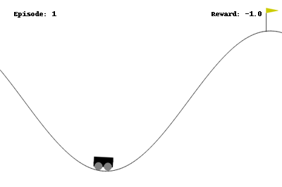
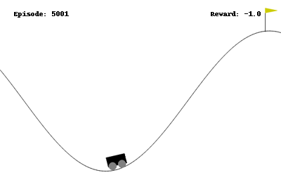
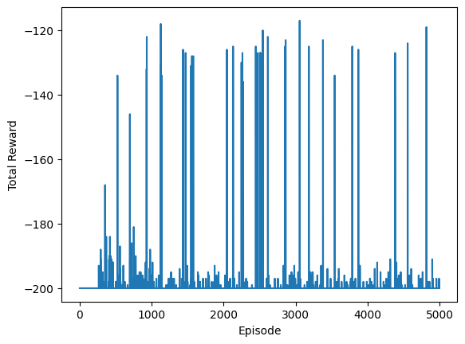
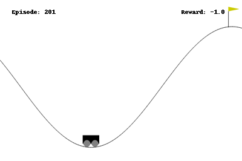
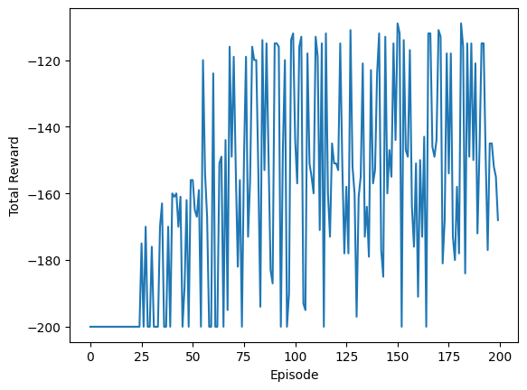

## Introduction

It's been a while since I made my last post on the reinforcement learning. Here's a brief recap: In the last post (check [here](https://www.statwizard.in/posts/q-learning/) if you haven't already), we learned about the Q-learning algorithm. Q-learning is a variant of the temporal difference learning, which tries to combine both the Monte Carlo type algorithm where you experience the rewards, and also the Dynamic Programming algorithms where you theoretically calculate the expected value of each state using recursion techniques. 

However, so far whatever we have discussed has a major drawback: It requires both the state space and the action spaces to be finite and discrete. This means, you can create a table of rows and columns; rows denoting each state and columns denoting each action you take, and in the cell of the table, you can keep updating the value of the state-action pair. Due to this, when solving the `acrobot` problem from [`OpenAI gym`](https://gymnasium.farama.org/content/basic_usage/), we had to discretize the state into buckets. This is often called *sparse encoding* of a continuous variable, more on this later.

For now, we will try to solve another reinforcement problem from the `gymnasium` package, called **Mountain Car**. The goal in this problem to move a car up into a mountain starting from the bottom of a valley, while the gravity works against the car pulling it downwards. At any point, there are two state variables available, the position of the car and the velocity of it. Based on this, the car has to determine whether to try to move to the left, or to the right, or do nothing and let gravity and the car's acceleration do the magic. The car is asked to move to $200$ turns, every turn gives a reward of $(-1)$ unless you reach the goal above the mountain top to get a reward of $0$. The goal thus becomes to reach the mountain top as fast as possible. You can read more about the environment [here](https://gymnasium.farama.org/environments/classic_control/mountain_car/). 

Here's a gif about an unlearned agent randomly trying to move left or right.



Unfortunately, the tabular methods (you should now be able to guess why it is called tabular! :sunglasses: ) discussed so far cannot handle this environment, since we have two continuous variables (velocity and position) as observations. Instead of the tables, we now need to learn a function approximation which takes in a state and action pair, and output the q-value for that pair.

$$
f: \mathcal{S} \times \mathcal{A} \rightarrow \mathbb{R};   \text{such that} f(s_t, a_t) = Q(s_t, a_t) 
$$

Since $Q(\cdot)$ is unknown, we usually take linear, polynomial, logistic functions, random forests or neural networks to approximate the Q-function, and all of these approximations work on the basis of finding some correct weights or parameters for that models. 


## Linear Approximation

### Representation

Let us look carefully that the Q-learning update step,

$$
Q_{new}(s_t, a_t) = Q_{old}(s_t, a_t) + \alpha (r_{t+1} + \gamma \max_{a} Q_{old}(s_{t+1}, a) - Q_{old}(s_t, a_t))
$$

which we can rewrite as 

$$
Q_{new}(s_t, a_t) = (1-\alpha)Q_{old}(s_t, a_t) + \alpha (r_{t+1} + \gamma \max_{a} Q_{old}(s_{t+1}, a))
$$

for some learning rate $\alpha$ and discount factor $\gamma$. This expression tells that the updated Q-value is simply a convex combination of the old Q-value and the target $(r_{t+1} + \gamma \max_{a} Q_{old}(s_{t+1}, a))$. Hence, every such step is taken such that the current Q-value moves a bit towards the target; and the ultimate goal is to make sure that the current Q-value matches with the target. If it matches for some $Q^\ast$, we will have 

$$
Q^\ast(s_t, a_t) = (r_{t+1} + \gamma \max_{a} Q^\ast(s_{t+1}, a))
$$

which is exactly same as the Bellman's optimality equation introduced earlier. See [here](https://www.statwizard.in/posts/markov-decision-process/) if you don't know what Bellman equation is.

Now consider a linear approximation to the Q-value. Hence, instead of creating a table, we consider the special form

$$
Q(s_t, a_t) = f(s_t, a_t; W) = \langle W(a_t), s_t \rangle = (W(a_t)_1 \times (s_t)_1 + W(a_t)_2 \times (s_t)_2 + \dots )
$$

where $W$ is an unknown weight. To see this for our Mountain car problem, imagine this:

$$
\begin{align*}
  Q((\text{position}, \text{velocity}), \text{left}) 
  & = w_{11} \times \text{position} + w_{12} \times \text{velocity}\\\\
  Q((\text{position}, \text{velocity}), \text{nothing}) 
  & = w_{21} \times \text{position} + w_{22} \times \text{velocity}\\\\
  Q((\text{position}, \text{velocity}), \text{right}) 
  & = w_{31} \times \text{position} + w_{32} \times \text{velocity}
\end{align*}
$$

where $w_{11}, \dots w_{32}$ are unknown weights which the agent will learn over time. We can also compactly write its form by collecting these weights together in rows,

$$
W = \begin{bmatrix}
  w_{11} & w_{12} \\\\
  w_{21} & w_{22} \\\\
  w_{31} & w_{32}
\end{bmatrix}
$$

and then a matrix multiplication between $W$ and the vector (postion, velocity) of the car will give us the Q-values for all 3 actions as once. Here's a python code that implements this idea.

```python
N_ACTION = 3
N_STATE_DIM = 2
W = np.zeros((N_ACTION, N_STATE_DIM))  # initialize all action with equal probability
EPSILON = 0.1   # 10% of the time it would explore
# this function implements the agent's behaviour
def agent(observation):
    if np.random.random() < EPSILON:
        return env.action_space.sample()  # randomly do an action
    else:
        state = np.array(observation).reshape(-1)
        qvals = W @ state
        return np.argmax(qvals)
```

### Learning the Weights

Now how do we actually learn the unknown weights? :mag: As mentioned before, we want the Q-value to be such that it satisfies the Bellman equation. So we want the error squared (i.e., the target minus the current Q-value difference squared),

$$
(f(s_t, a_t; w) - r_{t+1} - \gamma \max_{a} f(s_{t+1}, a; w))^2
$$

to be as small as possible (We take square to ensure negative errors also impacts positively). Since we want to minimize this error with respect to the weights $w$, and for that we can take the derivative of the error with respect to the weights $w$ and set its value equal to $0$. (You might want to see some refresher course in elementary differential calculus[^1].) The derivative of this error turns out to be

$$
\nabla \text{error} = 2 (f(s_t, a_t; w) - r_{t+1} - \gamma \max_{a} f(s_{t+1}, a; w)) \nabla f(s_t, a_t; w)
$$

Here, $\nabla f(s_t, a_t;w)$ denotes the gradient (or the derivative) of the function $f$ with special form. We will figure this out for the linear case in a bit. Since the derivative tells you the slope of the curve how the errors are changing, you actually need to go to the opposite direction of the slope to reduce the error. To see this, consider the case when $\nabla f(s_t, a_t; w)$ is positive (I know the pendantic math folks will scream :scream: here! but just bear with me for the sake of explanation). It means increasing $w$ will increase the value of $f(s_t, a_t; w)$. When $f(s_t, a_t; w)$ is more than the target, then error is positive, hence we would want to reduce the $f(s_t, a_t; w)$ and hence the weights $w$, which can be achieved by taking a step towards the negative of the above expression of gradient. On the other hand, if $f(s_t, a_t; w)$ is less than the target, then we want to increase $f(s_t, a_t; w)$ by increasing value of $w$, which can be again achieved by taking a step towards $-(f(s_t, a_t; w) - \text{target})$ which is positive, hence increases $w$. 

The case when $\nabla f(s_t, a_t; w) < 0$ can be explained similarly, you might want to ponder a little and convince yourself about it.

Finally, we can use the update rule;

$$
w_{new} = w_{old} - \alpha (f(s_t, a_t; w) - r_{t+1} - \gamma \max_{a} f(s_{t+1}, a; w)) \nabla f(s_t, a_t; w)
$$

This is often popularly known as the [**Gradient Descent** Method[^2]](https://en.wikipedia.org/wiki/Gradient_descent). This is often used as a general purpose optimization routine to minimize or maximize any differentiable function. For the linear function case in the Mountain Car problem, 

$$
f((\text{position}, \text{velocity}), a) = w_{a1} \times \text{position} + w_{a2} \times \text{velocity}
$$

and hence 

$$
\nabla f((\text{position}, \text{velocity}), a) = \begin{bmatrix}
  \text{position}\\\\
  \text{velocity}
\end{bmatrix} = \text{the state vector itself}
$$

So, here's a python code that implements this update step to train an agent for the Mountain Car problem. The code is pretty similar to what we did before, so you should be able to follow along.

```python
env = gym.make("MountainCar-v0")  # create the environment
N_EPISODE = 5000  # we do this many episodes
DISCOUNT_FACTOR = 1.0   # discount factor is 1 since this is an episodic task
LR = 0.01   # the learning rate
episode_rewards = np.zeros(N_EPISODE)   # an array to store the rewards history
for ep in range(N_EPISODE):
    # loop through the environment
    observation, info = env.reset()
    while True:
        state = np.array(observation).reshape(-1)
        action = agent(observation)   # get the action suggested by the agent's policy
        new_observation, reward, terminated, truncated, info = env.step(action)  # Do the action in the environment
        new_state = np.array(new_observation).reshape(-1)
        new_action = agent(new_observation)  # get the next suggested action as well
        target = reward + DISCOUNT_FACTOR * np.dot(W[new_action, :], new_state)      # now do the weight update
        W[action,:] += LR * (target - np.dot(W[action, :], state)) * state
        episode_rewards[ep] += reward   # add the rewards history
        if terminated or truncated:
            break
        observation = new_observation  # go to the next step
```

Most of this is standard that we have done before for the Q-learning case. However, you can see that the value of the target differs a bit here compared to the Q-learning, if you pay close attention to these lines.

```python
new_action = agent(new_observation)  # get the next suggested action as well
target = reward + DISCOUNT_FACTOR * np.dot(W[new_action, :], new_state)      # now do the weight update
```

Instead of taking the action with the maximum Q-value, it generates the action from the agent itself, and considers its Q-value as the target. This means now the update equation is

$$
Q_{new}(s_t, a_t) = (1-\alpha)Q_{old}(s_t, a_t) + \alpha (r_{t+1} + \gamma Q_{old}(s_{t+1}, a_{t+1}))
$$

Notice that $\max_a$ is replaced by $a_{t+1}$, to ensure a bit more exploration compared to Q-learning. This method is known as SARSA (State-Action Reward State-Action) in Reinforcement Learning Theory[^3]. 

Here's the trained agent after $5000$ episodes of learning.



Huh! :worried: Not very impressive! It is trying to move to the right and pull the car up, but the gravity is continually pulling it downwards. So, we need to do a bit more.



As you can see, the agent is sometimes reaching the goal (receiving higher rewards than $120$), but it is not continually improving.


## Nonlinear Encoding

So far, we have only two features as the observations from our environment; the postion and the velocity. If you know a bit about Newtonian mechanics, you would be able to guess that linear combination of position and velocity makes no sense, they have different units altogether. You might want to take squares, multiply with the mass of the car, adjust for the acceleration by gravity and do all kinds of stuffs. All these operations are nonlinear functions of position and the velocity; so the linear approximation that we considered as the beginning wont work.

However, we can extend the idea and consider something like this:

$$
f((\text{position}, \text{velocity}), a) = w_1 \times \text{position} + w_2 \times \text{position}^2 + w_3 \times \text{velocity} + w_4 \times \text{velocity}^2
$$

or take 

$$
f((\text{position}, \text{velocity}), a) = w_1 \times \text{position} + w_2 \times \text{position}^2 + w_3 \times \text{postion}^3 + w_4 \times \text{velocity} + \dots
$$

or take even higher powers. All of these are called encoding of the observation features. Once we encode and create these new variables (position, $\text{position}^2$, and so on), we can use the same technique described above to train an agent, but will much more nonlinear information.


### Sparse Encoding

Here's a brief review of sparse encoding. Let's say you are giving an exam, where you have a score between 0 to 100, but the course requires you to have a grade of B or above. This grade is basically a sparse encoding of the continuous marks that you have achieved.

<div class="w-full flex justify-center items-center mermaid">
flowchart TD
    S[Score] --> |More than 80| A
    S --> |Between 60 to 80| B
    S --> |Between 45 to 60| C
    S --> |Between 30 to 45| D
    S --> |Less than 30| E
</div>

This certainly helps, because your passing depends on the grade, not of the actual score. But it may not be the case always. For example, consider the problem when you want to determine if a person has some debt based on his / her earnings. Usually, people with very little money and people with very much money has lots of debt (clearly, for separate reasons, the first set for sustaining the survival needs and the second set for making more money, :smirk: ). However, most of the people in the middle class family usually fears debt a lot, and they have very less amount of debt. They take debts for buying a car or house, but that's about it. Now in this kind of situation, the output (whether they have a debt or not) is not a completely known function of their earning grade. In such cases, we need to move beyond sparse encoding.

### Kernel Encoding

In the sparse encoding, the basic idea is that close values of position and velocity should be encoded into the same bucket and hence would have the same action. This means, the RL agent would want to learn how similar two (position, velocity) pairs are from each other rather than the exact values of the position and velocity. To work with this idea, imagine that there is a nonlinear map $\phi$ that takes the input position and velocity and output some feature, and the quantity of interest is 

$$
\langle \phi(\text{position}_1, \text{velocity}_1),  \phi(\text{position}_2, \text{velocity}_2)\rangle 
= K((\text{position}_1, \text{velocity}_1), (\text{position}_2, \text{velocity}_2))
$$

where $K$ is some function that measures the similarity in the $\phi$-transformed space. Hence, rather than individually specifying $\phi$ explcitly, it is often enough to specify $K$ alone which can produce a nonlinear mapping from the observation features to a new set of features[^4]. The function $K$ is called a **kernel**.

### Solving the Mountain Car Problem[^5]

In our mountain car problem, we consider the Gaussian kernel 

$$
K(\boldsymbol{x}, \boldsymbol{y}) = \exp\left( -\dfrac{\Vert \boldsymbol{x} - \boldsymbol{y}\Vert^2}{2\sigma^2} \right)
$$

with different values of $\sigma^2$. Before passing to this Gaussian kernel, we also do a normalization step which will ensure that the observed position and the velocity has an average close to $0$ and a standard deviation close to $1$.

Here's the python code that implements this feature encoding.

```python
from sklearn.preprocessing import StandardScaler
from sklearn.pipeline import FeatureUnion
from sklearn.kernel_approximation import RBFSampler
# do normalization
observation_samples = np.array([env.observation_space.sample() for x in range(10_000)])
scaler = StandardScaler()
scaler.fit(observation_samples)
# Create radial basis function sampler to convert states to features for nonlinear function approx
featurizer = FeatureUnion([
        ("rbf1", RBFSampler(gamma=5.0, n_components=100)),
        ("rbf2", RBFSampler(gamma=2.0, n_components=100)),
        ("rbf3", RBFSampler(gamma=1.0, n_components=100)),
        ("rbf4", RBFSampler(gamma=0.5, n_components=100))
		])   # so each observation becomes transformed into a 400 dimensional vector
featurizer.fit(scaler.transform(observation_samples))
```

So now we have a whooping $400$ nonlinear features derived from only two variables, position and velocity. This might be a overkill, but let's see how it performs. Before that, I just want to indicate the lines that needs to be changed in the RL training for this.

This is the function that converts the position and velocity into 400 features.

```python
def get_obs_feature(observation):
  scaled = scaler.transform([observation])
  featurized = featurizer.transform(scaled)
  return featurized[0]
```

Now our weight matrix is a bit big.

```python
N_STATE_DIM = 400
W = np.zeros((N_ACTION, N_STATE_DIM))  # initialize all action with equal probability
```

In the training loop, we must have

```python
feature = get_obs_feature(observation)
new_feature = get_obs_feature(new_observation)
```

and the update statement changes as 

```python
target = reward + DISCOUNT_FACTOR * np.dot(W[new_action, :], new_feature)      # now do the weight update
W[action,:] += LR * (target - np.dot(W[action, :], feature)) * feature   # the gradient is now entire 400 dimensional feature vector
```

We just train it for $200$ episodes, and here's the result.



Cool! :sunglasses: Just using a bit of nonlinearity, we could train the RL agent much faster. 



And this shows that the RL agent is continually learning to increase its rewards, and learning how to reach the goal.


## Questions to think about

Here's a few questions to think about before my next post.

1. What if we use more complicated algorithms rather than linear algorithms. What about using deep neural networks?
 
2. How do we know what kind of encoding to use for which problem? 

We will explore and try to answer some of these questions in the next post of the Reinforcement Learning Series.


## References

[^1]: Paul's Online Math Notes. https://tutorial.math.lamar.edu/classes/calci/MinMaxValues.aspx.

[^2]: Gradient Descent Wikipedia Page. https://en.wikipedia.org/wiki/Gradient_descent.

[^3]: Sutton, R. S., Barto, A. G. (2018). [Reinforcement Learning: An Introduction.](https://www.google.co.in/books/edition/Reinforcement_Learning_second_edition/sWV0DwAAQBAJ?hl=en) United Kingdom: MIT Press.

[^4]: Sklearn Kernel Methods User Guide. https://scikit-learn.org/stable/modules/kernel_approximation.html#rbf-kernel-approx.

[^5]: Mountain Car SARSA - SamKirkiles' Github. https://github.com/SamKirkiles/mountain-car-SARSA-AC/tree/master.