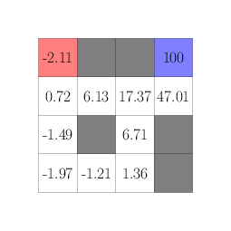
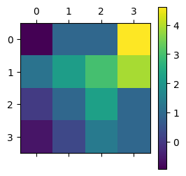
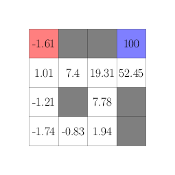
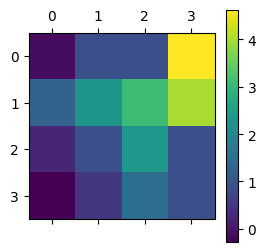

## Introduction

In my previous post (check [here](https://www.statwizard.in/posts/k-arm-bandit-2/) if you haven't already), we ended up with a question about how to formally express a reinforcement learning problem, and how should it be represented when the underlying of the system (i.e., the slot machine) itself is changing based on the arm you are choosing. The solution is given by **Markov Decision Process**. 


### Markov Decision Process (MDP)

Before defining what a Markov Decision Process (MDP) is, let us try to summarize the process the reinforcement learning happens, along with the components involved in the process. There are mainly two major components: An environment (for the $k$-arm bandit problem, it is the slot machine) and an agent (the gambler who wants to pull the arm and win rewards). These two components act in the following way:

1. The environment has a state $S_t$ at time $t$, which basically is an abstract representation of the environment features that are useful to the problem of learning. For instance, when you are playing chess or any board game, the state is the positions of all the chess pieces on the board. When you are playing pinball, the state is the values of all the pixels on the computer screen. When you are driving to the airport and you want to find out which road requires minimal time, the state could be the traffic and weather conditions.

<div class="w-full flex justify-center items-center mermaid">
    graph RL
    B[Environment] --> |Measures current state S<sub>t</sub>| A[RL Agent]
</div>

2. Given this state $S_t$ (which are kind of measurable features of the environment as measured by the agent), the agent tries to take one of the possible action $A_t$ at time $t$, which is an element of the action space $\mathcal{A}$. Basically this means, once you see the chess position, you have a set of valid moves that you can play with. For the pinball game, there are only two valid actions at every state: lifting the left flipper or the right flipper. For driving to the airport example, your action is limited to the roads that you can take at every crossing you encounter.


<div class="w-full flex justify-center items-center mermaid">
    graph LR
    A[RL Agent] --> |Action a<sub>t</sub>| B[Environment]
    B --> |Measures current state S<sub>t</sub>| A
</div>

3. Given this action $A_t$ acted on the environment, the environment spits out a reward $R_{t+1}$ to the agent and its transforms to new state $S_{t+1}$. The agent's objective will be to maximize these rewards over time (both over short and long term, we will get to that shortly). In the chess playing, the reward is +1 when you win, (-1) if you lose the game and 0 for everything else. For the pinball game also we can define a similar reward, adding to the reward whenever the ball bounces of an obstacle. For the driving scenario, every mile you drive more if going to cost some fuel which can essentially be thought of a negative reward.


<div class="w-full flex justify-center items-center mermaid">
    graph LR
    A[RL Agent] --> |Action a<sub>t</sub>| B[Environment]
    B --> |Measures current state S<sub>t</sub>| A
    B --> |New state S<sub>t+1</sub><br/>Current reward R<sub>t+1</sub>| A
</div>


> Now a MDP is a decision process as above with an additional Markovian property that the states $S_t$ contain all necessary properties of the environment that an agent needs to take an action, the knowledge of the entire history of the states $S_0, S_1, \dots S_{t-1}, S_t$ does not provide any additional benefit.

In terms of probability, these can be written as 
$$
\begin{align*}
    P(A_{t+1} \mid S_t) & = P(A_{t+1} \mid S_t, S_{t-1}, S_{t-2}, \dots ),\\\\
    P(S_{t+1}, R_{t+1} \mid A_t, S_t) & = P(S_{t+1}, R_{t+1} \mid A_t, S_t, A_{t-1}, S_{t-1}, \dots),
\end{align*}
$$
for all kinds of RL agent that we are going to look at. 

### The Objective of the RL Agent

The primary goal of a reinforcement learning (RL) agent is to learn a policy that maximize the reward over time (Surely, this is a capitalistic world!). Now, maximizing rewards over time can have two contrasting viewpoint: 

1. The RL agent tries to look for the short term gain and get instant gratification by maximizing its immediate rewards. This is essentially what we would do for the driving example, taking the shortcut road every now and then.

2. The RL agent can also be designed in a way to maximize gains over a very long horizon, essentially delaying gratification by waiting for the right opportunity or building success over time. For instance, a chess grandmaster would do this by thinking 10-20 moves ahead.

To represent both of these paradigms properly, we can use a trick from Finance, namely discounting future values by the inflation rate to obtain a [present value](https://en.wikipedia.org/wiki/Present_value). We define **Gain** at time $t$ as
$$
G_t = R_{t+1} + \gamma R_{t+2} + \gamma^2 R_{t+3} + \dots 
$$
where $\gamma \in [0, 1]$ is a discounting factor. Now, if you want a very long term view, you can modify $\gamma$ to be very close to 1, on the other hand, if you want the RL agent to take a short term view, you would want $\gamma$ to be near zero or zero. 

Therefore, instead of focusing on maximizing rewards, the RL agent would aim to maximize the gain $G_t$ for every time step $t$, and would take the action $a$ that has the maximum possible gain.


### Standard Terminologies


Before diving deeper into the Markov Decision Process, let's clarify some standard terminologies commonly used in reinforcement learning:[^1]

* State Space ($\mathcal{S}$): The set of all possible states that the environment can be in. States encapsulate all relevant information needed for decision making.

* Action Space ($\mathcal{A}$): The set of all possible actions that the agent can take. The choice of action at a certain state influences the subsequent state and the received reward.

* Policy ($\pi$): A policy is a strategy or decision-making function that maps states to actions. It defines the agent's behavior in the environment. A policy can be deterministic or stochastic. So you can think of $\pi$ as a collection of conditional probability distributions on the action space $\mathcal{A}$ given the current state $s$, for all $s \in \mathcal{S}$. 

* Transition Dynamics ($P$): The probability distribution over next states and rewards given the current state and action. It characterizes how the environment responds to the agent's actions. Basically, it is the probability distribution over the new state and reward pair $(S_{t+1}, R_{t+1})$ conditional on the current state of the environment $S_t$ and the RL agent's action $A_t$.


* Value Function ($V^\pi$): The expected gain starting from a particular state and following a specific policy $\pi$. It represents how good it is for the agent to be in a certain state under the policy $\pi$. It is mathematically described as $V^\pi(s) = E_{\pi}(G_t \mid S_t = s)$ where $E(\cdot)$ denotes expectation operator.

* Quality Function or popularly known as Q-Function ($Q^\pi$): Similar to the value function, but it takes both a state and an action as inputs. It represents the expected cumulative return starting from a certain state, taking a specific action, and then following policy $\pi$. It is mathematically described as $Q^\pi(s, a) = E_{\pi}(G_t \mid S_t = s, A_t = a)$.


## Making a Better Decision

Now that we are aware of the basic terminologies in the world of Markov Decision Processes, we can formalize the aim of an agent through concrete concepts. 

The RL agent wants to maximize its returns on both short term and the long term, means to increase its gains over time. However, gain $G_t$ is a stochastic quantity, meaning that it can be random due to the random reactions of the environment through its transition dynamics. The straightforward choice is to consider the expected gain $E(G_t)$, and trying to maximize that. But $E(G_t)$ has a name, the value function, which is a map from the state space to real numbers. Some states are basically more rewards, hence has more value and other states are less rewarding. The RL agent would always try to take actions that makes it move from a less rewarding state to a more rewarding state, thus increasing its chances to obtain a greater gain. 

Let us try to understand this in the context of a chess gameplay. You, (say the RL agent), want to win the game. So, one possible strategy you can take is that starting from the 50/50-chance at the beginning of the game, for every move that you take you try to increase your winning chances. But, how your opponent plays is not in your control, so it is very difficult to determine your winning chances at some particular chess position (call it $P_0$). Now think of a situation, where you played $100$ average chess players, all games starting from $P_0$ and you win $82$ of these games. Then it is quite easy for you to say, that particular chess position $P_0$ has a value of $0.82$, as you won $82\%$ of the time. Now imagine you have such data on every possible chess positions that can ever occur, then Congratulations! you have cracked a formulae for winning every chess game out there, as every move you take, you can try to create a chess position which is favourable to you. However, it turns out you cannot do this for chess (since the number of possible chess positions can be huge, about $10^{120}$, check out Shannon number for details[^2]), so we have some approximations to work with, which I will cover in upcoming blog posts.


Therefore, one of the fundamental thing for an RL agent to improve its action is to known where it stands, by basically estimating the value function (i.e., the expected gain) for its current policy (read for its current strategy).

### Example Game

Here, we shall see how an RL agent can try to estimate the value function. For that, we will use the following example game, which is like a maze game within a $4\times 4$ grid. The mission is to start on the top left corner (shown in <span class="text-red-500">Red</span> below) and reach the top right corner (shown in <span class="text-blue-500">Blue</span> below), but there are some obstacles (shown in Gray) along the way. The state is the agent's current position in the grid, and at any point, it can move up, down, left or right. Every move it makes gives no reward normally, unless it reaches the end when it gets a reward of $5$ and hitting any obstacle gives a reward of $(-1)$. 


Let us try to code this environment in `python`, which takes the current state $S_t$ and the action $A_t$, and returns the new state $S_{t+1}$ and the immediate reward $R_{t+1}$. 

```python
def gridworld_maze(cur_state, action):
  x, y = cur_state
  assert action in ["up", "down", "left", "right"]
  if action == "up":
    new_state = (x, y + 1)
  elif action == "down":
    new_state = (x, y - 1)
  elif action == "left":
    new_state = (x - 1, y)
  else:
    new_state = (x + 1, y)
  # bottom left corner is (0, 0), top right corner is (3, 3)
  if new_state[0] < 0 or new_state[0] > 3 or new_state[1] < 0 or new_state[1] > 3:
    # it is out of bounds
    return (cur_state, -1)   # reward is -1
  elif new_state in [(1, 3), (2, 3), (1, 1), (3, 0), (3, 1)]:
    # it is hitting obstacles
    return (cur_state, -1)
  elif new_state == (3, 3):
    # reached the end goal
    return (new_state, 100)
  else:
    return (new_state, 0)  # just a valid move
```

Now assume that the RL agent behaves randomly. That is, at any state $S_t$, it randomly picks any of the $4$ action, going up or down or left or right. We wish to obtain an estimate of the value function of different states, assuming that the RL agent follows this random policy. Essentially this means to find out which squares in the maze are more important (or closer) to reach the goal when the RL agent is only doing exploration by trying all possible actions.


### Monte Carlo - Accumulation of Experiences

Now to obtain an estimate of the value function $v_\pi(s)$, one simple way is to let the agent play a lot of these maze games and see how much rewards it can accumulate from these games, starting from which states. We can follow these steps:

1. Say the agent plays the game for $1000$ times.

2. At each game, once the game is over, we see a path $S_0, R_1, S_1, \dots R_T, S_T$. Here, $S_T$ is the end goal at the top right corner.

3. Calculate the gains starting from a state along these paths. For example, call $G(S_0) = R_1 + \gamma R_2 + \gamma^2 R_3 + \dots$, $G(S_1) = R_2 + \gamma R_3 + \dots$, and so on.

4. If there are repeatations in $S_0, S_1, \dots S_T$, then the corresponding gain is taken to be the average of all the repeated gains. For example, say $S_{10}$ is the bottom left corner, and then circling around the obstacles, the agent again comes back to the bottom left corner as $S_{20}$. Then, the gain for the bottom left corner is taken to be $(G(S_{10}) + G(S_{20})) / 2$. 

5. Finally, by repeating this process for each game, we have a list of gains for each state coming from different games. We can average these gains out and get an approximate value for each state.

We implement this strategy to get an estimate of the value function in the following code. However, to make it more efficient, instead of keeping a list of gains to average out, we keep a counter and the current value of the average and incrementally update the average after every round / episode / game.

```python
B = 5000 # run 5000 games
gamma = 0.9   # discount factor
val_ests = np.zeros((4, 4))
val_counts = np.zeros((4, 4))
for b in range(B):
  # simulate the actions
  cur_state = (0, 3)  # the starting state
  niter = 0
  visits = []
  while cur_state != (3, 3) and niter < 1000:
    niter += 1
    action = ["up", "down", "left", "right"][np.random.randint(4)]
    cur_state, reward = gridworld_maze(cur_state, action)
    visits.append((cur_state, reward))
  # end of episode, now we backoff and revise the value function estimates
  gain = 0
  for (cur_state, reward) in visits[::-1]:
    gain = reward + gamma * gain
    x, y = cur_state
    val_ests[x, y] = (val_ests[x, y] * val_counts[x, y] + gain) / (1 + val_counts[x, y])  # update the estimated value
    val_counts[x, y] += 1   # update the visited count
```

The resulting value estimates turn out to be as follows.

<div class="flex gap-4 justify-center items-center flex-wrap">
    
    
</div>

If you see now the heatmap generated from the value estimates, it clearly shows the shortest path the agent needs to take in the maze, just follow along the lighter shades. Hence, just by estimating the value itself, the agent knows how to find a good policy to solve the game.


### Bellman Equation - Fixed point iteration

The previous strategy we used require use to simulate the experiences of playing the game itself, and then accumulate those experiences to get a good value estimate. In constrast, if we know the dynamics of the environment completely (i.e., which action triggers which state and rewards), we can theoretically come up with a formula for estimating the value function. 

Here's how we do this.

$$
\begin{align}
    v^\pi(s) 
    & = \sum_{a \in \mathcal{A}} \pi(a \mid s) E(G_t \mid S_t = s, A_t = a),\\\\
    & \text{we rewrite the value in terms of policy probabilities and conditional gains for an action}\\\\
    & = \sum_{a \in \mathcal{A}} \pi(a \mid s) \sum_{s' \in \mathcal{S}} p(s' \mid s, a) E(G_t \mid S_t = s, A_t = a, S_{t+1} = s'),\\\\
    & \text{we now do a further conditioning over the next state and introduce the transition dynamics}\\\\
    & = \sum_{a \in \mathcal{A}} \pi(a \mid s) \sum_{s' \in \mathcal{S}} p(s' \mid s, a) E(R_{t+1} + \gamma G_{t+1} \mid S_t = s, A_t = a, S_{t+1} = s')\\\\
    & \text{since, } G_t = R_{t+1} + \gamma R_{t+2} + \gamma^2 R_{t+3} + \dots = R_{t+1} + \gamma G_{t+1}\\\\
    & = \sum_{a \in \mathcal{A}} \pi(a \mid s) \sum_{s' \in \mathcal{S}} p(s' \mid s, a) \left( R_{t+1} + \gamma E(G_{t+1} \mid S_{t+1} = s') \right)  \\\\
    & \text{here, we use the markov property}\\\\
    & = \sum_{a \in \mathcal{A}} \pi(a \mid s) \sum_{s' \in \mathcal{S}} p(s' \mid s, a) \left( R_{t+1} + \gamma v^{\pi}(s') \right)
\end{align}
$$

This equation is called **Bellman Equation**[^3].

Therefore, one way to estimate the value function is to start with some initial estimate of the value function. Then use the right hand side of the above equation to get a better estimate, and then iterate this process over and over unless we reach a stable estimate of the value function. Note that, you need to have the policy distribution $\pi(a \mid s)$ and the transition dynamics $p(s'\mid s, a)$ for this strategy to work. Fortunately, we have both of them available since we know the game exactly and know how the environment will respond.


```python
gamma = 0.9   # discount factor
val_ests = np.zeros((4, 4))
# for obstacles and terminal state, the value is known
for x, y in [(1, 3), (2, 3), (1, 1), (3, 0), (3, 1)]:
  val_ests[x, y] = 0
val_ests[3, 3] = 100  # end goal value is 100
err = 1e9
niter = 0
while True:
  new_val_ests = np.zeros((4, 4))
  # loop through all states and see how the environment will respond
  for cur_x in range(4):
    for cur_y in range(4):
      if (cur_x, cur_y) in [(1, 3), (2, 3), (1, 1), (3, 0), (3, 1), (3, 3)]:
        continue
      # for all states except end and obstacles, take the all 4 actions
      action_vals = {}
      for action in ["up", "down", "left", "right"]:
        new_state, reward = gridworld_maze((cur_x, cur_y), action)
        action_vals[action] = reward + gamma * val_ests[new_state[0], new_state[1]]
      new_val_ests[cur_x, cur_y] = np.mean([action_vals[k] for k in action_vals])
  err = np.sum((new_val_ests - val_ests) ** 2)**0.5   # see the RMSE
  niter += 1
  if err < 1e-5 or niter > 500:
    break
  else:
    val_ests = new_val_ests.copy()
# finally update the value at the obstacles and the end goal
for x, y in [(1, 3), (2, 3), (1, 1), (3, 0), (3, 1)]:
  val_ests[x, y] = 0
val_ests[3, 3] = 100  # end goal value is 100
```

The resulting value estimates turn out to be as follows.

<div class="flex gap-4 justify-center items-center flex-wrap">
    
    
</div>

Notice that, the heatplot is very similar to the one for the Monte Carlo estimates, and it also demonstrates the optimal path to solve the maze game.

This particular method is often called **Value Estimation** using Dynamic Programming in Reinforcement Learning literature.


### Why value estimates are different?

So we estimated the values using two different method: accumulating experiences through Monte Carlo method, and iterative computation of Bellman equation. Although both shows the same path, the resulting value estimates are slightly different. So, which one is correct?

Turns out the Monte Carlo estimate is correct in this case. The Bellman equation uses on crucial fact that,

$$
G_t = R_{t+1} + \gamma G_{t+1}
$$

Now this only holds if there are infinite number of moves in the game and there is no end of the game, it continues even after the game ends. But in our maze example, the game ends when the agent reaches the top right corner (the blue corner) which makes it a terminal state. Hence, the above relation is only approximately true in this case.

On the other hand, the Monte Carlo method requires a terminating state, otherwise you cannot perform the accumulation step where you refine the value estimates. So, here are the key differences between above two methods.

| Monte Carlo Method | Bellman Equation Iteration (Dynamic Programming) |
| ----- | ----- |
| Works only where the game is finite, there is a terminal state | Works only when the game is infinite with no terminal state |
| Does not require knowledge of transition dynamics | Require knowledge of transition dynamics |
| Need to play / simulate lots of experiences which visits all states at least once | Does not require any simulation | 


Here are some questions to think about before my next post.

1. What kind of games would have no terminal state? Even if it is not a game, try to think of some situation where you can apply RL.

2. Often you don't know how your opponent / environment will behave if it is a two player or multi-player game. Then, can you combine Monte Carlo with Bellman equation to create an algorithm that works even for infinite games?

3. How to get an optimal or best policy if there are many actions which improves the value of the current state?


## References 

[^1]: Sutton, R. S., Barto, A. G. (2018). [Reinforcement Learning: An Introduction.](https://www.google.co.in/books/edition/Reinforcement_Learning_second_edition/sWV0DwAAQBAJ?hl=en) United Kingdom: MIT Press.

[^2]: https://en.wikipedia.org/wiki/Shannon_number

[^3]: https://en.wikipedia.org/wiki/Bellman_equation