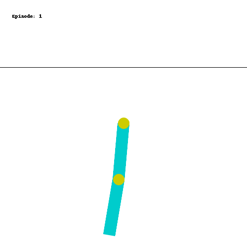
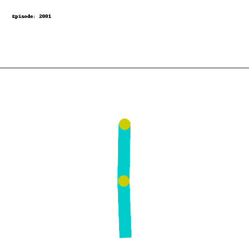
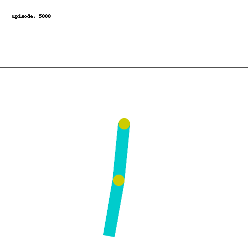
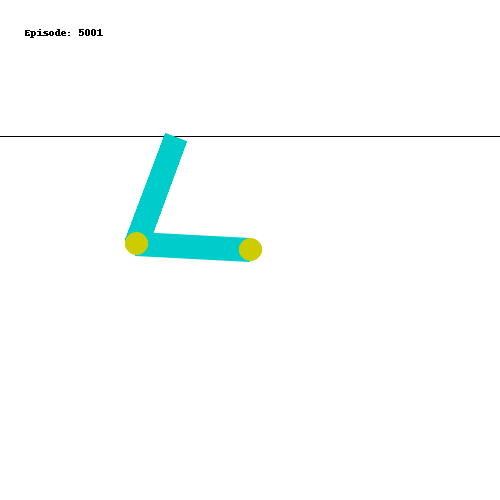
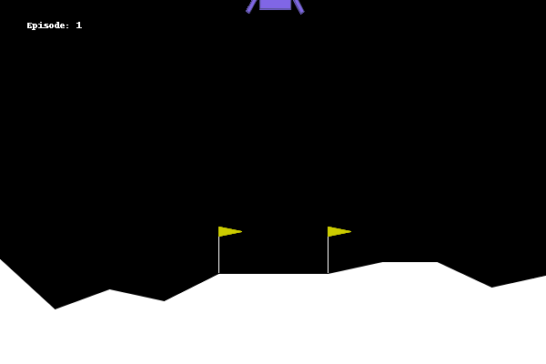
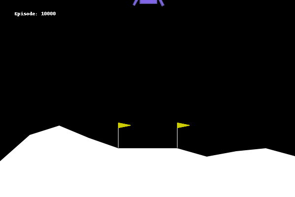
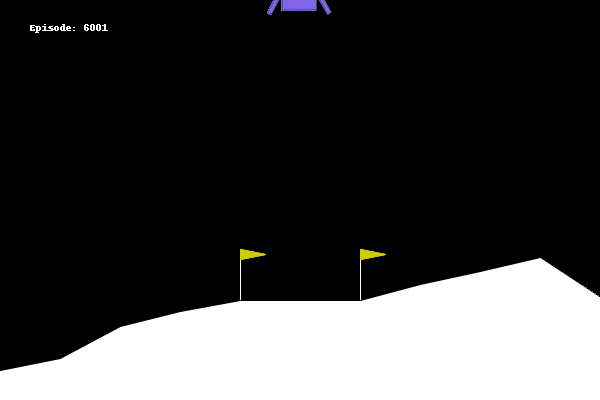
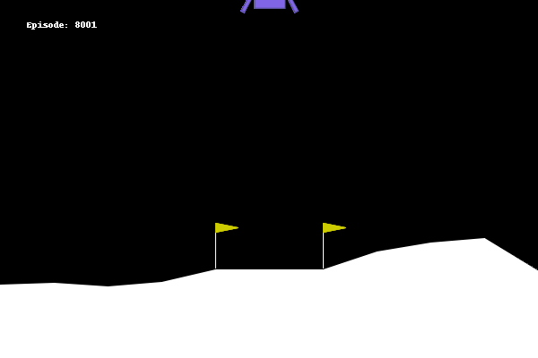

## Introduction

In my previous post (check [here](https://www.statwizard.in/posts/td-algorithms/) if you haven't already), we learned how we can use different algorithms to estimate the value function of a markov decision process. If you are not familiar with these concepts / terminologies, I recommend to check out my other posts on the same topic. In this post, we shall finally take a look at how we can use the value estimates to know which actions to take, and how we can find out optimal policies in a reinforcement learning system.

So far, we have seen that given a policy $\pi$, it is possible to use different algorithms to get an estimate of the value function of the policy $\pi$, which will tell us how valuable each state is. We learned about the methods as:

1. Dynamic Programming with Bellman equation.
2. Monte Carlo algorithm.
3. Temporal Different learning algorithms.

We applied all of these methods for our maze game, and estimated the value function under the policy of random movement (i.e., all four directions are picked with equal probability). Also, I have indicated before that at every state, if we just keep taking some action that improves the value of the state, we can reach the end goal for this scenario. However, in general, this procedure can get stuck in a local optimum. Imagine that you have estimates on how much traffic will be in different roads while commuting to your work, so you accordingly choose a particular road. But may be, there is some construction work going on that road, due to which the best possible road that you have in mind is actually sub-optimal.


## Optimal Policy Finding

However, to find an optimal policy, we can follow this principle and try to estimate the Q-function (quality function) instead of the value function for every state-action pair. That means,

1. For the dynamic programming, you can use the Bellman equation of expressing $Q(s, a)$ as a sum over its next state-action Q-values.

2. For Monte Carlo algorithms, we keep track of rewards and gains grouped by the state-action pairs instead of grouping by states only.

3. For temporal difference algorithms, we update $Q(s, a)$ as 
$$
Q^\pi_{new}(S_t, A_t) = Q^\pi_{old}(S_t, A_t) + \alpha \left( R_{t+1}(A_t) + \gamma \sum_{a \in A} \pi(a \mid S_{t+1}) Q^\pi_{old}(S_{t+1}, A_{t+1} = a) - Q^\pi_{old}(S_t, A_t) \right)
$$
which is very similar to the TD iteration rule that we have seen before.

So, lets say for a policy $\pi$, we have an estimate of Q-value function $Q^\pi(s, a)$. Then, based on the above principle, we can choose the action $a$ which has the highest Q-value given state $s$.

In particular,

$$
\pi_{new}(a \mid s) = \begin{cases}
    1 & \text{ if } a = \arg\max_{a \in A} Q^\pi(s, a)\\\\
    0 & \text{ otherwise}
\end{cases}
$$

Naturally, this new policy $\pi_{new}$ is called a greedy with respect to the Q-function. Since $\pi_{new}$ is a new policy, the Q-function for this new policy will also change. Using the learning techniques, we can obtain its Q-function estimate, and then again from that Q-function, we can take the greedy approach. We can repeat these two steps **Policy Evaluation** (Q-function estimation) and **Policy Improvement** (Improving the policy by taking greedy action with respect to current Q-function estimate), until we reach a halt. At that time, we have found a policy which is doing its best according to its own value function, and hence it cannot be improved further. Thus, it becomes an optimal policy.

<div class="w-full flex justify-center items-center mermaid">
    graph LR
    E1[$\pi_0$] --> |PE| E2["$Q_{\pi_0}(s, a)$"] --> |PI| E3[$\pi_1$] --> |PE| E4["$Q_{\pi_1}(s, a)$"] --> |PI| E5[$\pi_2$] --> |PE| E6["$\dots$"]
</div>

This approach to finding the optimal policy is called **Policy iteration**.

## Q-Learning

Q-Learning is a fundamental reinforcement learning algorithm that plays a pivotal role in finding optimal policies for Markov decision processes (MDPs). It's a powerful and widely used technique because it combines the benefits of both model-free and off-policy learning. Now, before delving further, let us understand these two key terms: *model-free* and *off-policy learning*. 

* Model Free: It is basically some kind of learning algorithm which can accumulate experience and use that to estimate the value, as opposed to the Dynamic programming which requires the model of the environment in terms of state-transition probabilties. Examples would be the Monte-Carlo method. 

* Off-Policy Learning: In this kind of learning, you learn the value estimates of a different policy which can in turn tell you how to improve your current policy. That is, the policy evaluation step and the policy improvement steps run on different policies, but they still provides correct optimal policy.

To understand it, notice that in the TD-learning, we do the iteration with a target value of
$$
R_{t+1}(A_t) + \gamma \sum_{a \in A} \pi(a \mid S_{t+1}) Q^\pi_{old}(S_{t+1}, A_{t+1} = a)
$$
which tells that all the actions coming from policy $\pi$ has an effect on the current action-value estimates. However, ideally you would want to only that the action that maximizes your Q-function. So, we can revise the target like
$$
R_{t+1}(A_t) + \gamma \max_{a \in A} Q^\pi_{old}(S_{t+1}, A_{t+1} = a)
$$

Notice now that we don't need to rely on the current policy $\pi$ anymore, hence this becomes an off-policy learning. This is the basis of Q-learning. Since the entire algorithm relies on only the quality function (or the action value function), the algorithm was named Q-learning. Now we summarize the broad steps for performing Q-learning.

1. Maintain $Q(s, a)$ values for each state $s$ and each action $a$. Start with some random initial values.
2. For each step of the iteration $t = 0, 1, 2, \dots$ (it could be each action you take in multiple episodes), update $Q$ values using

$$
Q_{new}(S_t, A_t) = Q_{old}(S_t, A_t) + \alpha \left( R_{t+1} + \gamma \max_{a \in A}Q_{old}(S_t, a) - Q_{old}(S_t, A_t) \right)
$$

3. Finally, output the optimal policy as $\pi^\ast$ as the policy which takes action $a = \arg\max_{a \in A}Q(S_t, a)$ at state $S_t$.

## Q-Learning in action

Now, we shall try to implement this Q-learning algorithm in an actual reinforcement learning game. For that, we shall be using the `gymnasium` package, which is the evolved version of the old `gym` package developed by openai. [Here](https://gymnasium.farama.org/content/basic_usage/) is the package documentation where you can find lots of different game environments which you can use to see if a reinforcement learning works properly or not.

We start by importing the package and creating the game environment we are going to use.

```python
import gymnasium as gym
env = gym.make("Acrobot-v1", render_mode = "rgb_array")
```

Each environment describes a game. The setup of the game of `Acrobot-v1` is as follows: There are two chain links hanging from a point, tied together, and each of the link can freely move within the reasonable bound of physical system. The objective is to apply force to the joint of these two links to ensure that the link touches a line above a certain height from the chain.



The observation space or the state for this game consists of some properties like linear and angular velocity of the chains and stuffs, (very complicated physics for me!), so we are just going to assume that it is simply a vector. There are only 3 possible actions at every time, push the joint to the left or to the right or do nothing. 

While we take some random actions, you can see that the chain links just moves erratically and it does not achieve the objective. So, let us apply Q-learning and see whether we can make the agent learn to solve this game.

Before we do that, since the state is continuous, it is difficult to apply Q-learning right away, since we need to maintain a (state, action) pair table to store the Q-values. So, we discretize the entire state space into $10^6$ boxes, namely $10$ grid boxes for each coordinate of the $6$ dimensional state vector. The following python function is doing that.

```python
import numpy as np  
N_STEPS = 10  # number of steps / grids on each coordinate
obs_space_high = np.array(env.observation_space.high)
obs_space_low = np.array(env.observation_space.low)
# function to convert state vector to discrete state
def convert_observation_to_state(observation):
    obs = np.array(observation)
    state = np.floor((obs - obs_space_low) / (obs_space_high - obs_space_low) * N_STEPS)
    return state.astype('int').clip(0, N_STEPS-1)
```
Now that we have a function to convert the continuous states to discretized state vector, we shall write a class which represents the Acrobot playing RL agent. It shall have 2 functions, one for taking an action given the state and another for updating its Q-values.


```python
# So we are going to create a class which will represent the learning agent
class AcrobotAgent:
    def __init__(self, lr, gamma = 0.95):
        q_shape = (N_STEPS, ) * env.observation_space.shape[0] + (env.action_space.n, )
        self.q_vals = np.zeros(q_shape)
        self.lr = lr
        self.gamma = gamma
```

The first function will be the function to get the action with the maximum Q-value. This is the Policy improvement step.

```python
def get_action(self, observation):
    state = convert_observation_to_state(observation)
    return self.q_vals[(*state, slice(None))].argmax()
```

The second function will be the one which updates the Q-values according to the Q-learning equation described above.

```python
def update(self, obs, action, reward, terminated, next_obs):
    state = convert_observation_to_state(obs)
    next_state = convert_observation_to_state(next_obs)
    target = reward + (not terminated) * self.gamma * self.q_vals[(*next_state, slice(None))].max()
    temporal_diff = (target - self.q_vals[(*state, action)])
    self.q_vals[(*state, action)] += self.lr * temporal_diff
```

Now, we will try these Q-learning method on the Acrobot game for $5000$ episodes, with a learning rate of $0.01$. 

```python
learning_rate = 0.01
n_episodes = 5000
agent = AcrobotAgent(learning_rate)
# now, perform many episodes
for episode in range(n_episodes):
    obs, info = env.reset()   # start from at rest position
    done = False
    # play a single episode
    while not done:
        action = agent.get_action(obs)
        next_obs, reward, terminated, truncated, info = env.step(action)
        # update the agent's q-value estimates
        agent.update(obs, action, reward, terminated, next_obs)
        done = terminated or truncated  # check if episode reached a terminating state
        obs = next_obs
```

Once we perform these 2000 episodes, we try to save the agent's behaviour on a new episode and record that as a GIF image.




It looks like the agent is not learning anything. Wonder why is that? The behaviour still looks very random.

The reason is that only a very specific set of actions will lead to the correct goal. So, most of the time, the agent is not able to get any reward. Hence from the initial time itself, the Q-values are not updating much and staying at their initial values only.

Instead we can do the decaying $\epsilon$-greedy type strategy that we explored in the first post (Check [here](https://www.statwizard.in/posts/k-arm-bandit/) if you have not already). Because in the initial episodes, we will be spending much time exploring the consequences of different actions, it is more likely to hit the target a few times and the rewards would propagate through the Q-values appropriately. As the episodes increases, we shall try to decrease the $\epsilon$ to reduce exploration.

So, here's the few modifications we need to do. The new get action function:

```python
def get_action(self, observation):
    state = self.convert_observation_to_state(observation)
    if np.random.random() < self.eps:
        return env.action_space.sample()
    else:
        return self.q_vals[(*state, slice(None))].argmax()
```

The new decay episilon function which reduces the episilon after every episode.

```python
def decay_epsilon(self):
    self.eps = max(self.final_eps, self.eps - self.eps_decay)
```

and finally in the learning loop we would have

```python
start_epsilon = 1.0
epsilon_decay = start_epsilon / (n_episodes / 2)  # reduce the exploration over time
final_epsilon = 0.01
agent = AcrobotAgent(learning_rate)
# now, perform many episodes
for episode in range(n_episodes):
    obs, info = env.reset()   # start from at rest position
    done = False
    # play a single episode
    while not done:
        action = agent.get_action(obs)
        next_obs, reward, terminated, truncated, info = env.step(action)
        # update the agent's q-value estimates
        agent.update(obs, action, reward, terminated, next_obs)
        done = terminated or truncated  # check if episode reached a terminating state
        obs = next_obs
    agent.decay_epsilon()
```

Now that we are exploring a bit at the beginning, we do $5000$ episodes, and after that the result becomes very promising.




It is a bit hard to see that the chain link is touching the target line. Here's the final frame.




## Q-Learning for Moon Landing?

Next, we will try the same method for the lunar landing enviroment present in the `gymnasium` package. It contains several continuous state related information as before, and making 4 actions: fire the left engine, fire the right engine, fire the main engine or do nothing.

Here's how the environment looks in action.



We try the same thing as we did for the acrobot game. We discretize the state space, and apply Q-learning algorithm to train an RL agent. After $10000$ episodes, this is the result.



Looks like it is failing pretty much. In between we have a few decent episodes though!


