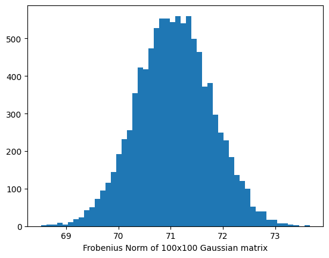
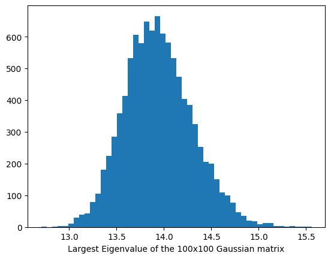
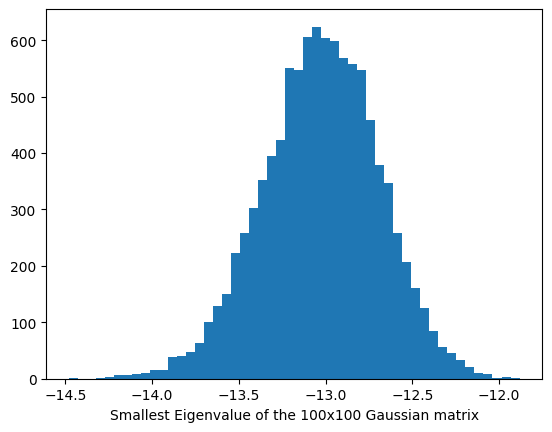
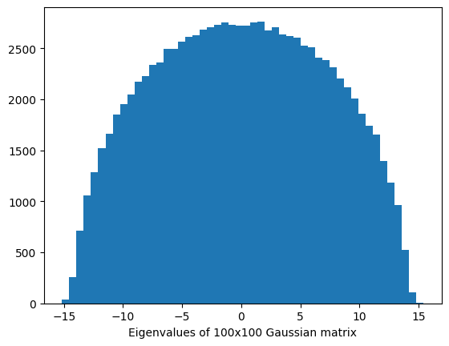
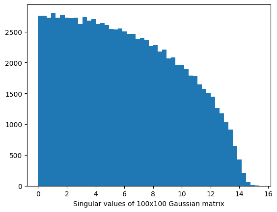

## Introduction

In asymptotic theory of probability, possibly the two most popular results are the Law of Large Numbers (LLN) and the Central Limit Theorem (CLT), which has numerous applications in statistics, in particular, a very prominent one in establishing asymptotic theory of an estimator. Let us briefly recap what these results essentially states.

### Law of Large Numbers (LLN)

Let $X_1, X_2, \dots X_n$ be a sequence of random variables. Let us also assume that each of these $X_i$s have finite expectation, i.e., $\mathbb{E}(|X_i|) \leq \infty$. We also assume that these $X_i$s are independently distributed and $\mathbb{E}(X_i) = \mu$ for each $i = 1, 2, \dots n$. Then, the sample average of these random variables satisfy
$$
\dfrac{X_1 + \dots + X_n}{n} \rightarrow \mu
$$
as $n \rightarrow \infty$. The above convergence can be made in probability or in almost sure sense, in which cases the resulting theorem is called as Weak Law of Large Numbers (WLLN) and Strong Law of Large Numbers (SLLN) respectively. You can learn more about the different notions of probabilistic convergence here[^2].

The result can be generalized to the cases where $\mathbb{E}(X_i)$ is different for each $i$, and also to the case when the expectations either go to $+\infty$ or $-\infty$. However, for the time being, we shall refrain from delving into much depth here. Interested readers may want to check out any standard probabilty book[^1].

### Central Limit Theorem (CLT)

We again start with a sequence of independent and identically distributed (i.i.d.) random variables $X_1, \dots X_n$ with finite second moments. Let, these have $0$ mean and variance $1$ (otherwise, we can also work with $Y_i = (X_i - \mathbb{E}(X_i))/\sqrt{var(X_i)}$). Then the Central Limit Theorem asserts that 
$$
\sqrt{n}\left( \dfrac{X_1 + \dots + X_n}{n} \right) \rightarrow Z
$$
where $Z$ is a random variable following the standard normal distribution. The above convergence is the convergence in distribution, meaning that the probability distribution function of the left hand side converges to the probability distribution function of standard normal random variable pointwise (for most of the points).

In effect CLT tells us one fundamental thing about the sum of $n$ i.i.d. random variables with $0$ mean and unit variance, that they mostly lie within a boundary of $-3\sqrt{n}$ to $3\sqrt{n}$ (To see this, think about the $3\sigma$-limit of the standard normal random variable), and the sum very much concentrates around the mean $0$.


## Exploration

So far we have been working with sums of i.i.d. random variables which is kind of a one-dimensional sequence. Now, let us try to explore how does a matrix with i.i.d. random entries behave. What all quantities or properties of this matrix will behave like LLN or CLT, and what properties do not behave like that, - these are the two fundamental questions we want to answer.

### Distribution of Frobenius Norm

One of the basic property of a matrix is the norm of the matrix. Let's say we consider a $n \times n$ matrix with each entries randomly distributed as standard normal distribution. We call this $M$. However, as we draw the entries of $M$ randomly, it may not be symmetric. Having a symmetric matrix is usually a desirable property to begin with, so we symmetrize the matrix using the trick 
$$
X = (M + M^{\top}) / 2
$$
which makes $X$ an $n \times n$ symmetric matrix. 

Note that, the entries of $X$ still follows normal distribution, namely
$$
X_{ij} = (M_{ij} + M_{ji})/2 \sim 
\begin{cases}
    N(0, 1/2) & \text{ if } i \neq j\\\\
    N(0, 1) & \text{ if } i = j
\end{cases}
$$

Now to see how the norm of the matrix $X$ is distributed, we can simulate many such matrices $M$, symmetrize it to get $X$, and record the norm of the matrix. Here, we take the Frobenius norm (i.e., the Euclidean $L_2$ norm of the matrix entries). Note that
$$
\Vert X\Vert_2 = \left( \sum_{i,j}X_{ij}^2 \right)^{1/2} = \left( \sum_{i > j}(2X_{ij}^2) + \sum_{i=1}^n X_{ii}^2 \right)^{1/2}.
$$
Here, $2X_{ij}^2$ for $i > j$ is independent and identically distributed as $X_{ii}^2$, hence the above sum of basically a sum of i.i.d. entries. We then expect the squared sum to range between $n-3\sqrt{n}$ to $n + 3\sqrt{n}$ using CLT, hence the square root of the sum is expected to range between $\sqrt{n - 3\sqrt{n}}, \sqrt{n + 3\sqrt{n}}$. Let us try to verify this by simulation.


```python
import numpy as np   # import necessary python packages
import matplotlib.pyplot as plt
B = 10000
n = 100
norms = np.zeros(B)   # an array to hold the norms
for b in range(B):
  X = np.random.randn(n, n)   # each entry of the matrix is standard normal
  X = (X + X.T)/2   # symmetrize it
  norms[b] = np.linalg.norm(X)  # look at matrix norm

# finally, plot it
plt.hist(norms, bins = 50)
plt.xlabel('Frobenius Norm of 100x100 Gaussian matrix')
plt.show()
```

Running the above python code and plotting the histogram yields a distribution close to a normal distribution plot. Hence, it reaffirms our belief.




### Distribution of Largest Eigenvalue

Now let's say instead of looking at the $L_2$-norm of the matrix entries, we consider the $L_2$-norm of vectors in the column space of the $X$ matrix. Specifically, we consider the quantity
$$
\sup_{\Vert v \Vert_2 = 1} \Vert Xv\Vert_2 
$$
which can be proven to be equal to the largest eigenvalue of the matrix $X$. Note that, the above norm basically looks that how much change the linear transformation corresponding to $X$ does to a vector $v$, and tries to see the maximum change possible.

This time, instead of trying to theoretically bound this largest eigenvalue and see where it lies mostly, we will do the simulation. The theoretical tools require a bit of work, and I will try to explain them in subsequent posts of this series. 

```python
eig_norms = np.zeros(B)   # placeholder for storing the largest eigenvalue
for b in range(B):
  X = np.random.randn(n, n)   # each entry of the matrix is standard normal
  X = (X + X.T)/2   # symmetrize it
  eig_norms[b] = np.linalg.norm(X, 2)  # look at the largest eigenvalue

plt.hist(eig_norms, bins = 50)
plt.xlabel('Largest Eigenvalue of the 100x100 Gaussian matrix')
plt.show()
```


It turns out again we have some kind of Gaussian looking plot, most of the histogram is concentrated around its mean, however, it may be a bit positively skewed. Note that, even if the largest eigenvalue is not a very straightforward linear function as before, we still have this CLT like behaviour and concentration around the mean.

Let's do the same experiment now for the smallest eigenvalue.

```python
eig_norms = np.zeros(B)
for b in range(B):
  X = np.random.randn(n, n)   # each entry of the matrix is standard normal
  X = (X + X.T)/2   # symmetrize it
  eig_norms[b] = np.linalg.eigvalsh(X)[1]  # look at the smallest eigen value
plt.hist(eig_norms, bins = 50)
plt.xlabel('Smallest Eigenvalue of the 100x100 Gaussian matrix')
plt.show()
```



Well, the concentration around the mean was expected, but now it is a bit negatively skewed. It is as if it is trying to balance out the slight positive skewness of the largest eigenvalue. 


### Distribution of Eigenvalues

Well, so far we have only seen how each individual eigenvalues behave. Each individual eigenvalue looks approximately like a Gaussian distributed random variable (for large $n$ say, i.e., large number of rows and columns of the random matrix), but with a bit of skewness here and there. What if we try to combine all of these eigenvalues together now? Basically we would keep track of every eigenvalue of the random matrix $X$, and then plot all these eigenvalues together to form a histogram. This will give us some idea about how a random eigenvalue of a random matrix look like.

```python
eigs = np.zeros((B, n))   # placeholder for tracking the eigenvalues
for b in range(B):
  X = np.random.randn(n, n)   # each entry of the matrix is standard normal
  X = (X + X.T)/2   # symmetrize it
  eval, evec = np.linalg.eig(X)  # look at the eigenvalues
  eigs[b, :] = eval
plt.hist(eigs.reshape(-1), bins = 50)
plt.xlabel(f"Eigenvalues of {n}x{n} Gaussian matrix")
plt.show()
```



Well, this is no way a Gaussian kind of a distribution anymore. There is, of course, no concentration about the mean, and this semicircular structure of the probability distribution is not very traditional in nature, like the CLT or WLLN that we have know so far. Dealing with this kind of distribution thus requires new tools, so we have a separate theory on Random Matrices.

> TO WRITE

Same thing happens for the singular values. We get a quarter circle instead of half circle here.

```python
sigs = np.zeros((B, n))
for b in range(B):
  X = np.random.randn(n, n)   # each entry of the matrix is standard normal
  X = (X + X.T)/2   # symmetrize it
  sval = np.linalg.svd(X, compute_uv = False, full_matrices=False)  # look at the singular values
  sigs[b, :] = sva
plt.hist(sigs.reshape(-1), bins = 50)
plt.xlabel(f"Singular values of {n}x{n} Gaussian matrix")
plt.show()
```




> TO WRITE


## References 

[^1]: Feller, W. (1991). An introduction to probability theory and its applications, Volume 2 (Vol. 81). John Wiley & Sons. 

[^2]: Billingsley, P. (2013). Convergence of probability measures. John Wiley & Sons.


