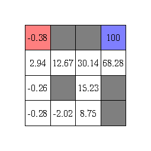
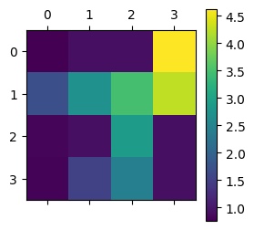
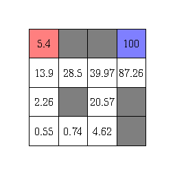
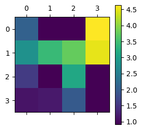

## Introduction

In my previous post (check [here](https://www.statwizard.in/posts/markov-decision-process/) if you haven't already), we learned two contrasting method of value function estimation. First, the Monte Carlo method which accumulates experiences. Second, the dynamic programming (sometimes also called bootstrapping) method which uses the Bellman equation. Both of these algorithms has its good and bad effects.

Monte Carlo method accumulates experiences, so it does not rely on your knowledge of how the environment behaves. This is particularly useful when you are playing a two-person board game where your opponent is a human, and you don't exactly know which move it is going to do. However, Monte Carlo requires you to reach the end of the game unless you can update your estimates, in order words, as you play the game, you are gaining knowledge about how the game works, but you are not putting them into use but storing them to be used later. This means you have a large memory requirements for the games which runs very long, and sometimes there is no end or terminal state (think of games like temple run or subway surfer which has no end unless you lose), so the Monte Carlo method never updates the estimates.

On the other end of the spectrum, we have Dynamic programming method which uses its current estimates along with the Bellman equation to refine and adjust its own estimates, thus enabling one to work with these infinitely long games. However, the problem is it is not model-free, i.e., it requires the knowledge of how environment works, and often that is a big problem by itself.

## Temporal Difference Learning

So in 1988, Richard Sutton[^4] came up with an algorithm that combines the benefits of these two algorithms. He named the method **Temporal Difference**, we shall why such a name is appropriate in a moment. He started by rewriting the Bellman equation as a two-step expectation as follows:

$$
v^\pi(S_{t}) = \sum_{A_t} \sum_{S_{t+1}} \pi(A_t \mid S_t) p(S_{t+1} \mid S_t, A_t) \left( R_{t+1} + \gamma v^\pi(S_{t+1}) \right)
$$

Here the quantity $\pi(A_t \mid S_t) p(S_{t+1} \mid S_t, A_t)$ denotes the probability of a two-step process: from the current state $S_t$, we generate an action $A_t$ according to policy $\pi$ and then environment gives back a state $S_{t+1}$. In a model-free design, we don't have the access to the probability $p(S_{t+1} \mid S_t, A_t)$. So Monte Carlo method avoids that by simulating the action and then receiving the state to accumulate the experience. Hence, in the above equation, we can similarly remove the expectation step and replace that by a simulation step, hence we believe that the following relation should hold approximately.

$$
v^\pi(S_{t}) \approx R_{t+1} + \gamma v^\pi(S_{t+1})
$$

### Update Rule

Now we look at the equation which incrementally updates the value estimates for Monte Carlo, let the current state value being updated is $s$ and it has been seen $n$ times below. So,

$$
v^\pi_{new}(s) = \dfrac{n v^\pi_{old}(s) + G_t}{n+1} = v^\pi_{old}(s) + \dfrac{1}{n+1}\left( G_t - v^\pi_{old}(s) \right) 
$$

It means that the new estimate is old estimate plus a multiple of the error $G_t - v^\pi_{old}(s)$ in the current estimate. It is as if $G_t$ is the target that we are trying to estimate using the value function. However, we have established that $v^\pi(S_{t}) \approx R_{t+1} + \gamma v^\pi(S_{t+1})$, so we can replace $G_t$ by $R_{t+1} + \gamma v^\pi(S_{t+1})$. But we do not know $v^\pi(S_{t+1})$ yet, so we again approximate that by our current estimate of the value function. Hence we can consider an update equation as

$$
v^\pi_{new}(S_t) = v^\pi_{old}(S_t) + \alpha\left( R_{t+1} + \gamma v^\pi_{old}(S_{t+1}) - v^\pi_{old}(S_t) \right) 
$$

This method is called **Temporal Difference (TD)**[^1], as the update equation now consists of the incremental changes in value estimates between two successive timepoints ($\gamma v^\pi_{old}(S_{t+1}) - v^\pi_{old}(S_t)$). The quantity $\alpha$ is called the learning rate which is typically choosen to be a small value.

In essence, the TD algorithm proceeds with the following steps:

1. Start with an initial estimate of the value function, and a starting state $S_0$.
2. For $t = 1, 2, \dots $:
    - Simulate one step of your policy, $A_t$ and receive $R_{t+1}, S_{t+1}$, starting from $S_t$.
    - Use the update equation: $v^\pi(S_{t}) \rightarrow v^\pi(S_{t}) + \alpha(R_{t+1} + \gamma v^\pi(S_{t+1}) - v^\pi(S_{t}))$.
    - Keep doing this until convergence, i.e., the value estimates are not changing much.


### TD Algorithm for Maze Game

Now we will try to apply the TD algorithm on the same maze game from the [last post](https://www.statwizard.in/posts/markov-decision-process/). Just to recap, the maze game has a maze shown as follow in the following figure, starting at the red corner to reach the blue corner, avoiding the obstacles shown in gray. The reward for reaching the end goal is $100$ but hitting any obstacle is $-1$.


Here is a code that performs the TD algorithm on the maze game.

```python
# temporal difference learning
B = 5000   # number of episodes
gamma = 0.9
val_ests = np.zeros((4, 4))
val_ests[3, 3] = 100  # the value for the terminating state

lr = 0.1  # learning rate
for b in range(B):
  niter = 0  # number of iterations
  cur_state = (0, 3)  # the starting state
  while True:
    # take a random move from current state
    action = ["up", "down", "left", "right"][np.random.randint(4)]
    new_state, reward = gridworld_maze(cur_state, action)
    val_ests[cur_state[0], cur_state[1]] += lr * (reward + gamma * val_ests[new_state[0], new_state[1]] - val_ests[cur_state[0], cur_state[1]])  # the TD(0) step
    niter += 1
    if niter > 100 or new_state == (3, 3):
      break  # reached the end, reset the game
    cur_state = new_state # update the state and continue the game
```


The resulting value estimates turn out to be as follows.

<div class="flex gap-4 justify-center items-center flex-wrap">
    
    
</div>

Although the estimates differ from the Monte Carlo estimates and the Dynamic Programming estimated we calculated in the [previous post](https://www.statwizard.in/posts/markov-decision-process/), the heatmap shows that the relative ordering of the value estimates are maintained. This is the main principle of having a value estimate, so that it enables you to compare between two states of the game, like a chess grandmaster often knows which of the two chess board positions is more advantageous with just a glance at them.


## n-step TD Variant

The Temporal Difference algorithm that we discussed so far is the 1-step version of it, this is because we are simulating the response for the environment for only 1 step ahead, and then using the Bellman backup equation to approximate the gain to update the estimate. We can generalize the same principle to create an $n$-step version of it, for any $n$. As you have guessed, it will simulate the game for $n$-steps ahead of the current state, and then approximate the gain by discounted sum of rewards from all these $n$ steps.

The update equation becomes
$$
v^\pi_{new}(S_t) = v^\pi_{old}(S_t) + \alpha\left( R_{t+1} + \gamma R_{t+2} + \gamma^2 R_{t+3} + \dots + \gamma^{n} v^\pi_{old}(S_{t+n}) - v^\pi_{old}(S_t) \right) 
$$

This now gives you control over how much information you want to propagate to back. (Doesn't it look like a hybrid version of deep neural network with a flexibility to control how much you will propagate the gradients back for parameter estimation!). 

Another example for a better understanding: Think of the $1$-step TD is the strategy that a novice chess player like me would employ. I often only think of only 1 step ahead, just seeing a fork or an x-ray kind of move or 1 move immediate checkmate. Though I might only see only $0$ step ahead if you play too well 😞. $n$-step TD is just extending that capability of that RL agent to play like a grandmaster, who can see several, may be $15-20$ (read $n$) moves ahead. And you want to create a chess world champion like [AlphaZero](https://en.wikipedia.org/wiki/AlphaZero), you might try your hand at 100-step TD! 😎


Let's see how $5$-step TD algorithm does in estimating value for the maze game.


```python
# temporal difference learning - 5-step TD
B = 5000   # number of episodes
gamma = 0.9
td_step = 5
val_ests = np.zeros((4, 4))
val_ests[3, 3] = 100  # the value for the terminating state

lr = 0.1  # learning rate
for b in range(B):
  niter = 0  # number of iterations
  cur_state = (0, 3)  # the starting state
  while True:
    prev_visits = []   # this holds the (state, reward) pairs
    runner_state = cur_state if len(prev_visits) == 0 else prev_visits[-1][0]   # an indexing state which runs through the n-step look ahead
    while len(prev_visits) < td_step:
      # take a random move from current state
      action = ["up", "down", "left", "right"][np.random.randint(4)]
      runner_state, reward = gridworld_maze(runner_state, action)
      prev_visits.append((runner_state, reward))

    # once it has enough previous visits, we can now apply TD update step
    target1 = np.sum((gamma ** np.arange(td_step)) *  np.array([r for (_, r) in prev_visits]))  # this is the sum of discounted rewards of 5 steps
    target2 = (gamma ** td_step) * val_ests[runner_state[0], runner_state[1]]  # the estimated value at the last state
    val_ests[cur_state[0], cur_state[1]] += lr * (target1 + target2 - val_ests[cur_state[0], cur_state[1]])  # the final TD step

    niter += 1
    if niter > 100 or (3, 3) in [s for (s, _) in prev_visits]:
      break # reached the end, reset the game
    cur_state = prev_visits[0][0]  # the new starting state
    prev_visits = prev_visits[:-1]
```


The resulting value estimates turn out to be as follows.

<div class="flex gap-4 justify-center items-center flex-wrap">
    
    
</div>

One of the interesting thing to note here is that there is no negative values in the estimates for the 5-step temporal difference method. This is probably because as soon as the end goal is only 5 steps away from a state, the state becomes valuable. With the value of the discount factor $\gamma = 0.9$, the ultimate reward of $100$ (i.e., the reward of reaching end goal) becomes $100\gamma^5 \approx 59$, which is clearly stil a larger reward compared to the punishment of $-1$ by hitting an obstacle. 


## TD($\lambda$) Variant[^2]

Although Temporal Difference algorithms has its strengths there are still a few ideas we can use to improve it.

1. If we do an $n$-step TD method, it uses the reward upto next $n$ future steps. However, since we are waiting till $n$ steps, we have the information to perform $(n-1)$-step TD method also, $(n-2)$-step TD also, and so on. (You get the pattern!) But we are just relying on the $n$-step look ahead thinking that the middle step look ahead patterns are not meaningful.

2. In dynamic programming, the Bellman equation consisted of a theoretical expectation of the gain, i.e., it was 

$$
v^\pi(S_{t}) = \sum_{A_t} \sum_{S_{t+1}} \pi(A_t \mid S_t) p(S_{t+1} \mid S_t, A_t) G_{t:(t+1)}
$$

Here $G_{t:(t+1)}$ is the gain we obtain by stepping from state $S_t$ to $S_{t+1}$. In Monte Carlo, we approximate this theoretical expectation by simulating a single path. However, this is like approximating the probability of a coin turning up head by tossing the coin once. As you have guessed, it certainly won't be accurate. We need to toss the coin hundreds of times to get a reasonable approximation. This idea can also be theoretically shown using a result called the **Law of Large Numbers**[^5]. Therefore, the principle is to take aggregate multiple estimates together to reduce the uncertainty in estimation. 

So, Richard Sutton[^3] came up with the idea that instead of using the $n$-step gain 
$$
G_{t:(t+n)} = R_{t+1} + \gamma R_{t+2} + \gamma^2 R_{t+3} + \dots + \gamma^{n-1}R_{t+n} + \gamma^n v^\pi(S_{t+n})
$$
we can use the average of $1$-step gain, $2$-step gain, and so on until $n$-step gain, i.e.,
$$
\dfrac{1}{n} \left( G_{t:(t+1)} + G_{t:(t+2)} + \dots + G_{t:(t+n)} \right)
$$
as the target in the TD update equation. In general, we can take any weighted average of these temporal difference gains $G_{t:(t_1)}, G_{t:(t+2)}, \dots G_{t:(t+n)}$ and that can be regarded as a valid estimate for the discounted sum of future rewards.


Relating back to the chess example: Using the average of the $n$-step gains is to consult multiple chess players, ranging from novices who see only $1$-step to a grandmaster seeing $20$-steps ahead, and accumulate their suggestions. This is certainly better than relying on only one chess player, who might miss some of the obvious moves.

However, since again there is a long-term look ahead vs short-term look ahead, we can use a discounting process to take average. Thus, our new target becomes
$$
G^\lambda_{t:(t+n)} = \dfrac{G_{t:(t+1)} + \lambda G_{t:(t+2)} + \lambda^2G_{t:(t+3)} + \dots + \lambda^{n-1}G_{t:(t+n)} }{1 + \lambda + \lambda^2 + \dots + \lambda^{n-1}}
$$
for some $0 < \lambda < 1$. And we have the corresponding update equation 
$$
v^\pi_{new}(S_t) = v^\pi_{old}(S_t) + \alpha\left( G^\lambda_{t:(t+n)} - v^\pi_{old}(S_t) \right) 
$$
This is called the **$n$-step TD($\lambda$) algorithm** for value estimation. In principle, this is just reducing the uncertainty by averaging estimates from multiple $n$-step TD algorithms.

I won't demonstrate the code for $n$-step TD($\lambda$) algorithm here, but I encourage the enthusiatic readers to try it out for the maze game and comment below the solution. Unfortunately, there is no prize for getting it, since I'm also on a tight budget here 😅!


## Next in Queue

In my next post in the RL blog series, we will dive deep into how we can use these value estimates to find an optimal strategy for an RL agent. And we will use python to code the algorithm, and then use the code to successfully land a space shuttle on the lunar surface inside a simulator. This should give a sneak peek at the amazing achievements of ISRO scientists who have successfully landed Chadrayaan-3 on the surface of the moon yesterday, on 23rd of August, 2023.


## References

[^1]: [Reinforcement Learning: Policy Evaluation through Temporal Difference](https://amreis.github.io/ml/reinf-learn/2017/07/08/reinforcement-learning-policy-evaluation-through-temporal-difference.html) - Alister Reis's Blog. 

[^2]: [Reinforcement Learning: Eligibility Traces and TD(lambda)](https://amreis.github.io/ml/reinf-learn/2017/11/02/reinforcement-learning-eligibility-traces.html) - Alister Reis's Blog.


[^3]: Sutton, R. S., Barto, A. G. (2018). [Reinforcement Learning: An Introduction.](https://www.google.co.in/books/edition/Reinforcement_Learning_second_edition/sWV0DwAAQBAJ?hl=en) United Kingdom: MIT Press.

[^4]: Sutton, R.S. Learning to predict by the methods of temporal differences. Mach Learn 3, 9–44 (1988). https://doi.org/10.1007/BF00115009. 

[^5]: https://en.wikipedia.org/wiki/Law_of_large_numbers