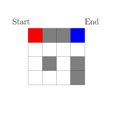

## Introduction

In my previous post (check [here](https://www.statwizard.in/posts/markov-decision-process/) if you haven't already), we learned two contrasting method of value function estimation. First, the Monte Carlo method which accumulates experiences. Second, the dynamic programming (sometimes also called bootstrapping) method which uses the Bellman equation. Both of these algorithms has its good and bad effects.

Monte Carlo method accumulates experiences, so it does not rely on your knowledge of how the environment behaves. This is particularly useful when you are playing a two-person board game where your opponent is a human, and you don't exactly know which move it is going to do. However, Monte Carlo requires you to reach the end of the game unless you can update your estimates, in order words, as you play the game, you are gaining knowledge about how the game works, but you are not putting them into use but storing them to be used later. This means you have a large memory requirements for the games which runs very long, and sometimes there is no end or terminal state (think of games like temple run or subway surfer which has no end unless you lose), so the Monte Carlo method never updates the estimates.

On the other end of the spectrum, we have Dynamic programming method which uses its current estimates along with the Bellman equation to refine and adjust its own estimates, thus enabling one to work with these infinitely long games. However, the problem is it is not model-free, i.e., it requires the knowledge of how environment works, and often that is a big problem by itself.

## Temporal Difference Learning

So in 1988, Richard Sutton[^4] came up with an algorithm that combines the benefits of these two algorithms. He named the method **Temporal Difference**, we shall why such a name is appropriate in a moment. He started by rewriting the Bellman equation as a two-step expectation as follows:

$$
v^\pi(S_{t}) = \sum_{A_t} \sum_{S_{t+1}} \pi(A_t \mid S_t) p(S_{t+1} \mid S_t, A_t) \left( R_{t+1} + \gamma v^\pi(S_{t+1}) \right)
$$

Here the quantity $\pi(A_t \mid S_t) p(S_{t+1} \mid S_t, A_t)$ denotes the probability of a two-step process: from the current state $S_t$, we generate an action $A_t$ according to policy $\pi$ and then environment gives back a state $S_{t+1}$. In a model-free design, we don't have the access to the probability $p(S_{t+1} \mid S_t, A_t)$. So Monte Carlo method avoids that by simulating the action and then receiving the state to accumulate the experience. Hence, in the above equation, we can similarly remove the expectation step and replace that by a simulation step, hence we believe that the following relation should hold approximately.

$$
v^\pi(S_{t}) \approx R_{t+1} + \gamma v^\pi(S_{t+1})
$$

### Update Rule

Now we look at the equation which incrementally updates the value estimates for Monte Carlo, let the current state value being updated is $s$ and it has been seen $n$ times below. So,

$$
v^\pi_{new}(s) = \dfrac{n v^\pi_{old}(s) + G_t}{n+1} = v^\pi_{old}(s) + \dfrac{1}{n+1}\left( G_t - v^\pi_{old}(s) \right) 
$$

It means that the new estimate is old estimate plus a multiple of the error $G_t - v^\pi_{old}(s)$ in the current estimate. It is as if $G_t$ is the target that we are trying to estimate using the value function. However, we have established that $v^\pi(S_{t}) \approx R_{t+1} + \gamma v^\pi(S_{t+1})$, so we can replace $G_t$ by $R_{t+1} + \gamma v^\pi(S_{t+1})$. But we do not know $v^\pi(S_{t+1})$ yet, so we again approximate that by our current estimate of the value function. Hence we can consider an update equation as

$$
v^\pi_{new}(S_t) = v^\pi_{old}(S_t) + \alpha\left( R_{t+1} + \gamma v^\pi_{old}(S_{t+1}) - v^\pi_{old}(S_t) \right) 
$$

This method is called Temporal Difference (TD)[^1], as the update equation now consists of the incremental changes in value estimates between two successive timepoints ($\gamma v^\pi_{old}(S_{t+1}) - v^\pi_{old}(S_t)$). The quantity $\alpha$ is called the learning rate which is typically choosen to be a small value.

In essence, the TD algorithm proceeds with the following steps:

1. Start with an initial estimate of the value function, and a starting state $S_0$.
2. For $t = 1, 2, \dots $:
    - Simulate one step of your policy, $A_t$ and receive $R_{t+1}, S_{t+1}$, starting from $S_t$.
    - Use the update equation: $v^\pi(S_{t}) \rightarrow v^\pi(S_{t}) + \alpha(R_{t+1} + \gamma v^\pi(S_{t+1}) - v^\pi(S_{t}))$.
    - Keep doing this until convergence, i.e., the value estimates are not changing much.

### TD Algorithm for Maze Game

Now we will try to apply the TD algorithm on the same maze game from the [last post](https://www.statwizard.in/posts/markov-decision-process/). Just to recap, the maze game has a maze shown as follow in the following figure, starting at the red corner to reach the blue corner, avoiding the obstacles shown in gray. The reward for reaching the end goal is $100$ but hitting any obstacle is $-1$.

> Write code and results here.

## n-step TD Variant

The Temporal Difference algorithm that we discussed so far is the 1-step version of it, this is because we are simulating the response for the environment for only 1 step ahead, and then using the Bellman backup equation to approximate the gain to update the estimate. We can generalize the same principle to create an $n$-step version of it, for any $n$. As you have guessed, it will simulate the game for $n$-steps ahead of the current state, and then approximate the gain by discounted sum of rewards from all these $n$ steps.

The update equation becomes
$$
v^\pi_{new}(S_t) = v^\pi_{old}(S_t) + \alpha\left( R_{t+1} + \gamma R_{t+2} + \gamma^2 R_{t+3} + \dots + \gamma^{n} v^\pi_{old}(S_{t+n}) - v^\pi_{old}(S_t) \right) 
$$

This now gives you control over how much information you want to propagate to back. (Doesn't it look like a hybrid version of deep neural network with a flexibility to control how much you will propagate the gradients back for parameter estimation!). 

Another example for a better understanding: Think of the $1$-step TD is the strategy that a novice chess player like me would employ. I often only think of only 1 step ahead, just seeing a fork or an x-ray kind of move or 1 move immediate checkmate. Though I might only see only $0$ step ahead if you play too well 😞. $n$-step TD is just extending that capability of that RL agent to play like a grandmaster, who can see several, may be $15-20$ (read $n$) moves ahead. And you want to create a chess world champion like [AlphaZero](https://en.wikipedia.org/wiki/AlphaZero), you might try your hand at 100-step TD! 😎

Let's see how $5$-step TD algorithm does in estimating value for the maze game.

> Write code and results here.

## TD($\lambda$) Variant[^2]

## References

[^1]: [Reinforcement Learning: Policy Evaluation through Temporal Difference](https://amreis.github.io/ml/reinf-learn/2017/07/08/reinforcement-learning-policy-evaluation-through-temporal-difference.html) - Alister Reis's Blog. 

[^2]: [Reinforcement Learning: Eligibility Traces and TD(lambda)](https://amreis.github.io/ml/reinf-learn/2017/11/02/reinforcement-learning-eligibility-traces.html) - Alister Reis's Blog.

[^3]: Sutton, R. S., Barto, A. G. (2018). [Reinforcement Learning: An Introduction.](https://www.google.co.in/books/edition/Reinforcement_Learning_second_edition/sWV0DwAAQBAJ?hl=en) United Kingdom: MIT Press.

[^4]: Sutton, R.S. Learning to predict by the methods of temporal differences. Mach Learn 3, 9–44 (1988). https://doi.org/10.1007/BF00115009. 