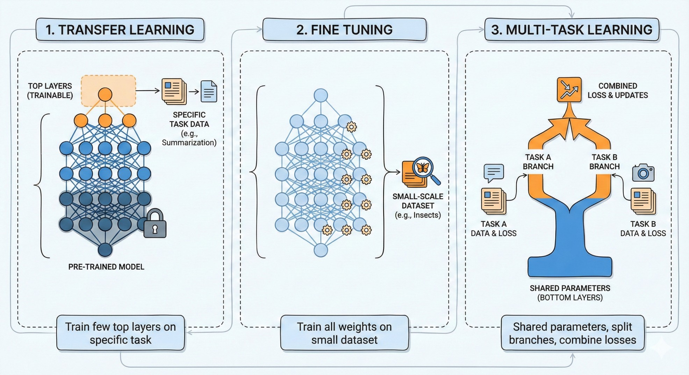
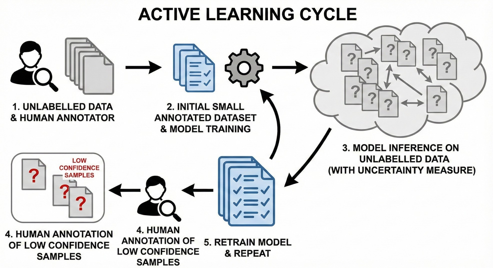
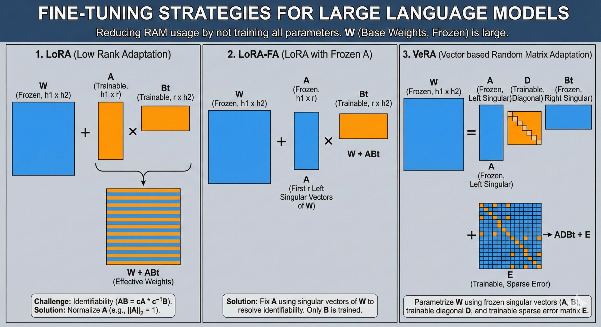
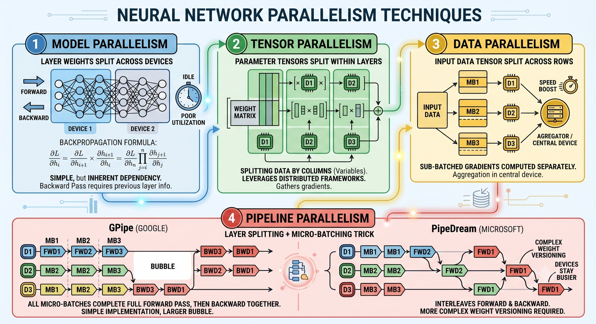
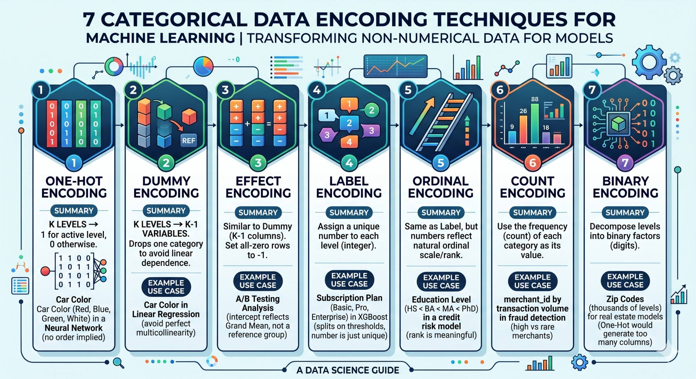
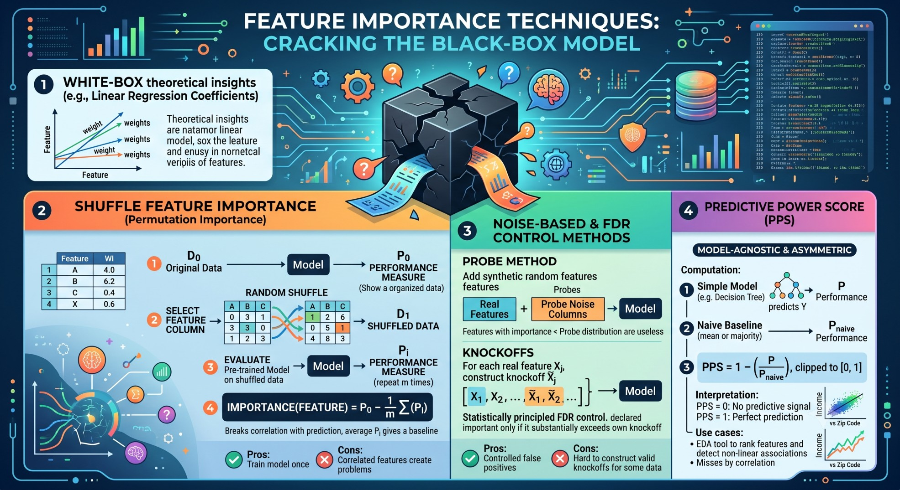
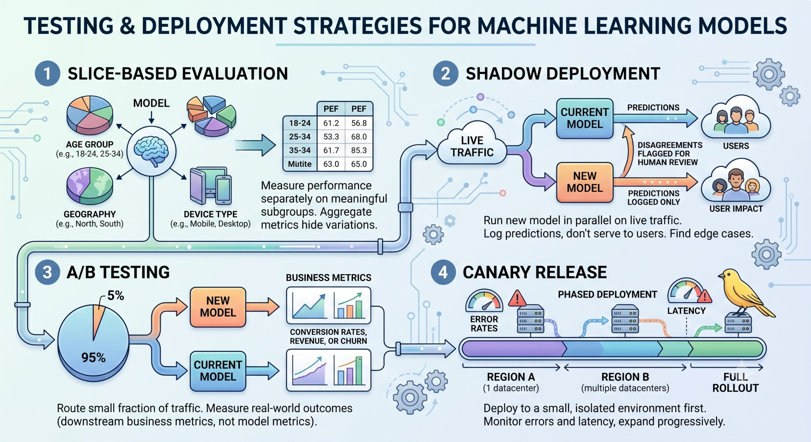

## Learning Paradigms

Beyond the usual training of neural networks, there are few major learning variants:


1. **Transfer Learning:** Here, you take a pre-trained model, and train only a few top layers to ensure that it adapts to the specific tasks. For example, a pre-trained model capable to comprehension of English language, could be used via transfer learning to summarize paragraphs, or for question-answering. 

2. **Fine tuning:** Again we take a pretrained model, but train all the weights (or parameters) but only for a small scale dataset (less number of epoch) to make it adhere to the nuisances of that dataset. A pre-trained large image classification model can be fine-tuned to classify between different types of insects and their species, which may be useful for a group of entomologists.

3. **Multi-task Learning:** Here, we take atleast two different tasks, and we want to keep the idea of shared parameters like transfer learning. But, instead of training for one task at a time, we combine the losses arising from two different tasks, and then train the entire network (like fine tuning). The network architecture looks like it has a few shared parameter at the bottom layers, but suddenly it splits off into branches, each adapted to a specific task, and uses different parameters and different set of top layers.




Additionally, there are also different variants that are emerging due to specific needs. 

* **Federated Learning:** 
    - Modern devices like mobiles and other IoT devices collects lots of data. But most of these data are private.
    - Due to privacy concerns, the ML model training cannot use whole of the data as they do not remain in a central place.
    - Instead of bringing the data to the models, we bring the model to the data.
    - Each IoT device downloads a part of the model, trains it on the private data by computing a few gradient steps, and send back to server. 
    - The server aggregates the gradient steps from billions of users, and updates the entire model from an aggregated source of data.

* **Active Learning:**
    - Suppose we want to build a supervised system, but we do not have a training data with labels, only unlabelled data is present.
    - This means, we need to build the system step-by-step where each step should ideally improve the model.
    - Active Learning refers to a paradigm where the sampling is done simulteneously with model training. What this means is the following:
      - Start with a small human annotated datasets. Large part of the data remains unlabelled.
      - Train a model using that annotated part. We understand that this model is going to be inaccurate. Let it be. Also create some sort of uncertainty measure.
      - Use the model to predict the labels / make inference on rest of the dataset, along with confidence level.
      - Whichever samples have low confidence level, for them, ask the human annotator to label them.
      - Retrain the model on this new dataset.

    - While combining the low-confidence data with the seed data, we can also use the high-confidence data. The labels would be the model's predictions. This variant of active learning is called "Co-operative learning".




## Efficient Training Techniques

### Cost of Training Large Models

Let us ask the question:

> How much memory does it take to train a $n$ billion parameter model?

The key trick is to remember this approximate conversion table: 

- $10^3$ bytes = 1 thousand bytes = 1 KB

- $10^6$ bytes = 1 million bytes = 1 MB

- $10^9$ bytes = 1 billion bytes = 1 GB

Let us now look at the amount of storage we need:

1. If each parameter has `float16` representation, they take 16 bits or 2 bytes. Hence, we need $2n$ billion bytes or $2n$ GB of RAM to load the model.
 
2. If we are training, each parameter will have its own gradient value that we need to store, resulting in another $2n$ GB of storage.

3. If we use Adam optimizer, then we have a formula like:

$$
\hat{\theta}^{(t+1)} = \hat{\theta}^{(t)} - \alpha \frac{\partial L}{\partial \theta}\vert_{\theta = \hat{\theta}^{(t)}} + \beta \frac{m_t}{\sqrt{v_t}}
$$

These $m_t$ and $v_t$ are momentum and variance parameters, and since we are doing division and taking square roots, we will need more precision for them. Standard is to use `float32` for these variables. Hence, storing momentum requires $4n$ GB, and so is variance.

Together we need $(2 + 2 + 4 + 4)n = 12n$ GB of storage for full-precision training. But for testing, we need only $2n$ GB of storage.

### Fine-tuning Strategies for Large Language Models

There have been proposals of various fine-tuning strategies for large language models, that does not require the whole $12n$ GB of storage in your RAM.

1. **LoRA:** LoRA (Low Rank Adaptation) is a fine-tuning technique where instead of modifying the parameters (or weights) for the LLM directly, we add a low-rank adjustment on top of it. Say, at a particular layer of the large language model, we need a trainable weights $W$ of dimensions $h_1 \times h_2$, where $h_1$ and $h_2$ are large. Then, with the fine-tuning, we replace it by 
$$
W + AB^t
$$

where $A$ is of dimension $h_1 \times r$ and $B$ is of dimension $r \times h_2$ and $r$ is a much smaller number than $h_1$ and $h_2$. The matrices $A$ and $B$ are trainable. 

:::{.callout-caution}
A challenge is that both the matrices $A$ and $B$ are not identifiable, for example, $AB = cA \times c^{-1}B$ for any $c \neq 0$. Usually, to avoid this, one approach is to always keep the $A$ matrix normalized so that $||A||_2 = 1$. 
:::

2. **LoRA-FA:** LoRA with Frozen A. In this case, to avoid the identifiability issue, one may take $A$ to be fixed as the matrix comprising of first $r$ left singular vectors of $W$ corresponding to the largest (in magnitude) $r$ singular values of $W$. Then, only the matrix $B$ is trained. 

3. **VeRA:** VeRA (Vector based Random Matrix Adaptation) is a technique where we parametrize the weight matrix $W$ as 

$$
W = ADB^t + E
$$

where $A$ and $B$ are the top $r$ left and right singular vectors and are kept fixed. The diagonal matrix $D$ and error matrix $E$ are trainable. A sparsity structure can be adapted to $E$ to reduce computational cost of training a large number of parameters.




### Optimization using Momentum with Gradient Descent

Suppose that we have a loss function $L(\theta)$ that we want to minimize with respect to $\theta$. Typical gradient descent updates look like:

$$
\theta^{(t+1)} = \theta^{(t)} - \alpha \nabla L(\theta^{(t)})
$$


Theoretically, under suitably small step sizes (i.e., $\alpha$), gradient descent always improves the objective, and converges always to a local minimum. Furthermore, with some additional assumptions, the rate of convergence can be proven to be exponential. 

However, in many practical scenarios, you will see that the drop in objective value is significant at first, but becomes lesser and lesser as things approach minima: and the pace of convergence slows down very much. This happens because near the minima, we would have $\nabla L(\theta) \approx 0$, which essentially says that the typical gradient descent will only take very timid steps. But imagine you are going down the hill (the most common analogue how you would describe a gradient descent algorithm) by taking the steepest road, and you are now near the foot of the hill. Would you still look for the steepest road around there, or would you continue down the same way? The momentum says that you can use the previously computed gradients (which essentially gives you some direction where you came from) to help your descent steps navigate the way. This idea is summarized into a moving average type formula:

$$
\theta^{(t+1)} 
= \theta^{(t)} - \alpha \nabla L(\theta^{(t)}) - \alpha \sum_{k=1}^t \beta^k \nabla L(\theta^{(t-k)})
$$

At this point, you may be concerned with the fact that implementing this rule will require one to store all the previously computed gradients, i.e., $\nabla L(\theta^{(t-k)})$ for $k = 1, 2, \dots, t$ which can be very challenging and quickly run into memory issues. However, simple algebraic calculations can reduce the above daunting equation into two simpler nice equations to avoid this problem:

$$
\begin{align*}
z^{(t+1)} & = \beta z^{(t)} + \nabla L(\theta^{(t)})\\
\theta^{(t+1)} & = \theta^{(t)} - \alpha z^{(t+1)}
\end{align*}
$$

This is essentially the **momentum** trick. A nice visualization along with a detailed example is available by @goh2017why on this topic.

### Gradient Accumulation

Gradient accumulation is a simple technique by which you can perform neural network training using smaller batches but effectively get the benefit of using a bigger batch size. 

In standard training, you might want a batch size of 64 for stable convergence. However, loading 64 complex examples (like high-res images or long text sequences) into your GPU's VRAM at once might cause it to crash. You are forced to use a smaller batch size (e.g., 8), but this can make your gradient updates "noisy" and unstable, leading to poor training performance. 

Gradient accumulation solves this by breaking the large batch down but deferring the update step. Instead of updating the model weights after every small batch of 8, you run the small batch, calculate the gradients, and add them to a "bucket" of gradients. You repeat this $8$ times ($8$ batches $\times$ $8$ samples = $64$ samples). Only after the $8$-th small batch do you actually update the model weights using the total accumulated gradients. A pytorch implementation of this would look like this:

```python
accumulation_steps = 8             # Define how many steps to wait

for i, (data, label) in enumerate(loader):
    output = model(data)           # Forward
    loss = criterion(output, label)
    loss = loss / accumulation_steps # Normalize loss to account for the accumulation
    loss.backward()                # Backward (grads are added to existing grads)

    # Only update weights every 4 steps
    if (i + 1) % accumulation_steps == 0:
        optimizer.step()           # Update weights using accumulated grads
        optimizer.zero_grad()      # Clear grads
```

### Parallelism

There are different approaches how you can aim to parallelize your neural network related computation across multiple devices (could be multiple GPUs or multiple CPUs or even multiple machines). Here are a few ideas:

1. **Model Parallelism**: This typically refers to the scenario where the layer weights of the model is split across devices. This, although, the most simple, is not the most efficient way to parallelize training. Because back-propagation may require inputs from previous layers, this creates a dependency when the previous layer parameters (and gradients) remain on a separate device.

$$
\frac{\partial L}{\partial h_i} = \frac{\partial L}{\partial h_{i+1}} \times \frac{\partial h_{i+1}}{\partial h_i} = \frac{\partial L}{\partial h_n} \prod_{j=i}^n \frac{\partial h_{j+1}}{\partial h_{j}} 
$$

Here, the different devices can compute these products independently across devices, and then pass relevant information to compute all the gradients.

2. **Tensor Parallelism**: In this approach, the parameter tensor in every layer is splitted acorss devices. These leverage standard distributed computing framework to compute the gradients. One can think of this as splitting the data by columns (or variables).

3. **Data Parallelism**: When the batch size is too high, the input data tensor is splitted across rows, and the gradient with respect to each sub-batch of rows are computed sepearately. Then, a central device collects these sub-batched gradients and aggregate them.

4. **Pipeline Parallelism**: Pipeline parallelism combines the layer-splitting idea with a micro-batching trick. In model parallelism, if Device 1 holds layers 1-3 and Device 2 holds layers 4–6, then during the forward pass Device 2 sits idle until Device 1 finishes. During the backward pass, Device 1 sits idle while Device 2 computes gradients. Only one device is active at any moment — leading to poor utilisation. To avoid this, we can split each batch into smaller micro-batches, then feed them through the devices in a staggered fashion. While Device 2 runs the forward pass on micro-batch 1, Device 1 can already start on micro-batch 2. There are two well-known variants:
    * GPipe (Google): all micro-batches complete their full forward pass first, then all run backward together. Simple to implement; larger bubble.
    * PipeDream (Microsoft): interleaves forward and backward passes of different micro-batches so devices stay busier. More complex weight versioning required since a device may run backward on micro-batch 1 using weights that have already been partially updated by micro-batch 2's forward pass.




## Feature Engineering

### Cyclical Feature Handling

There are some features which has periodic interpretation, so they require special handling compared to the typical use of continuous or discrete variables. For example, hour of the day, day of the month, month of the year, phases of the moon, wind direction, days of the week, etc. 

Note that, the feature engineering must ensure that if $p$ is the period, and $f$ is the processing function, then the similarity (or difference) between $f(x)$ and $f(x + 1)$ should be same as $f(x)$ and $f(x + p + 1)$ (e.g., month Jan-Feb are as close as month Dec-Jan). A common choice is to use trigonometric functions such as

$$
f(x) = \sin\left( \frac{2\pi}{p} x \right), f(x) = \cos\left( \frac{2\pi}{p} x \right)
$$

### Categorical Data Encoding Techniques

Typically, people uses one-hot encoding to deal with categorical data. However, there are many different techniques to describe categorical data as one (or multiple) features.

1. **One-hot encoding**: Consider a categorical variable with $K$ levels. We create $K$ variables, one for each level. For $i = 1, 2, \dots, K$, variable $V_i$ is equal to $1$ for row $r$ if the categorical variable has level equal to $i$, otherwise it is equal to $0$. *E.g., encoding car color (red, blue, green, white) for a neural network — no ordinal relationship should be implied.*

2. **Dummy encoding**: Since the sum of all the columns is equal to $1$, and hence we can drop one randomly selected column due to linear dependence. Instead of $K$ columns, we now have $(K-1)$ columns. *E.g., the same car color example in a linear regression — dropping one level avoids perfect multicollinearity in the design matrix.*

3. **Effect encoding**: Because with dummy encoding there will be rows that maps to $\{V_i\}_{i = 1}^{K-1} = \boldsymbol{0}$, the vector of $(K-1)$ many zeros. In the effect encoding, we set these rows with all zeros to $-1$. *E.g., A/B testing analysis where you want the intercept to reflect the grand mean rather than the mean of an arbitrarily chosen reference group.*

4. **Label encoding**: In this case, we simply assign a number for each level of the categorical variable. Hence, it will only be a numerical variable with $K$ different unique numerical values. *E.g., encoding a "subscription plan" feature (basic, pro, enterprise) in an XGBoost churn model — tree-based models split on thresholds so the assigned integer does not imply any order.*

5. **Ordinal encoding**: This is exactly same as the label encoding, but if the original variable has a ordinal scale, then corresponding scale naturally provides a numerical value as per the order of these levels. *E.g., education level (high school $<$ bachelor's $<$ master's $<$ PhD) in a credit risk model — the natural rank is genuinely meaningful.*

6. **Count encoding**: The numerical variable assigns the values as the count (or frequency) based on the level of categorical variable. *E.g., encoding `merchant_id` by total transaction volume in a fraud detection model — high-frequency merchants carry systematically different risk profiles than rare ones.*

7. **Binary encoding**: In some cases, different levels of the categorical variable may be decomposed into several factors. Depending on the value of the categorical variable, the factor-specific variable takes value equal to $1$ if that factor is present in the current level, or $0$ otherwise. *E.g., encoding zip codes (thousands of levels) for a real estate price model — one-hot would generate thousands of columns, whereas binary encoding needs only $\lceil \log_2 K \rceil$.*




## Model Evaluation and Inference

### Leaky Variables

When we split the data into training and testing parts, sometimes because the split is done mistakenly, some information may leak from the training data to the testing data, which will be unavailable for the unseen new data. It appears via some sort of correlation between the training and validation sets.

For example, consider we have data on $n$ patients, and $N (N > n)$ images of chest x-rays, so that we have multiple images of the same patient. We are building a model to predict if there is disease or not based on the chest x-ray image. If we randomly split the data of images, it may happen that for a single patient, Image A is in the training set, and Image B is in the testing set, but their labels will be correlated.

### Dropout Layers

We use dropout layers to improve generalizability of the model. This typically sets some randomly selected neuron values to $0$ in a layer, so that the network calculates different pathways to learn the goal.

However, dropout layer works behave differently during training and inference. 

Suppose, we have a hidden layer with values $h_1, h_2, \dots, h_n$. Let, $\delta_{i} \sim \text{Ber}(\delta)$, where $\delta$ is the dropout probability. During the training phase, the output is calculated as:

$$
\text{output} = \sigma(\sum_{i=1}^n w_i h_i (1 - \delta_i))
$$

But during the time of inference, no $h_i$ is set to $0$, and hence, we get the output as $\sigma(\sum_{i=1}^n w_i h_i)$ instead. Clearly, there's a difference in expectation (which affects the subsequent layers), i.e.,

$$
\mathbb{E}(\sum_{i=1}^n w_i h_i (1-\delta_i)) = (1-\delta) \mathbb{E}(\sum_{i=1}^n w_i h_i)
$$

To avoid this, the dropout layer during the training phase also performance a scaling by dividing by $(1 - \delta)$. So, 

$$
\text{Dropout}(h) = \frac{1}{1-\delta} (h_i(1 - \delta_i))_{i=1}^n
$$

### Feature Importance

Feature importance is a class of techniques that aims to assign a score for the feature representing its ability to helps the prediction of a ``black-box'' model.

For a ``white-box'' model, the feature importance can be obtained by theoretical insights, e.g., the coefficients in linear regression.


#### Shuffle Feature Importance

1. Consider the original data $D_0$. We train a model, evaluate its performance, and performance measure is $P_0$.
2. Pick a column (single feature), and then we create another data $D_1$ that keeps all other features intact, but randomly shuffles the values of the chosen feature. We don't train it further, rather evaluate the trained model, let $P_1$ be its performance measure.
3. We repeat this multiple times (for multiple different shuffles). Call these measures $P_2, \dots, P_m$.
4. Feature importance is given by:

$$
\text{Importance}(\text{Feature}) = P_0 - \frac{1}{m}\sum_{i=1}^m P_i
$$

We choose $m = n!$ for an exhaustive search, otherwise we can choose $m$ to be sufficiently large as a Monte-Carlo estimate.
5. The idea is that with random values of the feature, it behaves like a random feature that remains uncorrelated with the prediction. Hence, average of $P_i$s yield a baseline performance, answering the question: how well does this model performance if we did not have any information on that feature?

* Pros: Train the model only once.
* Cons: Since the model importantance are measured independently, correlated features create problems. Even if the feature "race" under study is permuted, non-permuted version of a related feature "country of origin" may contain the related information.

#### Probe Method and Knockoffs

The **probe method** adds one or more synthetic random features (pure noise columns) to the dataset before training. After training, any real feature whose importance score is lower than the probe's is essentially useless — the model extracts less signal from it than from random noise. Running multiple probes gives a noise baseline distribution rather than a single threshold. Contrast this with the "shuffle feature" importance, instead of permuting the rows, we just replace the values by random values (may be from normal distribution) with the same mean and standard deviation.


**Knockoffs** extend this idea with statistical guarantees. For each real feature $X_j$, a knockoff $\tilde{X}_j$ is constructed to have the same marginal distribution and correlation structure as $X_j$, but is forced to be independent of the response $Y$ given the other real features. The model is trained on $[X, \tilde{X}]$ together. A feature is declared important only if its importance substantially exceeds that of its own knockoff, controlling the false discovery rate (FDR) at a chosen level $q$.

* Pros: statistically principled — you know the expected proportion of false positives among selected features.
* Cons: constructing valid knockoffs is hard for high-dimensional or non-Gaussian data.

#### Predictive Power Score

Unlike correlation, which is symmetric and only captures linear relationships, the **Predictive Power Score (PPS)** measures how well feature $X$ predicts target $Y$ in a model-agnostic, asymmetric way. Knowing someone's zip code has high PPS for predicting income, but income has low PPS for predicting zip code.

The computation:

1. Fit a simple model (e.g., a decision tree) predicting $Y$ from $X$ alone; record its performance $P$.
2. Fit a naive baseline (always predict the mean for regression; always predict the majority class for classification); record $P_{\text{naive}}$.
3. $\text{PPS} = 1 - P / P_{\text{naive}}$, clipped to $[0, 1]$.

PPS = 0 means $X$ carries no predictive signal for $Y$; PPS = 1 means $X$ alone perfectly predicts $Y$. It is useful in EDA to quickly rank features and detect non-linear associations that correlation would miss.




### Conformal Prediction

Standard ML models output a point prediction — a single number or class. Conformal prediction wraps any trained model and produces a **prediction interval** (regression) or **prediction set** (classification) with a guaranteed coverage probability, without any distributional assumptions on the data.

The key ingredient is a **nonconformity score** $s(x, y)$ measuring how surprising label $y$ is given input $x$. A natural choice for regression is the residual $s(x, y) = |y - \hat{f}(x)|$. Suppose, there is a held-out calibration set $\{(x_i, y_i)\}_{i=1}^n$, and the prediction for a new point $x_{\text{new}}$ is $\hat{f}(x_{\text{new}})$, and the true value $y_{\text{new}}$ which is unknown. 

Assuming exchangeability, $\{ (x_i, y_i) \}_{i=1}^n \cup \{ (x_{\text{new}}, y_{\text{new}}) \}$ has an invariant distribution under any permutation. Then, the rank of $s(x_{\text{new}}, y_{\text{new}})$ among $\{ s(x_i, y_i) \}_{i=1}^n$ should be uniformly distributed between the ranks $1, 2, \dots, (n+1)$. As a result, we can use these values to obtain $(1-\alpha)$-th empirical quantile, and obtain a prediction interval as:

$$
C(x_{\text{new}}) = \left\{y : s(x_{\text{new}}, y) \leq Q_{1-\alpha}\!\left(\{s(x_i, y_i)\}_{i=1}^n\right)\right\}
$$

E.g., a house price model predicts \$350,000. The $(1-\alpha)$-quantile of calibration residuals is \$28,000, so the conformal interval is [\$322,000, \$378,000] — guaranteed to contain the true price at least $1-\alpha$ of the time on new houses, regardless of how the underlying model was trained.

Two common variants:

* **Split conformal**: uses a separate calibration set. Cheap and simple; slightly wider intervals.
* **Full conformal**: retrains the model for every candidate label $y$ on every test point. Tighter intervals, but computationally expensive.

### Drift Detection via Proxy Labelling

After deployment, the distribution of incoming data can shift from what the model was trained on. Getting true labels quickly is usually impossible — a fraud label may only arrive weeks later via a chargeback. **Proxy labelling** uses an observable downstream signal correlated with the true label to construct a delayed performance metric.

E.g., in a fraud detection model, a chargeback 30 days later is a proxy label. If chargebacks start rising without a corresponding rise in the model's fraud scores, the model has drifted. Monitor the metric over rolling windows and alert when it drops significantly below baseline (using a Page-Hinkley test or a simple t-test on sliding windows).

Another way is to do the following:
1. Consider samples from old data, and new data and combine then.
2. Create a label depending on whether the row is coming from old or new data.
3. If one trains a model that can predict this label based on these features, then it indicates a data distribution drift.

When no proxy labels are available, drift can be detected by comparing the distribution of the model inputs or outputs between the training period and the current period using statistical tests:

* **Kolmogorov-Smirnov (KS) test**: for continuous features.
* **Population Stability Index (PSI)**: industry standard in credit risk; $\text{PSI} < 0.1$ is stable, $> 0.2$ signals significant drift.
* **KL divergence**: measures how much the current input distribution has shifted from the reference.


### Decision Tree Inference Pipeline

Consider a large decision tree model. Typically, decision tree inference is not parallelizable, because the lower-level comparisons depends on the higher-level comparisons. However, if the decision tree can be represented using matrix operations, then one can use efficienct matrix algorithms for efficient, fast and even batch-based inference pipeline.

* First, note that any of the leaf nodes in the binary tree can be identified by a binary string of $0$s and $1$s. For example, $101$ means, at the root level, go left, then go right and then go left (rule is  satisfied, go left; go right otherwise). Say, there are in total $T$ many nodes in the decision tree.
* Let $A = ((\delta_{ij}))_{p \times T}$ be a feature-to-evaluation node matrix, i.e., if feature $i$ is used in $j$-th rule, then it is equal to $1$, otherwise is equal to $0$. In general, one can write every rule as

$$
\sum_{k} c_k X_k < c^*
$$

for rule $j$, say. Then, the $j$-th column is given by $(c_1, \dots, c_p)$.

* Let, $B$ be the vector with the values $c^*$, which is of length $T$. So, at this point, the matrix operation $XA < B$ yields a $T$ length binary vector defining whcih rules are satisfied vs which rules are not.

* Let $C$ be a matrix that maps the evaluation node to the leaf node such that

$$
C_{ij} = \begin{cases}
    -1 & \text{ if } j\text{-th leaf} \in \text{left(evaluation node i)}\\
    1 & \text{ if } j\text{-th leaf} \in \text{right(evaluation node i)} 
\end{cases}
$$

* Consider the expression $(XA < B) * C$. The matrix product yields a vector of length $L$, the number of leaf nodes. Fix a particular leaf node, say $l$. Then, the corresponding entry after the product becomes $\sum_{t=1}^T (XA < B)_t C_{tl} = \sum_{t: \text{rule satisfied}} C_{tl}$, which yields the index of the corresponding leaf row where the data $X$ will end up after running through the decision tree.

* Let $E$ be the matrix which converts the leaf nodes to the labels. Then, the decision tree output can be then obtained by indexing $E$ via $(XA < B) * C$.


## Model Compression & Deployment

### Knowledge Distillation

Knowledge distillation trains a small **student** model to mimic a large, powerful **teacher** model, rather than learning directly from hard ground-truth labels. The intuition is that the teacher's output probability distribution carries richer information than a one-hot label. When classifying a cat image, the teacher might output [cat: 0.85, lynx: 0.10, dog: 0.05] — telling the student that cats look more like lynxes than dogs, a relationship absent from the hard label.

The student is trained on a combined loss:

$$
L = \alpha \cdot L_{\text{hard}}(y,\, p_s) \;+\; (1-\alpha) \cdot L_{\text{soft}}(p_t^{(\tau)},\, p_s^{(\tau)})
$$

where $p_s$ and $p_t$ are the student and teacher output distributions, and $\tau > 1$ is a **temperature** that softens both distributions before computing $L_{\text{soft}}$, amplifying the information in the small probabilities. E.g., DistilBERT is a distilled version of BERT — 40% smaller and 60% faster while retaining 97% of BERT's performance on most benchmarks.

### Activation Pruning

Large networks are over-parameterized — many neurons fire weakly and contribute little to the output. Pruning identifies and removes these neurons to reduce model size and inference cost, then fine-tunes the pruned model to recover lost accuracy.

The standard recipe:

1. Train the full model to convergence.
2. Score each neuron or filter by its average absolute activation magnitude across the training set. Low-magnitude units are candidates for removal.
3. Remove units below a threshold; fine-tune for a few additional epochs.

Two flavors:

* **Unstructured pruning**: zero out individual weights based on magnitude. Creates sparse weight matrices — speedup requires sparse computation support (e.g., NVIDIA's sparse tensor cores).
* **Structured pruning**: remove entire neurons, attention heads, or convolutional filters. Produces a genuinely smaller dense model that runs faster on standard hardware without special support.

E.g., pruning 50% of ResNet-50's convolutional filters reduces inference time by ~40% with less than 1% drop in ImageNet top-1 accuracy after fine-tuning.


### Testing and Deployment Strategy

Validation accuracy on a held-out test set is necessary but not sufficient. Only live traffic reveals distribution shifts, latency issues, edge cases, and feedback loops. A few strategies to bridge that gap:

**Slice-based evaluation**: measure performance separately on meaningful subgroups (age group, geography, device type). A model with 95% overall accuracy may have only 70% accuracy on a subgroup that matters — aggregate metrics hide this.

**Shadow deployment**: run the new model in parallel with the current production model on live traffic, logging predictions but not serving them to users. Disagreements between the two models flag edge cases for human review before any user is affected.

**A/B testing**: route a small fraction of traffic (e.g., 5%) to the new model and measure real-world outcomes — not model metrics, but downstream business metrics (conversion rate, churn, revenue). Only roll out fully if the target metric improves significantly.

**Canary release**: deploy to a small, isolated environment first (e.g., a single datacenter region or 1% of users). Monitor error rates and latency; expand progressively if the deployment stays within acceptable bounds.





## Acknowledgements

Many materials covered here are taken from the website by @Chawla_2025.


## References

::: {#refs}
:::