## What is Cloud Computing

Cloud computing is the on-demand delivery of IT resources over the Internet with pay-as-you-go pricing model.

There are 4 aspects in this definition.

- On demand delivery - As per your business needs, get delivery of IT resources instantly, without any additional contract or any heads up to AWS
- IT resources - Whatever business you have, almost all kinds of IT resource that you need would be available
- Over the internet - Provides those resources to you from anywhere in the world (across the globe) to wherever you want to access it to.
- Pay as you go pricing - You pay for only what you use, nothing more, nothing less.

Amazon Web Service (AWS) offers various services, popular categories include Compute, Storage, Networking, Security, Machine Learning Models, etc.

## Amazon Compute

There are a few services that falls under the category of Amazon Compute. Among them, the simplest one is "Amazon Elastic Compute Cloud (EC2)"

EC2 is a virtualization tool, which creates virtual cores on top of the physical cores of a physical machine. So, it might be that, when you are using EC2 compute, you are sharing the same physical machine with another EC2 instance.

There are 5 primary types of EC2 instances available.

- General Purpose - These instances provide a balance between computing, storage and network requirements. Used for any general purpose.
- Compute optimized - High performance computing machines. May be used for high performance computations, batch processing, dedicated gaming servers, etc.
- Memory optimized - Used for high internal memory like high RAM, workloads requiring manipulation of large data in memory
- Storage optimized - Used for high iops with the persistent disk or storage, used for distributed file system applications, high frequency transaction writings, etc.
- Accelerated computing - Has GPU or other acceleration devices. Used for numerical computing or training ML or DL algorithms.

EC2 has 5 different types of instances available based on the pricing models available.

- On demand instances - The usual pricing model
- Dedicated instances - Does not share a physical host with another instance, runs on a separate physical server.
- Reserved Instances - You go for a contract with AWS for 1 year or 3 year commitment and get to use a predetermined number of EC2, then you can get high discounts.
  - You can go with standard reserve rates - where you specify the machine type, availability zone, os, etc at the time of purchasing reserved rates.
  - You can go with convertible reserve rates - where you don't specify these things.
- EC2 instance savings plan - You go for a contract with AWS for 1 year or 3 year commitment, but here you specify the number of hours of monthly usage you will do. Unlike reserved instance, you don't need to specify availability zones, ec2 instance types, or OS used.
- Spot Instances are ideal for workloads with flexible start and end times, or that can withstand interruptions. Spot Instances use unused Amazon EC2 computing capacity and offer you cost savings at up to 90% off of On-Demand prices.
  - After you have launched a Spot Instance, if capacity is no longer available or demand for Spot Instances increases, your instance may be interrupted. This might not pose any issues for your background processing job

### Amazon EC2 Scalability

Scalability involves beginning with only the resources you need and designing your architecture to automatically respond to changing demand by scaling out or in.

- Scale up = Meaning making the current EC2 instance more powerful
- Scale out = Increasing the number of EC2 instance.

You can add automatic scaling capacity by using AWS EC2 Auto Scaling.

- There are two types of scaling:
  - Dynamic scaling - Changing the scaling as per demand.
  - Predictive scaling - Changing the number of EC2 as per the prediction of demand ahead of time.
- For enabling auto scaling, you specify 3 things.
  - Minimum capacity = Minimum number of instances you want to run always..
  - Desired capacity = On average what would be the number of instances. Defaults to minimum capacity.
  - Maximum capacity = Maximum number of instances you want to run in case demand reaches it peak.

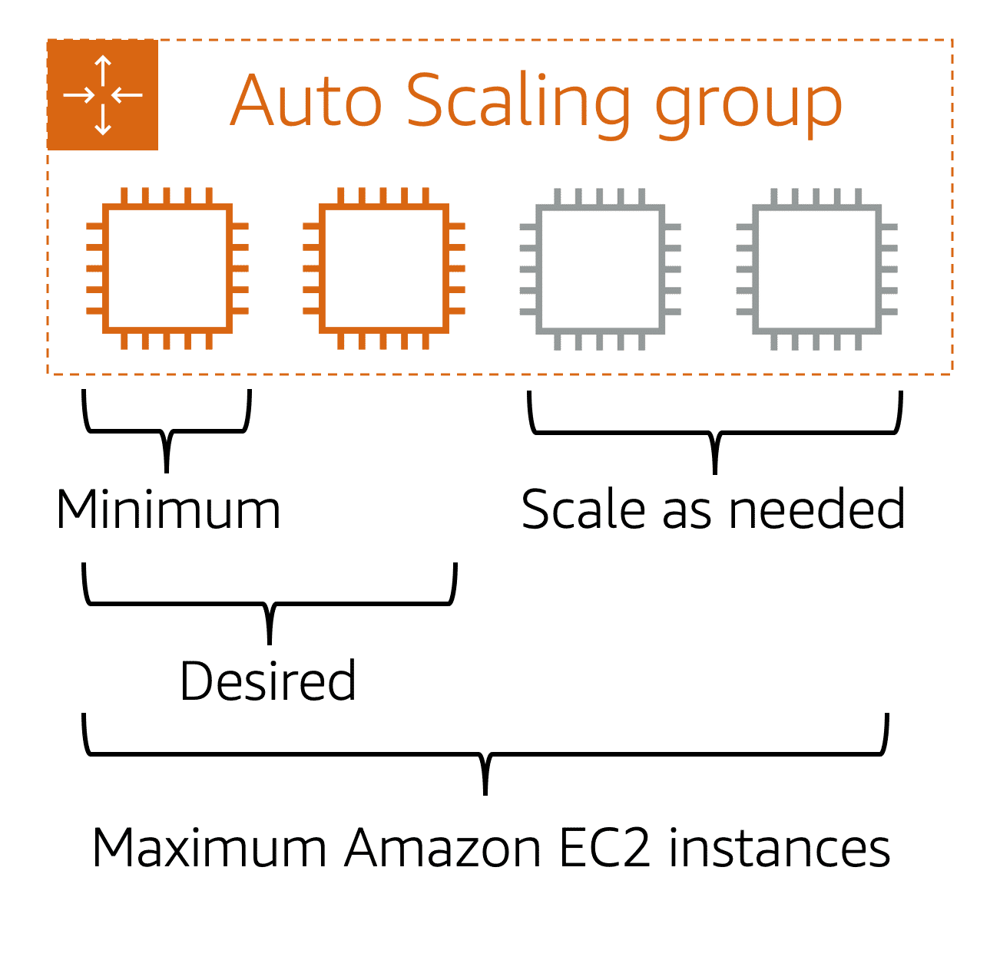

_Even though you have 10 servers running, if there are 10 requests coming in, it does not mean everything gets routed uniformly. Some server may be clogged up with 4 requests at random._

To counter this problem, we need Load Balancing.

### AWS Elastic Load Balancer (ELB)

It routes the incoming traffic properly into proper server in an ASG group with the least amount of load.

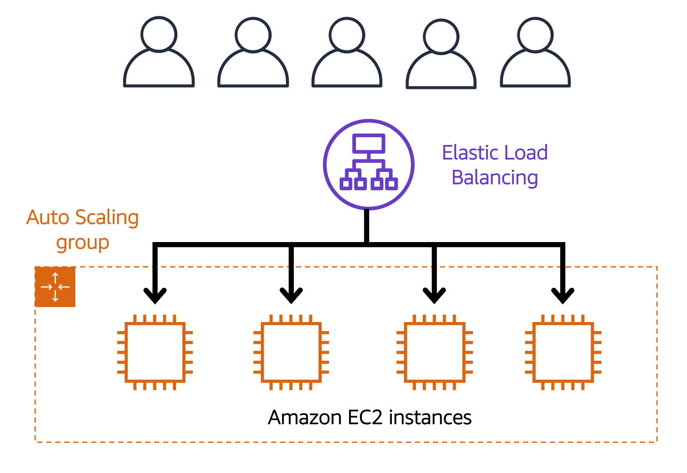

### Messaging and Queuing

Imagine the frontend is talking to the backend. The ELB is one option to handle the traffic properly. However, if backend process is clogged that means customer is experiencing bad UX, since frontend is also waiting for the response for the same.

The way to tackle that is to decouple the architecture. There are 2 ways to do that.

- Using Amazon Simple Queue Service (SQS) - It provides a queue buffer to hold your messages, as long as you want, unless you process or delete it.

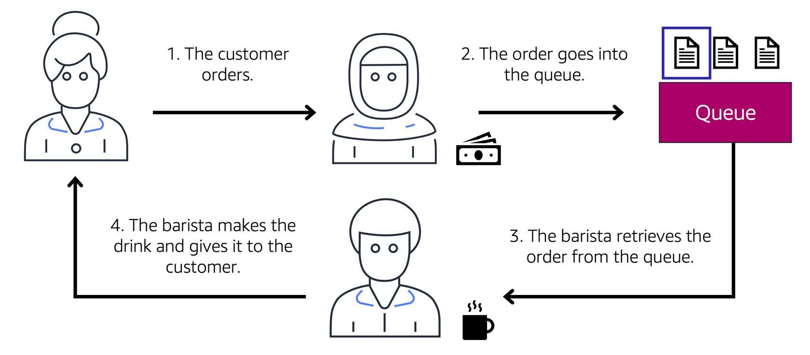

- Amazon Simple Notification Service (SNS) - It provides a way to broadcast your request to some specific topics (or channels). The servers listen to those channels (topics) and processes things from these channels one by one.
  - In this case, we have a network of servers, every server is a frontend and every server is a backend.

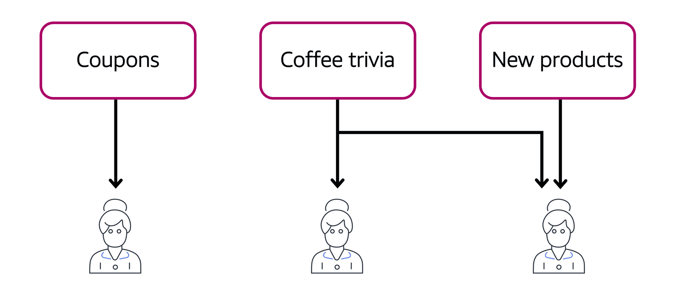

### AWS Lambda

It is a computer service provided by AWS that allows you to run code, without thinking about the underlying infrastructure of the server where it is running. This is hence called "serverless".

- You just select the runtime of the code you want to run, infrastructure with the compile engine or programming languages are auto installed.
- Your code can be setup to trigger from other events happening in AWS.
- Code can run a maximum of 15 minutes.
- You pay on the basis of (runtime x the memory usage)

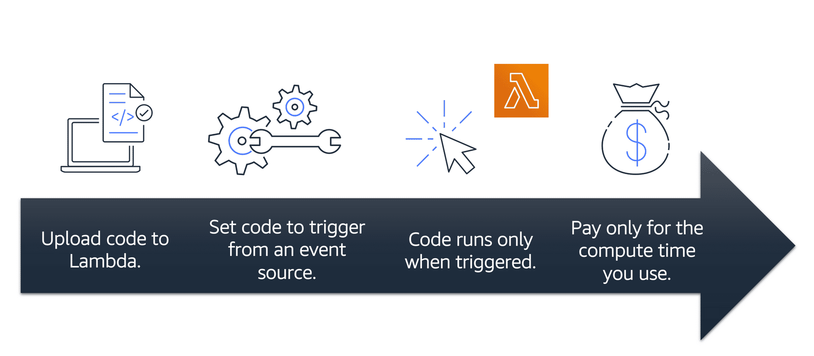

### AWS Container Services

**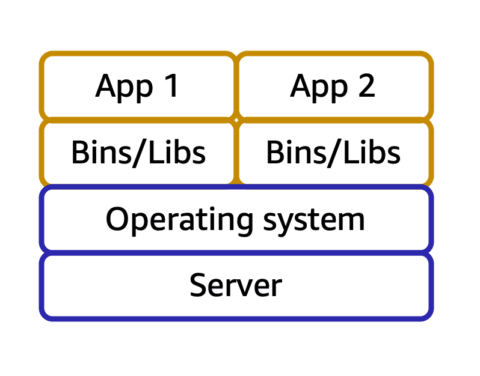**

Containers are special types of packaged software that package the OS, dependencies, software and code completely.

AWS has 2 types of container services if you want to run containerized applications.

- AWS Elastic Container Service (ECS) - If you want to run Docker
- AWS Elastic Kubernetes Service (EKS) - If you want to run Kubernetes

For each, you can choose to:

- Manage your own servers using ASG with a group of EC2 instances.
- Ask AWS to manage everything, using a serverless framework called **AWS Fargate** .
  - This means it is just like Lambda, you only bring your code, AWS takes care of managing and provisioning the instances.

## AWS Global Infrastructure

In order to make sure disasters or any kind of physical activities at a data center does not compromise the safety of your company's data / IT resource in AWS, AWS provides an infrastructure that scales globally.

Across the globe, AWS has different regions, which are geographically separated areas. Examples include us-west-1 (California), us-west-2 (Ohio), Singapore, Australia, Mumbai, etc.

### What should you consider when selecting a region for your IT infra?

- Compliance requirements - If the business you operate in or the country you operate in, requires the customer's data never to leave a country's boundary, then you have to use specific region.
- Proximity - For low latency, you should choose the regions that are closer to your customer bases.
- Services available - Not all AWS services are available everywhere, so check and make sure the region you are using, satisfy all requirements of IT infra.
- Cost - Another aspect is that regions has different costs for the same infra, due to the various factors such as availability of physical chips and other things, tax expenditure, datacenter rent fees, etc.

Within every region, AWS has three or more availability zones (AZ). Each availability zone is a single or a group of data centers.

These availability zones are usually tens of miles apart (so that there is a less chance of a natural disaster striking both simultaneously), while they are connected through high speed network to provide one-hundredth of a millisecond latency.

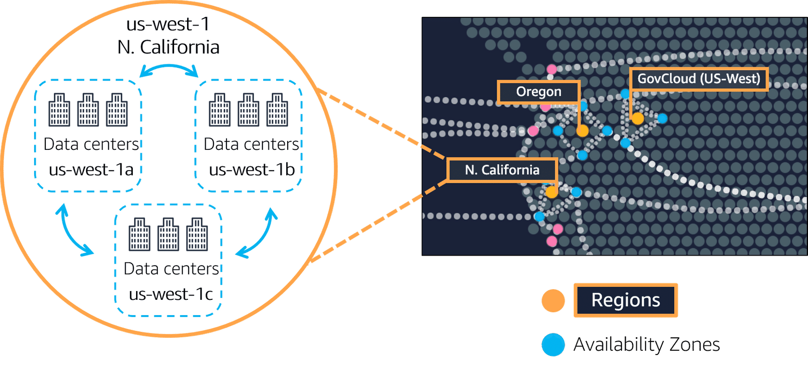

**Note:** AWS recommends that once you choose a region, you should replicate your IT infra in at least 2 AZs (as a disaster recovery plan).

### Caching and Data Delivery

If your customers are scattered across the world, then only having your IT resource to the regions or AZs is not enough for the latency. For instance, a customer sitting in Malaysia requesting some document from your applications, gets served from Singapore region, which may be hundreds of miles away.

To reduce the latency, AWS has "edge locations", some small scale setup compared to a full fledged data center. These are scattered across the globe in almost all locations.

These locations run a service called "**AWS CloudFront**" which is a CDN (Content Delivery Network) service that caches the data. The region or AZ where your data resides puts the cached data to the edge location, and when customer requests the data, it shows it from cache (does not need to travel entire distance to the region)

Also, if you have a specific data center or on-premise data center available where you must host your infra, but you want AWS to manage them, you can request service from "**AWS Outposts**". This means AWS guys will come and install the necessary infra in your data center, they will maintain it, but they will charge a custom pricing for the same.

### Provisioning Infrastructure / IT resources from Cloud

To provision the IT resources that you need from AWS, internally everything uses AWS API. To get access to these AWS standardized APIs, you can interact with them in 3 major ways.

- AWS Management Console - An web-based UI to manage IT resource provisioning
- AWS Command Line Interface - A CLI tool to do the same using your terminal
- AWS SDK - Do the same using programming from your code written in various programming languages

AWS also has their own services that helps you do this.

- AWS Elastic Beanstalk - It is a PaaS service, you provide only your code and configuration settings like how much memory and CPU you need.
  - It takes care of launching EC2, inside ASG group.
  - Adjust capacity and other settings.
  - Add ELB for load balancing
  - Connect cloudwatch for logging and health monitoring, etc.
- AWS CloudFormation - With AWS CloudFormation, you can treat your infrastructure as code. This means that you can build an environment by writing lines of code(meaning configs in YAML or JSON files) instead of using the AWS Management Console to individually provision resources.
  - It ensures that you can use the same configuration YAML or JSON file and redeploy / build your infra exactly as it is in another region.
  - It deploys all resources mentioned in the config parallely, so very fast for deployment.

## AWS Networking

AWS delivers every IT resource over the Internet. So, security is a concern, since you don't want everyone using the internet to access the IT resources you are paying for.

So you create a virtual private boundary of the IT resources you have, this is called "**Amazon Virtual Private Cloud"** (Amazon VPC). It is a networking service that you can use to establish boundaries around your AWS resources.

Within each VPC, you can have multiple logical groups of resources that share networking boundaries. These groups are called **"subnets" (**sub-inter-nets)

Now, by default, your VPC does not allow any traffic. But, you might have 2 use cases:

- You have a web server inside your VPC. You want the public to be able to access that VPC and request your website content.
  - For this, you need to attach an **Internet Gateway** to the VPC.
  - This is like a door to the office room (VPC) where you have your business running.

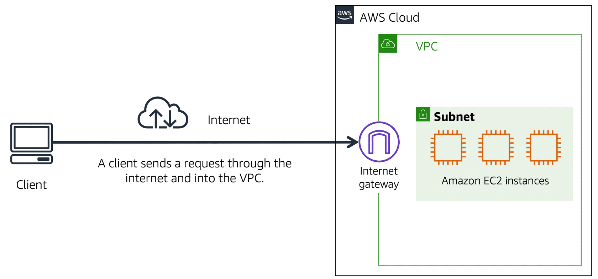

- You might have only privately secured instances running inside the VPC and you don't want the public to access that. However, you want your employees to be able to access that.
  - So basically you have a **Virtual Private Network (**VPN) for your employees.
  - And you can use the VPN to connect to the VPC.
  - For this connection, you need a **Private Gateway** attached to the VPC.
  - It encrypts your requests and protects them from bad guys.

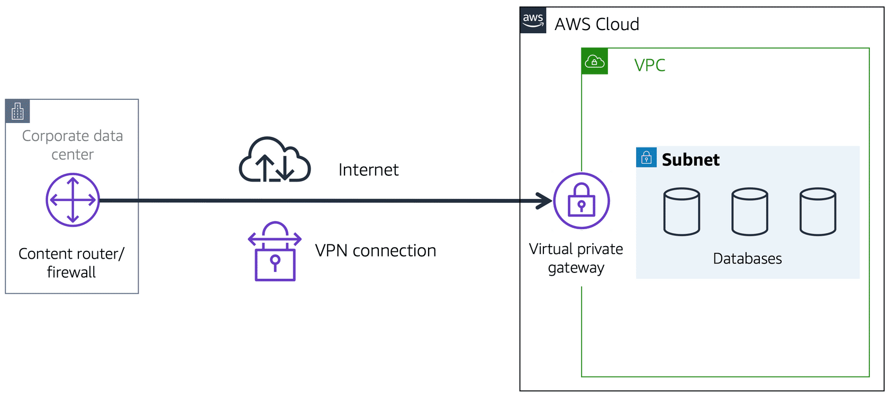

When you use Private Gateway, you still use the same optical fibre cable (physical hardware) that others are using, so you do not get any bandwidth benefit, except security.

If you want more bandwidth (and exclusive connection between your AWS resources in VPC to your on-premise network), you need to use **Amazon DirectConnect.** This requires AWS partner to go and physically install a special optical fibre cable from AWS connection to directly to your on-premise network.

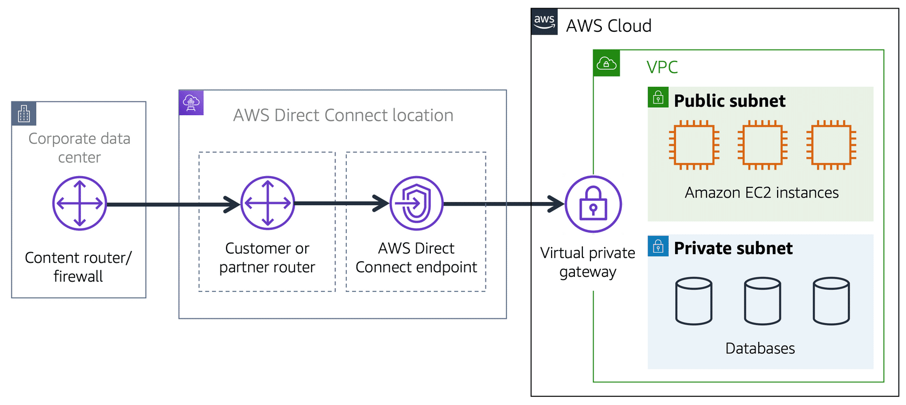

### Subnet Access Controls

A subnet is a logical group of AWS resources sharing a common network.

Subnets are of 2 types:

- **Public subnet**s contain resources that need to be accessible by the public, such as an online store's website.
- **Private subnets** contain resources that should be accessible only through your private network, such as a database that contains customers' personal information and order histories.

To differentiate between subnets and VPC, consider the following:

- In a VPC, subnets can communicate with each other. For example, you might have an application that involves Amazon EC2 instances in a public subnet communicating with databases that are located in a private subnet.
- Different VPCs cannot communicate with each other, this means, VPC's are isolated environments of resources that do not know the existence of each other.

A **packet** is a unit of data sent over the internet or a network.

When you send/receive a packet to a subnet, at the subnet level, there is a check. These checks are done using **Network Access Control Lists (Network ACL).** The default ACL allows all inbound and outbound traffic.

- Inbound traffic = The packets that want to come into the subnet.
- Outbound traffic = The packets that want to go outside the subnet.

Note that, the Network ACLs are stateless, so they don't remember whether a packet has already been sent. It always checks against the list.

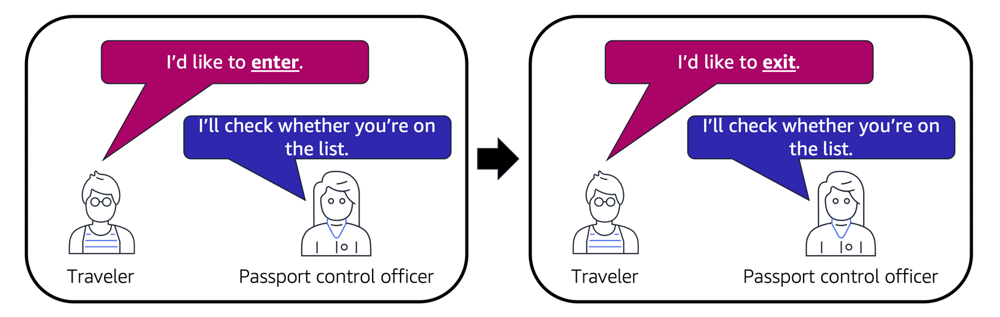

If you want instance-level networking control, you need to use **AWS Security Groups (SG)**. This can be applied to a single EC2 instance or a small group of instances.

Compared to Network ACL, there are 3 major differences.

- It is stateful, so it remembers that a packet has been sent.

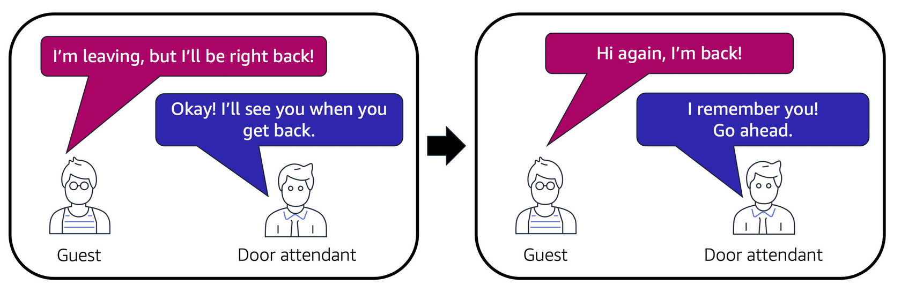

- By default, it denies all inbound traffic.
- It does not check the packet for outbound traffic. Compared to that, ACL performs checks for both inbound and outbound traffic.

In summary, we have the following system.

VPC has multiple subnets. Each subnet has multiple security groups. Each SG can have one or more (usually one) EC2 instances.

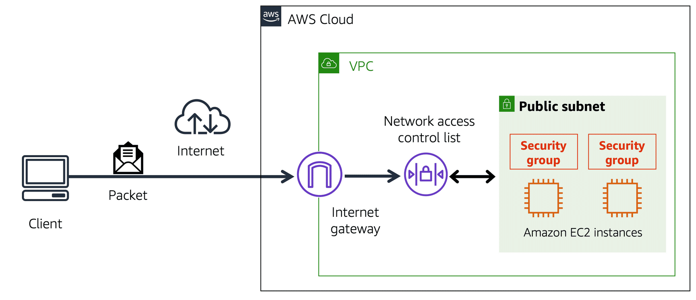

### Domain Management

For domain management, AWS has a tool called **AWS Route 53**. It is a DNS service that takes the name of the website like "mywebsite.com" and uses its address book to find the server's IP address "234.23.435.11"

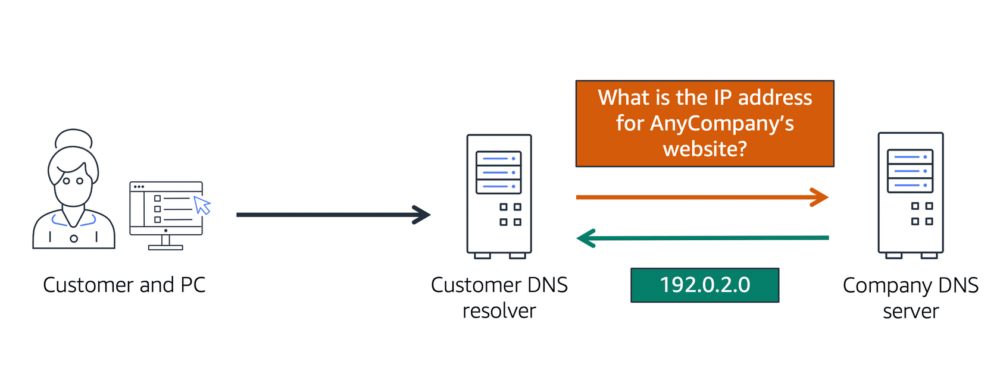

When a customer requests a file by typing the website address, AWS uses Route 53 to look up its DNS address. Then it searches the same file in CloudFront edge locations if the file is present in CDN, if not found, the request goes to the ELB and then to the ASG or EC2 instance.

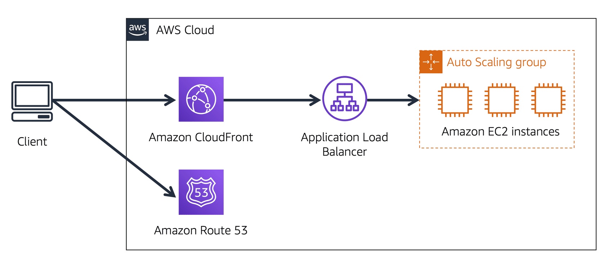

## AWS Storage Services

When you work with an EC2 instance, you get some amount of memory by default. This is the harddisk or SSD attached to the physical host of the machine where the EC2 virtual server is running. This means, the storage is not permanently accessible and is not guaranteed to be persistent between sessions. When you stop the EC2 instance and start another EC2 instance, it may boot up in some other host, hence none of the data that you saved temporarily would be available. Also, AWS performs cleanups of these disks, so it may get deleted as well.

To ensure persistent storage, there are different kinds of storages that you can use.

- Block Level Storage
  - This kind of storage is architectured as a set of blocks of bytes. When you modify the data in this storage (i.e., edit some files), then the block of bytes which were modified only those are updated.
  - This is similar to the usual harddisk kind of storage we are familiar with.
- Object Level Storage
  - This storage stores items as Objects, so there is no block.
  - Each stored item has 3 things: The object to store, its metadata and a key.
  - Every time you update the data, the entire object data is updated with the help of this key.
- File Level Storage
  - This is a block storage
  - But additionally provide shared permissions, like two or multiple compute unit can access the data simultaneously over a network
  - This is a truly linux like file system based storage, you will have your /mnt, /etc, /var, etc paths available.
- Database
  - Stores special kinds of data that needs additional capabilities of querying and analyzing the data
- Data Lake
  - A dump of data storage for historical data,
  - Usually these are immutable, but constantly growing in size
  - You need to run business analytics on these.

AWS has a solution for each of the type of storage that you need based on your use case.

### Elastic Block Storage

Elastic Block Storage (EBS) is a simple block storage service, that you can attach to your EC2 instances. You can write or read from it, and the data persists even if your EC2 instance is terminated.

To create an EBS volume, you define the configuration (such as volume size and type) and provision it. After you create an EBS volume, it can attach to an Amazon EC2 instance.

- EBS only attaches to a single EC2 instance.
- EBS is available only in a single availability zone.
- EBS does not scale automatically, you must define the volume size in its configuration.
  - However, after you create EBS, you can modify its storage size and resize this.

Also, you can take EBS snapshot for make a backup of your EBS volume, in case you need to restore back. EBS snapshot stores only incremental data (i.e., the blocks that are modified or are newly added)

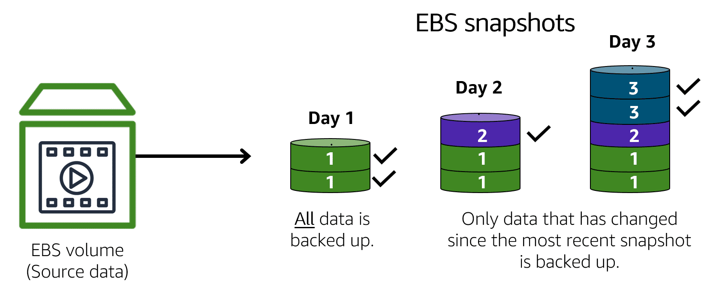

### Elastic File Storage

Elastic File Storage (EFS) is a file system based storage service. In comparison to EBS, it has following features:

- EFS can be attached to multiple EC2 instances.
- EFS is replicated across multiple AZ
  - So within same region, you can access EFS by an EC2 instance from any AZ
- On-premise IT resource can access EFS using **AWS DirectConnct**
- EFS scales automatically based on the amount of storage you are using and the scaling policy you have in place.

### Amazon Simple Storage Service

AWS Simple Storage Service (AWS S3) is an object level storage. In object storage, each object consists of data, metadata, and a key.

- The data might be an image, video, text document, or any other type of file.
- Metadata contains information about what the data is, how it is used, the object size, and so on.
- An object's key is its unique identifier.

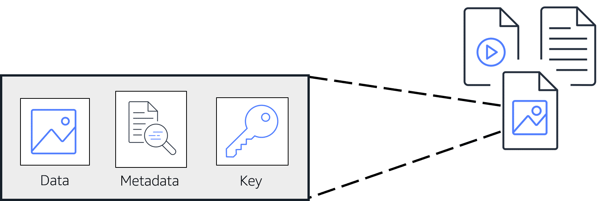

The maximum file size that you can upload in S3 is 5TB. It has potentially unlimited storage.

You first define the storage partition (called **buckets**) where you want to store these objects. At each bucket level, you can define its access permissions. Objects residing in a bucket inherits its access permissions.

Also, using S3 you can have versioning, for each object. Hence for any object, you can do a point-in-time restore to go back to any version that you want. This is possible since it is object level storage, one does not need to revert each incremental changes to restore, one can simply modify the entire object at once.

S3 has different storage classes depending on:

- The availability of your data
- How often you plan to retrieve your data
- How much cost you want to bear.

- S3 Standard (default)
  - Designed for frequently accessed data
  - Stores data into a minimum of 3 AZs, hence 99.(9 many 9)% available (very high reliability).
- S3 Standard - Infrequent Access (IA)
  - Similar to S3 Standard, but lower storage price and higher retrieval price
- S3 One Zone - Infrequent Access
  - Much lesser cost
  - Stores data into a single AZ
- S3 Intelligent Tiering
  - Has a small monitoring/subscription kind of fee.
  - Intelligently moves the objects from standard to standard IA if you have not accessed the file in the last 30 days.
  - Once you retrieve from IA, again moves back to standard.
- S3 Glacier Instant Retrival
  - Archival storage
  - But require immediate access, and retrieval within milliseconds
- S3 Glacier Flexible Retrieval
  - Archival storage
  - Retrieval takes between 1 to 12 hours. (several hours)
- S3 Glacier Deep Archive
  - Archival storage
  - Retrieval takes about 12 hours to 48 hours.
- S3 Outposts
  - Creates S3 buckets in your on-premise AWS outpost environment.

You can also have a lifecycle policy that will automatically move your data from one tier to another, based on the rules you specify.

### Amazon Database Services

- **Amazon Relational Database Service (RDS)** is a fully managed relational data service.
  - Automates tasks such as hardware provisioning, database setup, patching, and backups.
  - Provides SQL engine with popular backend for Postgresql, MySql, MariaDB, Oracle, SQL Server
  - Amazon also provides its own engine called **"Amazon Aurora".** It is an enterprise-class RDMS compatible with MySql and Postgresql and much faster than their standard versions.
    - It is also highly available, provides 6 copies of data across 3 AZs and runs continuous backups to S3.
- **Amazon DynamoDB** is a nonrelational database.
  - You can key - value pair data.
  - It has very low latency, millisecond latency for fetch and put.
  - It is serverless, performs automatic scaling based on the amount of your data.
  - You dont need to manage anything, just create table and put the data.
- **Amazon Redshift** is a data lake (i.e., the data warehousing) service that you can use to store historical data, that needs less modification but require very sophistical business analytics query running.
  - Also, use it if your data is growing day by day.
- **Amazon DocumentDB** is a NoSql document / text based storage, like MongoDB.
- **Amazon Neptune** is a graph DB service.
  - You can use Amazon Neptune to build and run applications that work with highly connected datasets, such as recommendation engines, fraud detection, and knowledge graphs.
- **Amazon Quantum Ledge Database (QLDB)** is a ledger database service, you can use for accounting or finance services. The data here is immutable, hence may be used reliably for auditing purposes.
- **Amazon Managed Blockchain** is a blockchain based service for AWS. Blockchain is a distributed ledger system that lets multiple parties run transactions and share data without a central authority.
- **Amazon ElastiCache** is a service that adds caching layer for the RDS to improve the read times of requests.
  - It supports Redis and MemCache.
- **Amazon DynamoDB Accelerator (DAX)** is an in-memory cache for Dynamodb. It improves dynamodb reading performance, used for very critical low latency applications.

Amazon also has a database migration service **(AWS DMS)** which you can use to migrate relational databases.

- You select a source database and a target database
- The source and target DB can have the same type or different types.
  - If they are the same type, it is easy. Same as copying the schema, data types and functions.
  - If they are of different types, there is a transformation layer that converts the schema and the SQL functions from one SQL to another SQL.
  - During migration, it does not put too much load on the source so that your source DB remains operational, so there is no downtime.
- Other use cases of DMS include:
  - Create development or test DB identical to production
  - Database consolidation => where you copy data from multiple DB into a single DB
  - Continuous replication

## Amazon Security

AWS security relies on a principle of shared responsibility model. Basically it means,

- AWS is responsible for the "security of the cloud". This means, security of the datacenter, network, EC2 or other infrastructures, etc.
- Customers are responsible for the "security in the cloud". This means, whatever OS you use in your EC2 instances, the application and the data security.

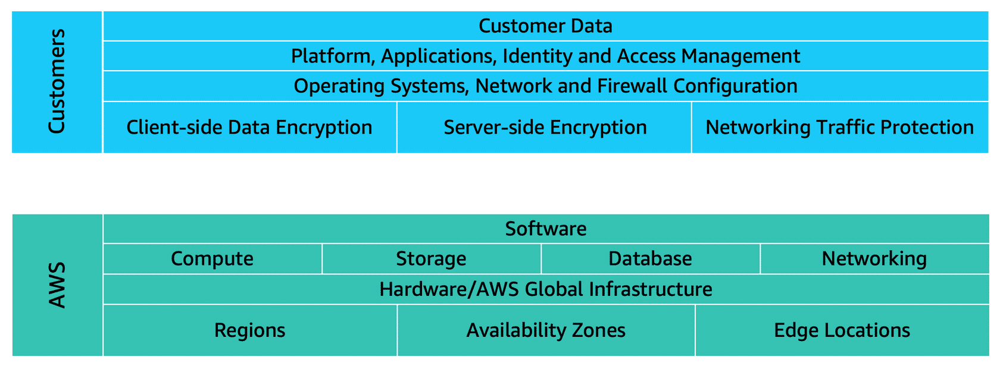

### AWS Identification and Authentication Management (IAM)

In AWS, you have different users and each user can have different level of access in your AWS provided IT resources.

- Root User is the user who have all access to all of your IT resources in your AWS account.
  - AWS recommends that you enable Multi Factor Authentication (MFA) in your root user and also provide a strong password for the login.
- IAM User is an user that you create in AWS using AWS IAM Portal. You can provide granular level scope or permission access to the resources this user can use.
- IAM Policy is a document that you use to specify the AWS API access a particular group or user will have.

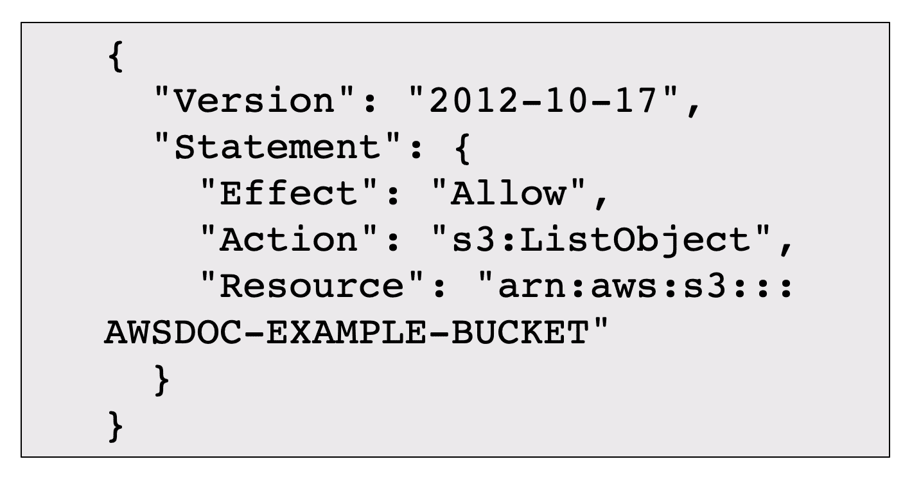

It has 3 things inside.

- Effect: Which is either "Allow" or "Deny"
- Action: Which is the name of the API
- Resource: The specific resource ARN (Amazon Resource Number) where you can use this API.

For example, the above policy tells that "List Object permission in s3 bucket AWSDOC-EXAMPLE-BUCKET is allowed."

- IAM group is a group of users to which you can attach a policy for access management. It means, all user in the same group inherits those permission.

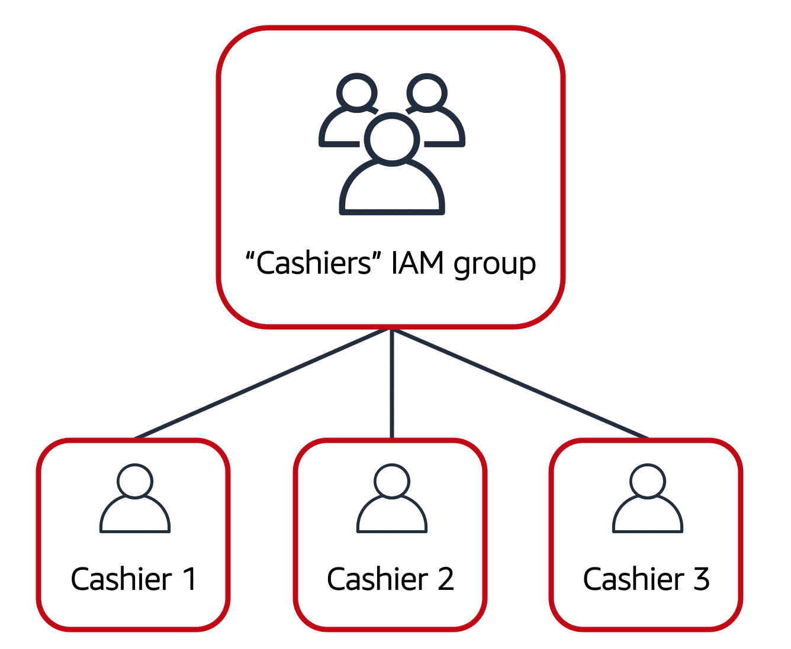

- IAM role is a collection of IAM policy, which you can assume to temporarily gain access to certain level of permission. For example, in an organization, you may have roles for different departments, and each role has different responsibilities due to which they want access to only a set of things in AWS. You can create then role level permission only. Then, as your users change from one role to another, their permission sets can accordingly vary.

### AWS Organizations

If you have multiple AWS accounts, (say for different environments such as development and production or testing), you can centrally manage them in a portal called AWS Organization.

These include 3 major features:

- You can centrally control the access specifications using **Service Control Policies (SCP).** This means you can control in each account what all AWS services your users can use.
- You can have consolidated billing and corresponding recommendations in one single place.
- You can organize the AWS accounts into groups based on their functioning, and nest them into Org Units (OUs).

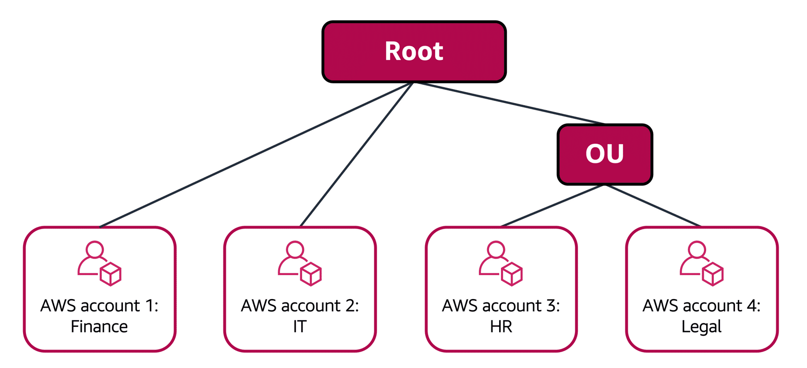

### Compliance Reports

Based on the industry you operate in, you may require auditing to be performed. You can access AWS security and compliance reports on-demand for the same from **AWS Artifacts**.

AWS Artifacts has 2 kinds of reports.

- Suppose that your company needs to sign an agreement with AWS regarding your use of certain types of information throughout AWS services. You can do this through **AWS Artifact Agreements**.
- Next, suppose that a member of your company's development team is building an application and needs more information about their responsibility for complying with certain regulatory standards. You can advise them to access this information in **AWS Artifact Reports**.

AWS also has a **Customer Compliance Center** which contains various resources about AWS compliance. In the Customer Compliance Center, you can read customer compliance stories to discover how companies in regulated industries have solved various compliance, governance, and audit challenges.

You can also access compliance whitepapers and documentation on topics such as:

- AWS answers to key compliance questions
- An overview of AWS risk and compliance
- An auditing security checklist

Additionally, the Customer Compliance Center includes an auditor learning path. This learning path is designed for individuals in auditing, compliance, and legal roles who want to learn more about how their internal operations can demonstrate compliance using the AWS Cloud.

### Distributed Denial of Service (d-Dos) Attacks

Denial of Service attacks basically means to bombard your server with unreasonable requests which ends up denying the server usage for valid users of the service.

For instance, a particular user can flood lots of spam requests to your server. This means, your server will be processing these spam requests while your actual customer requests won't go through. A simple solution to this is blocking the IP address of the spamming user.

However, a carefully planned attack is distributed, which uses some random machines on the internet to perform this Dos attack unknowingly. In this case, you cannot block a singled out IP address.

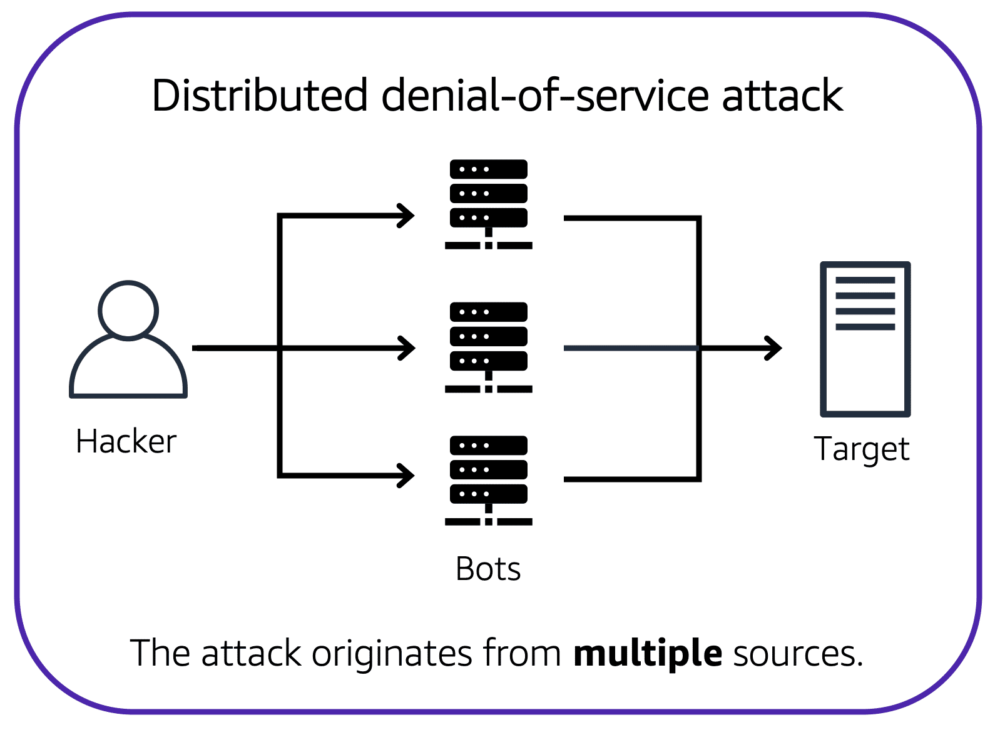

- AWS solves this problem by using a service called **AWS Shield.** It tracks the usage patterns of different requests to understand and flag malicious requests.
  - This has two offerings. Standard and Advanced.
  - **AWS Shield Standard** automatically protects all AWS customers at no cost. It protects your AWS resources from the most common, frequently occurring types of DDoS attacks.
  - **AWS Shield Advanced** is a paid service that provides detailed attack diagnostics and the ability to detect and mitigate sophisticated DDoS attacks. It also integrates with other services such as Amazon CloudFront, Amazon Route 53, and Elastic Load Balancing. Additionally, you can integrate AWS Shield with AWS WAF by writing custom rules to mitigate complex DDoS attacks.

Another kind of d-Dos attack is to perform a really slow request (basically the malicious user pretends to have a really crappy network connection). In this case, while your server is processing that request, it cannot tend to other requests which might be in line.

- In this case, AWS has ELB which automatically directs the other good traffic to other servers in the ASG.
  - Also note that ELB is a region level infrastructure. So, it means it can scale and accept the other requests from valid customers. In this case, the scale of AWS is a huge advantage since it is expensive to overwhelm region level AWS resource.

One more kind of d-Dos attack uses weather API. Basically, the malicious user asks a question about the weather at some location to the weather API and the return address is specified as your server address. So, the weather API gets the weather details of the location, and floods your server with unreasonable data (which it never asked in the first place).

- Since weather API uses a different protocol compared to https, it is blocked by the security group of the EC2 instance.

### Encryption Service

Since it is customer's responsibility to protect and secure the data they have in AWS, AWS offers a solution that helps customer to do this, by encrypting the data "in transit" (when it is going as packet from one part of your IT infra to another) and "at rest" (when it is residing in S3 or EBS).

**AWS Key Management Service (AWS KMS)** enables you to perform encryption operations through the use of **cryptographic keys**. A cryptographic key is a random string of digits used for locking (encrypting) and unlocking (decrypting) data. You can use AWS KMS to create, manage, and use cryptographic keys. You can also control the use of keys across a wide range of services and in your applications

### Firewall

Similar to the security groups, subsets and VPC, AWS also offers a firewall service called **AWS WAF (Web Application Firewall)** to protect your web application or monitor all network requests in your application.

Similar to network ACL, it checks against as web access control (WAC) list to filter out some requests. It integrates with ELB and CloudFront.

You can use it to block access from certain IP address, certain regional IP address, etc. Helps you prevent against d-Dos attacks.

### More Security Applications

**AWS Inspector** is a service that performs automated security and compliance assessments of your web application and your infra. It checks applications for security vulnerabilities and deviations from security best practices, such as open access to Amazon EC2 instances and installations of vulnerable software versions. However, it provides a list of vulnerabilities and recommendations to fix them, but it is customer's responsibility to know how to fix them as per the shared responsibility model.

**AWS GuardDuty** is a service that continuously monitor your infrastructure, network activity and intelligently detect threats using help of machine learning. It uses data from your VPC logs as well as the DNS logs and analyzes them.

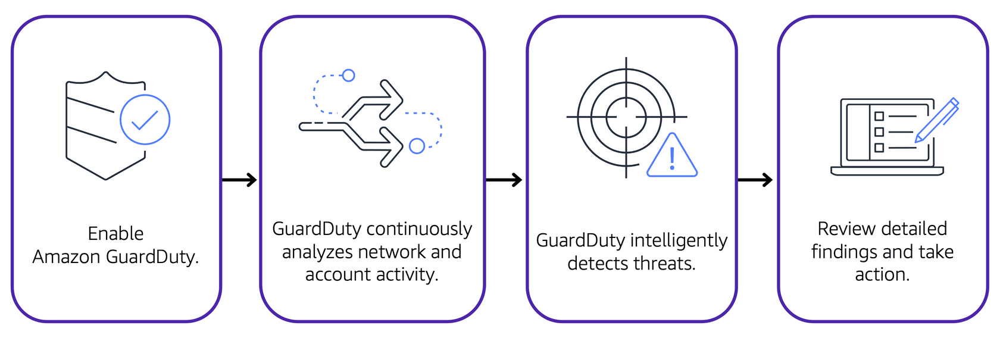

If GuardDuty detects any threats, you can review detailed findings about them from the AWS Management Console. Findings include recommended steps for remediation. You can also configure AWS Lambda functions to take remediation steps automatically in response to GuardDuty's security findings.

## AWS Logging and Monitoring

For logging and monitoring, AWS has offered a service called **Cloudwatch**. Cloudwatch tracks your application logs and various metrics on your application health.

CloudWatch uses metrics to represent the data points for your resources. AWS services send metrics to CloudWatch. CloudWatch then uses these metrics to create graphs automatically that show how performance has changed over time.

CloudWatch has multiple interesting features:

- Cloudwatch provides a consolidation logging feature from your EC2 instances, you can filter and view logs.
- It has **Cloudwatch Alarms** which is something like a notification service that automatically sends you alerts if some metrics are over or under a predefined threshold.
  - For example, if your EC2 CPU usage is under say 5%, it can sends an alarm to a SNS topic, asking you to may be stop the instance since it is not being used.
- **Cloudwatch Dashboard** feature enables you to look at health and metrics of all your AWS resources from a single central location.

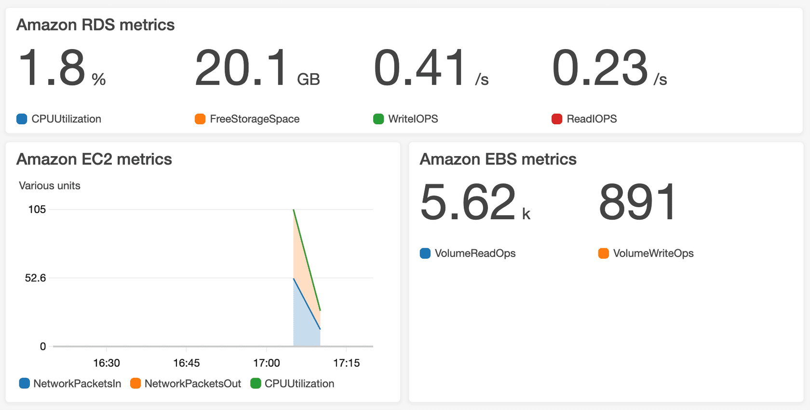

Another logging and monitoring offering from AWS is Amazon CloudTrail. It is a service that logs every API request made to AWS for auditing purposes. The recorded information includes the identity of the API caller, the time of the API call, the source IP address of the API caller, and more. You can think of CloudTrail as a "trail" of breadcrumbs (or a log of actions) that someone has left behind them. This means, you can view an entire history of your cloud interactions (or interactions of any user) by applying proper filters.

- Events are typically updated in CloudTrail within 15 minutes after an API call.

Within CloudTrail, you can also enable **CloudTrail Insights.** This optional feature allows CloudTrail to automatically detect unusual API activities in your AWS account. For example, CloudTrail Insights might detect that a higher number of Amazon EC2 instances than usual have recently launched in your account. You can then review the full event details to determine which actions you need to take next.

## AWS Pricing

### Free Tier and Cost Optimization

AWS has a free tier. It comes in 3 forms.

- Some things are always free. Like the first 1 million lambda calls every month.
- 12 months free. Like specific amounts of S3 storage.
- Trials. This trial period differs service by service, and usually ranges between 30-day trial to 90 day-trial periods.

AWS costs are built on 3 principles.

- Pay exactly for what you use.
- Pay less when you reserve, like reserved EC2 instances.
- Pay less when you use more with volume-based discounts. More storage in S3 allows you to quality for more discounts.

You can take advantage of this by using AWS organizations and enabling consolidated billing. In this case, even if your individual accounts are not eligible for the discounts, the discounts may be application all accounts taken together.

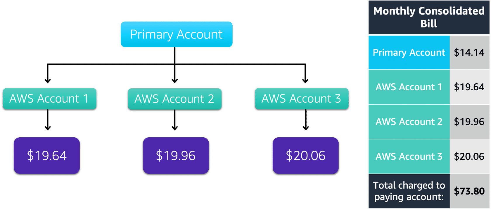

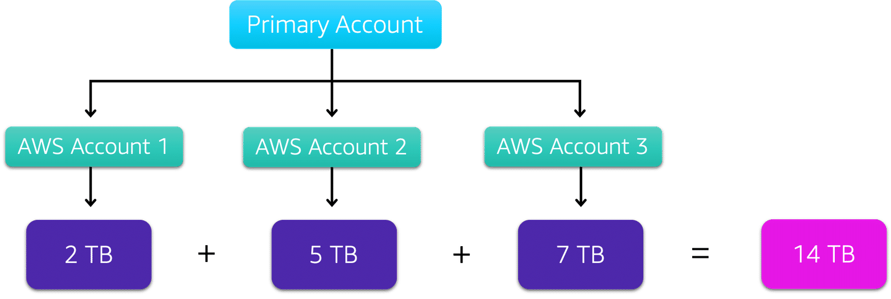

For example, suppose the above is your S3 usage in your 3 accounts. By using AWS organizations, your total exceeds the 10TB limit and you get high discount for the additional 4TB data stored.

You can use the **AWS Pricing Calculator** to get an estimate of your cost, and plan your resources accordingly before deploying them in the Cloud.

### AWS Cost Management Tools

AWS has various cost management tools as follows:

- Billing Dashboard, provides a consolidated view of your usages and billing, and future month forecasts.

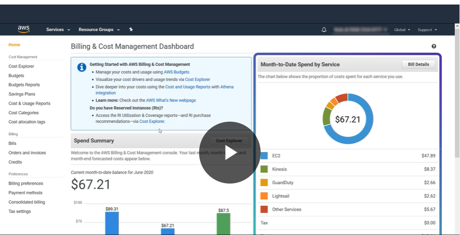

- Access AWS Budgets which can help you plan your service usages, and send you alerts when your usage or forecasted usage goes beyond what is set.
  - It updates 3 times a day.

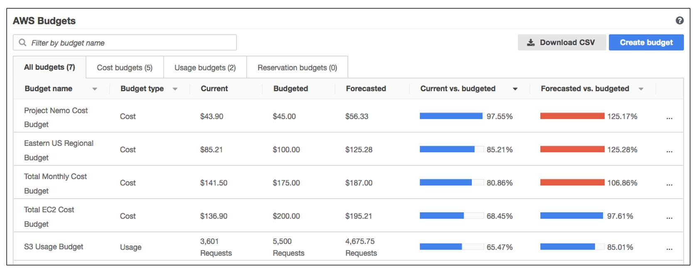

- Finally, AWS Cost explorer helps you create reports and drill down and do interactive analysis on your costs for your AWS account.

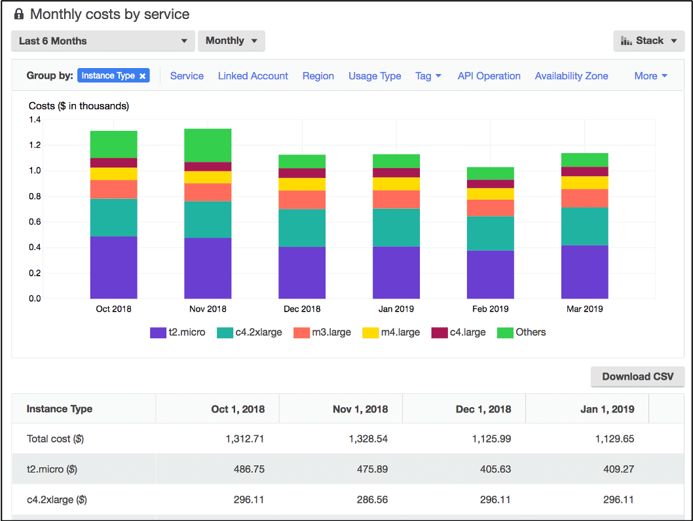

## AWS Support

### AWS Trusted Advisor

This is a system provided by AWS that monitors your AWS infrastructure in real time and provides recommendations about how you can improve them, in accordance with the industry and AWS best practices. It performs these automated checks in 5 main categories:

- Cost Optimization (are you paying for unnecessary things that you are not utilizing, like ec2 instances not being used)
- Fault tolerance (is your application protected against AZ failures?)
- Performance (is your application latency okay, ways you can improve performance, are you using CloudFront for CDN?)
- Security (are you using proper VPC and security groups?)
- Service Limits (are you close to the service limits of AWS, for example, in a particular region, you can have at most 5 VPC in your account. Are you close to that?)

These recommendations are provided to you in form of a dashboard and checklist with recommendation actions to perform.

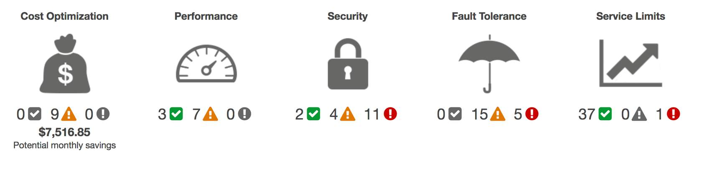

Here,

- Green checks mean no problem.
- Orange triangle means you need to do some investigation based on your use-case.
- The red circle means recommendation actions you need to take ASAP.

### AWS Support Plans

AWS has 5 different categories of Support Plans

- **Basic** support is free and enabled for all AWS customers.
  - It includes access to AWS docs, whitepapers and other support communities.
  - You can contact AWS for billing questions and an increase of service limits.
  - You have access to only limited AWS Trusted Advisor checks.
  - 24/7 access to customer support.
- **Developer** support is a paid monthly subscription plan that enables:
  - Best practice guidance.
  - Unlimited AWS technical support
  - Building block architecture support, guidance on AWS offerings, features, etc.
  - Email access to customer support with 24-hour response time.
- **Business** support enables:
  - Access to use-case specific guidance.
  - All AWS Trusted advisor checks.
  - Support response time of 48 hours.
  - Limited support on third-party software installation in EC2 or other application stack components.
  - Direct phone access to customer support, 4 hours response time normally, and 1 hour response time if your production system is down or impaired.
- **Enterprise On-Ramp** support includes:
  - A concierge support team for billing and account assistance.
  - Cost optimization workshop every year.
  - A pool of _Technical Account Managers (TAM)_ to provide guidance and coordinate access to programs and AWS experts.
  - 30 minutes or less response time for business-critical issues.
- **Enterprise Support** includes:
  - Training and game days to drive innovation.
  - A designated TAM.
  - 15 minutes or less response time for business-critical issues.

### AWS Marketplace

AWS Marketplace is a digital catalog that includes thousands of software listings from independent software vendors. You can use AWS Marketplace to find, test, and buy software that runs on AWS.

The following are broad categories of 3rd party softwares available on AWS marketplace.

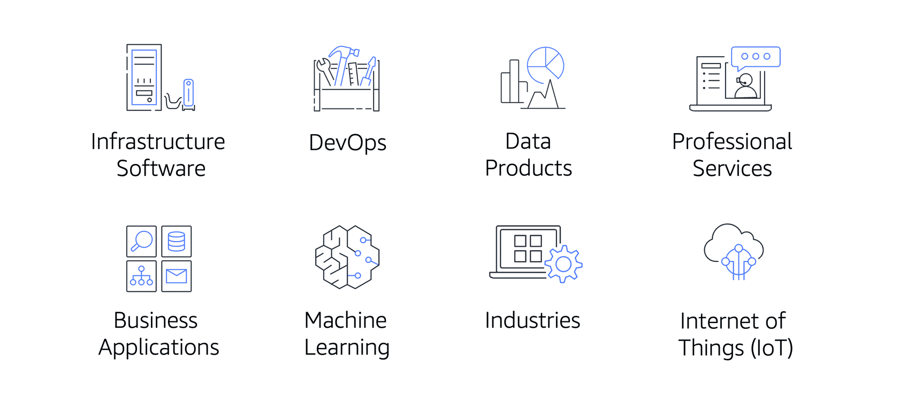

## Cloud Migration

### Cloud Adoption Framework (CAF)

If you have your IT resources are set up on-premise, and you need to migrate that to the AWS cloud, AWS has a framework to help you get started. This is called **AWS Cloud Adoption Framework.**

At the highest level, AWS CAF organizes the cloud migration guidance into 6 different perspectives in your organization. Each perspective addresses distinct responsibilities.

- **Business perspective** ensures that the IT aligns with the business needs and the investments towards cloud adoption in IT link to the key business metrics / results.
  - Used to create a strong business case for the cloud adoption, why it is needed and ensures that cloud offerings align with your business goals.
- **People perspective** ensures that your organization employees has the necessary technical skills for this cloud adoption. It evaluates the organizational structure, the different roles and identify gaps between skills and works on staffing / training as needed.
- **The governance perspective** focuses on understanding how to update staff skills and processes necessary to ensure business governance in the cloud. It focuses on changes in processes to align IT strategy on cloud adoption to align with business strategy.
- **Platform perspective** includes strategy for principles and patterns for implementing/architecting new solutions on the cloud.
  - Solution architects need to understand the relationships between IT systems and understand how cloud can bring value.
- **Security perspective** ensures that the organization meets the necessary security standards for visibility, audibility, control and agility.
- **Operations perspective** helps you to enable, run, use, operate and recover IT workloads at the agreed-upon level with your business stakeholders.

For a better understanding, please check out the whitepaper.

<https://docs.aws.amazon.com/pdfs/whitepapers/latest/overview-aws-cloud-adoption-framework/overview-aws-cloud-adoption-framework.pdf>

Now that you started your migration journey, there are 6 strategies that you can use to migrate your IT workload from on-premise to a cloud.

- Rehosting or "Lift and Shift" involves moving the application without any change to cloud. You just host your code entirely in EC2 instance.
- Replatforming or "Life, Tinker and Shift" involves making a few cloud optimizations without changing the core architecture or any code of your application. Like instead of using legacy DB by managing your own EC2 server, you can adopt the AWS provided RDS.
- Refactoring or "re-architecting" involves completely redesign your application using cloud optimized architectures. It should be driven by strong business needs.
- Repurchasing involves moving from a traditional licensing software to a SaaS model, (may be provided by a cloud)
- Retaining consists of keeping applications that are either critical to be moved to cloud, so some code / application which may be deprecated within few months. In this case, there is no tangible benefit to cloud migration for these applications, so they are retained in source environment.
- Retiring means the process of removing applications that are no longer needed, so no need to migrate.

### AWS Snow Family

Imagine you have about 1PB of data present in your on-premise data center. If we want to move the data to AWS S3 using a direct connect bandwidth with 1GBps speed, it will take 100 days to move the data.

Too much!

So, AWS has certain physical devices that can be shipped to you, you connect it to your data center, copy the data and send that device back to AWS. There are 3 options for these devices.

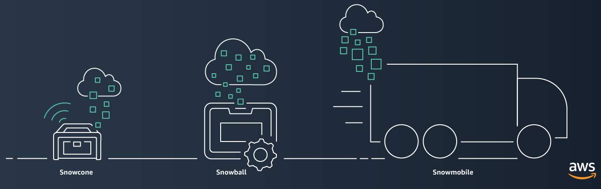

- AWS Snowcone is a small, rugged, and secure edge computing and data transfer device. It features 2 CPUs, 4 GB of memory, and up to 14 TB of usable storage.
- AWS Snowball offers two types of devices:
  - **Snowball Edge Storage Optimized** devices are well suited for large-scale data migrations and recurring transfer workflows, in addition to local computing with higher capacity needs.
    - Storage: 80 TB of hard disk drive (HDD) capacity for block volumes and Amazon S3 compatible object storage, and 1 TB of SATA solid state drive (SSD) for block volumes.
    - Compute: 40 vCPUs, and 80 GiB of memory to support Amazon EC2 sbe1 instances (equivalent to C5).
  - **Snowball Edge Compute Optimized** provides powerful computing resources for use cases such as machine learning, full motion video analysis, analytics, and local computing stacks.
    - Storage: 80-TB usable HDD capacity for Amazon S3 compatible object storage or Amazon EBS compatible block volumes and 28 TB of usable NVMe SSD capacity for Amazon EBS compatible block volumes.
    - Compute: 104 vCPUs, 416 GiB of memory, and an optional NVIDIA Tesla V100 GPU. Devices run Amazon EC2 sbe-c and sbe-g instances, which are equivalent to C5, M5a, G3, and P3 instances.
- **AWS Snowmobile** is an exabyte-scale data transfer service used to move large amounts of data to AWS. You can transfer up to 100 petabytes of data per Snowmobile, a 45-foot long ruggedized shipping container, pulled by a semi trailer truck.

### AWS Well-Architected Framework

The AWS Well-Architected framework helps you understand how to design and operate reliable, secure, efficient and cost-effective systems in the AWS Cloud.

Reference: [AWS Well-Architected Framework](https://docs.aws.amazon.com/wellarchitected/latest/framework/welcome.html)

It is based on 6 pillars.

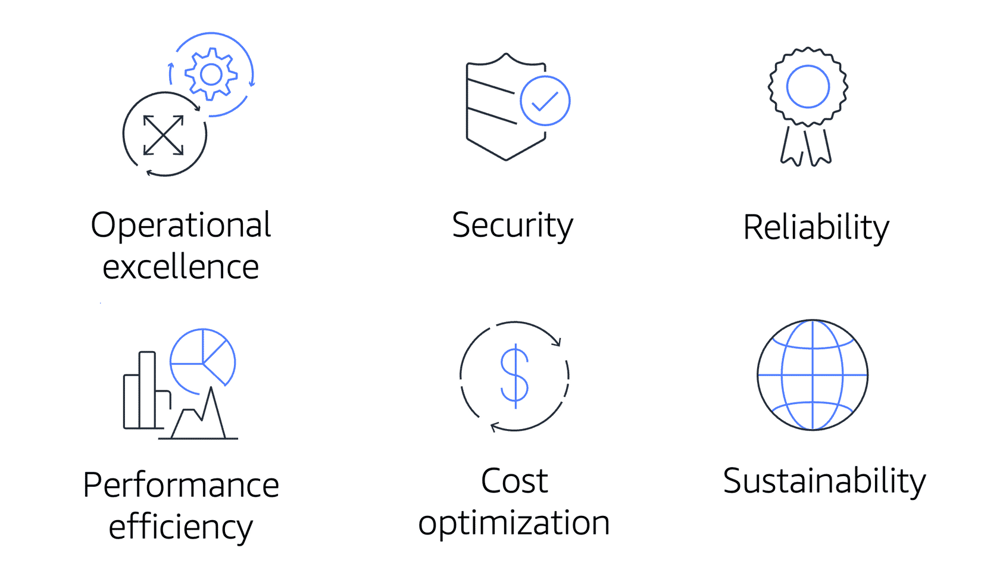

- Operational excellence is the ability to run and monitor systems to deliver business value and to continually improve supporting processes and procedures.
  - Design principles for operational excellence in the cloud include performing operations as code, annotating documentation, anticipating failure, and frequently making small, reversible changes.
- The security pillar is the ability to protect information, systems and assets.
- The reliability pillar is the ability of a system to recover from infra disruptions, and dynamically perform scaling to meet demand.
- Performance efficiency is the ability to use the computing resources efficiently.
  - Examples include using serverless architecture whenever possible.
  - Designing systems to be global in minutes.
- Cost optimization is the ability to run systems to deliver business value at the lowest price possible
- Sustainability is the ability to maximize utilization, reduce energy consumption, meet sustainability goals, reduce downstream impact of your cloud workloads.

## Other AWS Services

AWS has offerings related to AI models. For example:

- Convert speech to text with **Amazon Transcribe**
- Discover patterns in text with **Amazon Comprehend**
- Identify fraud transactions / online activities with **Amazon Fraud Detector**.
- Build voice and text chatbots with **Amazon Lex**.
- Use foundational LLM as an API with **Amazon Bedrock**
- Build, train and deploy customized ML models using **Amazon Sagemaker**
- **Amazon Augmented AI** (A2I) allows you to conduct a human review of ML systems to guarantee precision.
- Read and parse text from image or PDF using **Amazon Textract**.
- Use AWS Kendra to build a search functionality.
- Use AWS Polly to convert text to voice.
- Use AWS Translate for language translation services.
- **Amazon Athena** is a serverless querying system to query your extracted data catalogue from S3 using simple SQL like statements.
- **AWS Glue** is an ETL (extract, transform and load) service which discovers, prepares and moves the data from multiple sources (amazon S3, Dyanmodb, etc.) to the specific data lake or warehousing system.

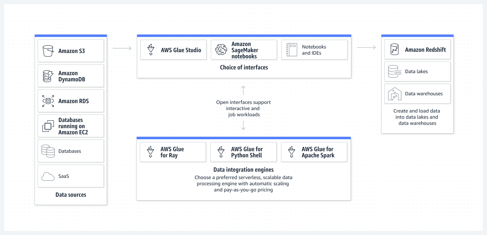

- **AWS Data Exchange** is a tool to find, subscribe to and use third-party data in the cloud.
- **Amazon EMR (Elastic MapReduce)** is a big data analytics platform and create petabyte-scale big data applications.
- **Amazon Kinesis** is a tool to process and analyze streaming data with low latencies.
  - Kinesis Data Streams is a serverless streaming data service that captures streaming data, and sends to EC2 / business analysis software.
  - Kinesis Data Firehose is an ETL service to capture and send data to storage (S3, redshift, opensearch, etc.)
  - Similar to Kinesis Data Streams, but specialized for video processing.
- **Amazon QuickSight** is a business analytics service. Create dashboards, visualizations, and embedded analytics in reports.
- **Amazon SES (Simple Email Service)** provides reliable low-cost emailing solutions using SES API.
- **AWS Billing Conductor** is a tool to simplify and customize reporting in the bills using organization groups or groups of AWS accounts.
- **AWS Batch** is a fully managed service that lets you run batch computing workloads at any scale.
- **AWS Lightsail** is like Elastic Beanstalk but for small business applications, with pre-configured environments. Build and personalise your blog, e-commerce or personal website.
- **AWS Local Zones:** Run applications that require single-digit millisecond latency or local data processing by bringing AWS infrastructure closer to your end users and business centers.
  - Compared to CloudFront, it is more capable allowing the AWS infra to be deployed, rather than only caching.
- AWS Wavelength is a 5G computing service that embeds AWS compute and storage services within 5G networks, providing mobile edge computing infrastructure for developing, deploying, and scaling ultra-low-latency applications.

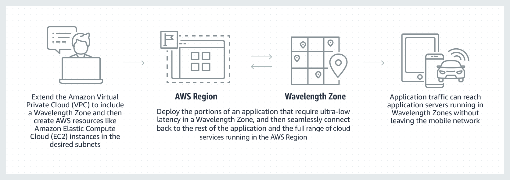

This is useful in cars (automatic cars) which can connect to the internet in the 5G web area and connect to AWS computing for the ML models.

- Amazon Elastic Container Registry (Amazon ECR) is AWS's own dockerhub, a repository to store container images.
- Customer Engagements:
  - AWS Activate for Startups is an initiative to help startups reduce their AWS bills.
  - AWS IQ is a community platform to search AWS certified professionals.
  - AWS Managed Services (AMS) helps you adopted AWS as scale and operate more efficiently and securely.
  - AWS Sales Support for sales requests
  - AWS Compliance support for support related to audit and compliance.
  - AWS Technical support for service related technical issues.
    - Unavailable under the basic support plan.
  - Billing or Account support for assistance with billing-related queries.
- AWS Systems Manager and AWS AppConfig helps creating dynamic configurations for softwares / applications to change behaviour quickly without deployment.
- AWS Cloud9 is a cloud based IDE, lets you code using a browser.
- AWS Cloudshell is a cloud based shell tool for working with AWS CLI commands.
- AWS Codeartifact is a software package management tool (like pypi or npm)
- AWS CodeBuild is a fully managed continuous integration service that compiles source code, runs tests and produces ready-to-deploy software applications.
- AWS CodeDeploy is a service that automates the deployments to different compute platforms, like EC2, AWS lambda, ECS, etc.
- AWS X-ray is a debug tool that traces user requests through your application and provides insights into performance, security and ocst.
- AWS Health Dashboard
  - Your personal account health dashboard shows events that impacts your services in all AWS regions.
  - AWS Health Dashboard (without login) - shows all public events that impacts all regions of AWS reach.
- AWS Config to track auditing changes for a particular AWS resource over time.
- The AWS Well-Architected Tool is designed to help you review the state of your applications and workloads against architectural best practices, identify opportunities for improvement, and track progress over time.