## What is Data Analytics

There are a few primary definitions:

- **Analysis** is detailed examination of something in order to understand its nature of determine its essentials features / properties.
- **Data Analysis** is the process of compiling, processing and analyzing data to perform the analysis, and use the analysis extracted properties to make a business decision.
  - Meta analysis is, in contrast, analysis performed through collection, processing and analyzing existing researches.
- **Analytics** is a systematic analysis of the data (i.e., a framework of how to perform data analysis)
  - It tells you what to look for
  - What step should you do next
  - How to ensure the next step you are doing is scientifically valid and meaningful, so that logical conclusion can be drawn.
- **Data Analytics** is the specific analytical process (i.e., one particular choice of framework) which is being applied.

We should give a clearer definition here.

- Data Analysis is to analyze the data to derive meaningful insights from the data. It works one a single dataset.
- Data Analytics is broader, it performs multiple data analysis techniques on different data, explore their relationships and finally provides some business value.

Thus, an effective data analytics solution should combine 3 main features:

- Scalability: Analyze small or vast data sets of different types.
- Speed: Analysis performed in near real time or fast as new data arrives.
- Goal: Analysis should be good enough to be able to derive business decisions from and yield high value returns.

Thus, a component of data analysis solution require 4 parts.

- Ingest or Collect the data in various forms.
- Store the data as necessary.
- Process or analyze the data in fast speed.
- Consume the analyzed or processed data in terms of query / dashboard / reports to provide business value or insights.

### Types of Data Analytics

Data Analytics come in 4 different forms.

- **Descriptive** - It is an exploratory data analysis part, performs summarization using charts, etc. It answers the question "What happened?"
- **Diagnostic -** It aims to answer the question "Why it happened?". It looks for past historical data, and compares and finds patterns and disparities, and performs correlation analysis.
- **Predictive -** It aims to answer "What might happen in future?". Basically, it uses time series analysis to discover historical trend, and predict the future trends.
- **Prescriptive -** It recommends actionable insights to the stakeholders based on the predictive analytics results, it answers questions like "What should we do to make the future look better?"

### The Five V's of Big Data

As businesses begin to implement data analysis solutions, challenges arise. These challenges are based on the characteristics of the data and analytics required for their use case. These challenges come in various forms, in five Vs.

- **Volume:** The data could be extremely large.
- **Variety**: The data may come in various forms such as structured, semi-structured or unstructured form, from different sources.
- **Velocity:** The data must be process fast with low latency, in near real time.
- **Veracity:** The data must be validated for accuracy, and any outlier must be removed or handled properly. The solution should be able to fix the errors if possible.
- **Value:** The processed and analyzed data must be able to provide business insights and value for decision making.

Most of the machine learning system, focuses only on the veracity anhd value part. But in AWS, we should be able to provide a comprehensive treatment using cloud machineries.

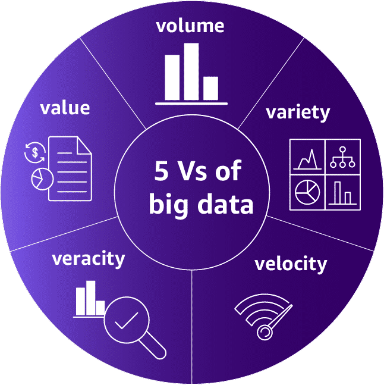

Not all organizations experience challenges in every area. Some organizations struggle with ingesting large volumes of data rapidly. Others struggle with processing massive volumes of data to produce new predictive insights. Still, others have users that need to perform detailed data analysis on the fly over enormous data sets. Before beginning your data analysis solution, you must first check which of these 5 Vs are present in the business problem and design your solution accordingly.

## Volume

One of the first things we require for performing data analysis is storage. Global data creation is projected to grow to 180 zettabytes (1000 GB = 1 petabyte, 1000PB = 1 exabyte, 1000 EB = 1 zetabyte) by 2025.

There are usually 3 kinds of data you will have in terms of storage burdening.

- Transactional data - Very important, like your user details, customer details, purchases, etc.
- Temporary data - moves you make in a game, website scrolling data, Browser cache, etc.
- Objects - Emails, text messages, social media content, videos, etc. that you cannot store as transactional, but require an object level storage.

There are mainly 3 types of data in terms of storage schema.

- Structured data is organized and are stored in the form of rows and columns of tables.
  - Examples are Relational databases
- Semi-structured data is like a key-value pair, with proper groupings / tags inside a file.
  - Examples include CSV, XML, JSON, etc.
- Unstructured data is data without a specific consistent structure.
  - Logs files
  - Text files
  - Audio or video, etc.

Most of the data present in business is unstructured.

### AWS S3

The most popular, versatile solution for storage in AWS is Simple Storage Service (S3). AWS S3 is a file system like object storage. Basically, it is like a key-value store:

- Keys are the paths of the file / object.
- Value is the object data itself.

Every put call to the existing overlapping key will update the entire object at once, with no block level updation.

S3 is highly available and highly durable storage.

- It has unlimited scalability.
- It is natively online, accessed over HTTP requests, so multiple machines can access the data simultaneously.
- AWS provides built in encryption security.
- 99.(9 many 9s)% durability.

In AWS S3, there are a few concepts.

- Buckets are the first concept. It is like system disk. Each bucket may contain different objects and are used for different purposes. The access pattern of the objects are configured at the bucket level.
- In each object stored inside a bucket, there is an associated metadata. The metadata is simply the prefix (the folder path) in the bucket, the namee of the object (or the object key) and a version number.

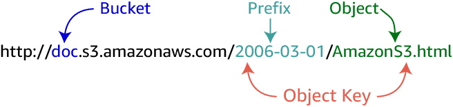

An object key is the unique identifier for an object in a bucket. Because the combination of a bucket, key, and version ID uniquely identifies each object, you can think of Amazon S3 as a basic data map between "bucket + key + version" and the object itself. Every object in Amazon S3 can be uniquely addressed through the combination of the web service endpoint, bucket name, key, and (optionally) version.

Using S3 provides many benefits, few are:

- It makes the storage decoupled from the processing / compute nodes.
- It is a centralized place for all of your data.
- AWS provides built in integration with clusterless and serverless computing.
- S3 has a standard API using which you can access objects like network requests.
- Built in security and encryption.

### Types of Data Stores

In Data Analytics literature, there are a few types of data stores based on their purpose.

- **Data Lake** is the storage of data where you can store unstructured, structured or semi-structured data for almost everything. Basically all of your business application dumps their data into a data lake. Starting from data lake, we add ingestion and other processing logic to convert this data into something useful.
  - A data lake is a centralized repository that allows you to store structured, semistructured, and unstructured data at any scale.
  - It gives you a single source of truth for any data.
  - The data lake should also contain an index or tags for the data, producing a catalogue for all data that exists in the data lake.
  - To implement data lake, one can use AWS S3.
    - Integration with AWS Glue can provide the metadata and cataloguing service for all data present in S3.
    - One can also use **AWS LakeFormation** (currently in preview) to set up a secure data lake in days. It also performs analysis using Machine Learning to understand the structure / format of the data, and create schema or field description for cataloguing purpose.

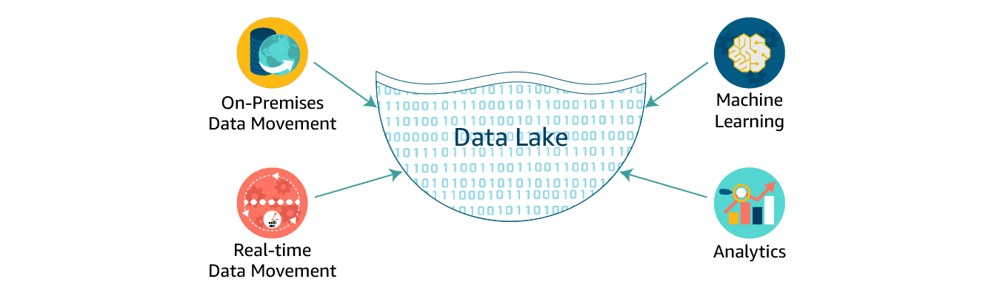

Data lakes are an increasingly popular way to store and analyze both structured and unstructured data. If you want to build your own custom Amazon S3 data lake, AWS Glue can make all your data immediately available for analytics without moving the data.

- **Data Warehouse** is a central repository to contain all your structured data from many different sources. These data are processed and ready to be ingested to business reporting tools and decision making.
  - This data is kept transformed, cleaned, aggregated and prepared beforehand using data analytics tools.
  - The data is structured here, using a relational database. Hence, before storing the data, one must define the schema and the constraints on the stored data.
  - These are kept in an efficient way to minimize read operations and deliver query results at blazing speeds to thousands of users concurrently.
  - You can use **AWS Redshift** for a data warehouse solution in AWS.
    - It is 10x faster than existing other data warehouse solutions.
    - Easy to setup, deploy and manage.
    - AWS provides built in security.

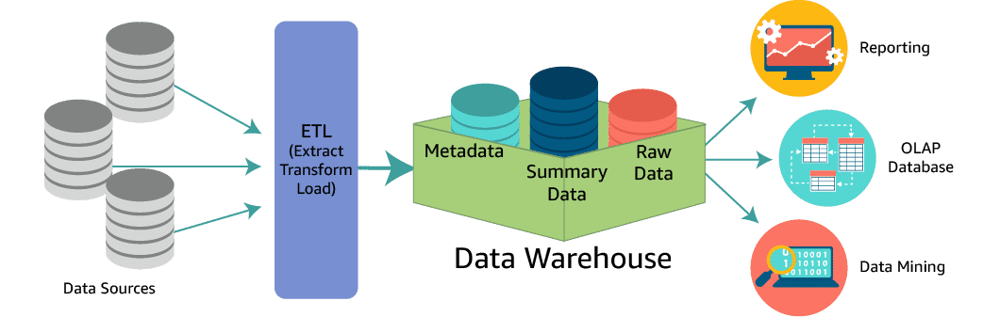

- **Data Mart** is a subset of data warehouse specific to a particular department or part of your organization. This is a restricted access subset of your data warehouse. Small transformations are allowed for creation of data mart.

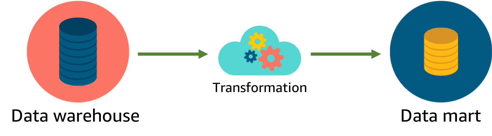

| **Characteristics** | **Data Warehouse** | **Data Lake** |
|---------------------|---------------------|----------------|
| **Data** | Relational data from transactional systems, operational databases, and line-of-business applications | Relational and non-relational data from IoT devices, websites, mobile apps, social media, and enterprise applications |
| **Schema** | Defined before loading (schema-on-write) | Applied during analysis (schema-on-read) |
| **Price / Performance** | Fastest query performance using higher-cost storage | Improving query performance using low-cost storage |
| **Data Quality** | Highly curated, serving as the trusted single source of truth | Any data, raw or curated |
| **Users** | Business analysts | Data scientists, data engineers, and analysts (with curated data) |
| **Analytics** | Batch reporting, BI, dashboards, and visualizations | Machine learning, predictive analytics, data exploration, and profiling |

**Amazon EMRFS**

Amazon EMR provides an alternative to HDFS: the EMR File System (EMRFS). EMRFS can help ensure that there is a persistent "source of truth" for HDFS data stored in Amazon S3. When implementing EMRFS, there is no need to copy data into the cluster before transforming and analyzing the data as with HDFS. EMRFS can catalogue data within a data lake on Amazon S3. The time that is saved by eliminating the copy step can dramatically improve the performance of the cluster.

## Velocity

When businesses need rapid insights from the data collected, they have a velocity requirement.

**Data Processing** in the context of the velocity problem means two things.

- Data collection must be rapid so that systems can ingest high volume of data or data streams rapidly.
- Data Processing must be fast to provide insights for the required level of latency.

### Types of Data Processing

There are 2 major types of data processing.

- Batch processing - Refers to the system when the data collection may be done separately from the data analysis tasks. Once a certain amount of data is collected, then only data analysis tasks kick in.
  - Scheduled Batch processing - means it runs on a specific regular schedule, and has predictable workloads.
  - Periodic Batch processing - means it runs only when a certain amount of data is collected, which may not be on a regular interval. So the workload is unpredictable.
- Stream processing - Refers to the system when data collection and analysis is usually coupled. The insights must be delivered very fast as the data is consumed.
  - Real-time - Insights must be delivered within milliseconds, like autonomous cars.
  - Near real-time - Insights must be delivered within minutes.

|                     | **Batch Data Processing** | **Stream Data Processing** |
|---------------------|----------------------------|------------------------------|
| **Data scope**      | Processes all or most of the data in a dataset | Processes data in a rolling time window or only the most recent records |
| **Data size**       | Large batches of data | Individual records or micro-batches of a few records |
| **Latency**         | Minutes to hours | Seconds or milliseconds |
| **Analysis**        | Complex analytics | Simple response functions, aggregates, rolling metrics |

### Distributed Processing

There are many distributed processing frameworks. The most popular ones are

- Apache Hadoop
- Apache Spark

#### Apache Hadoop

Apache Hadoop is a distributed computing system that is designed on the principle of delegating the data processing workload to several servers, and workload configuration managed by a single master server. Each of these servers are called nodes.

At its core, Hadoop implements a specialized file system called Hadoop Distributed File System (HDFS), that stores data across multiple nodes, making redundant data replication to make it failsafe.

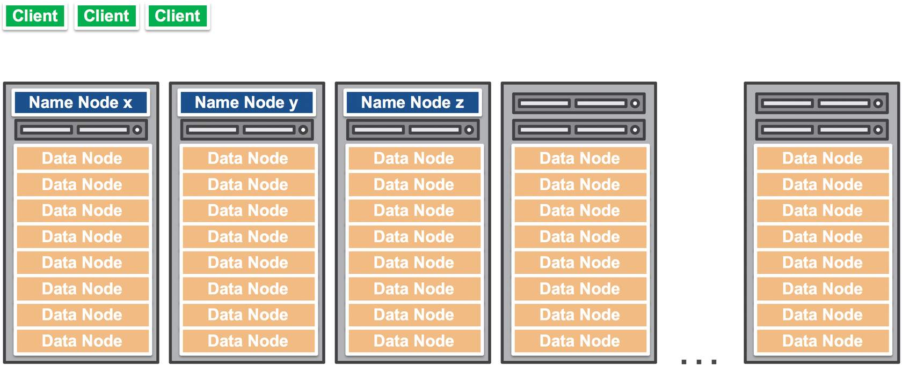

In Hadoop, most of the servers are configured as **Data Nodes**, these process and stores the data. And the few nodes will be **NameNodes,** these are where the memory management happens, it stores the maps of where the actual data resides.

Any client connects the **NameNode** for file metadata or file modifications.

But performs the I/O of actual file updation in **DataNodes.**

Let's say, a client issues a write request to **Name Node.** The node performs initial checks to make sure the file already does not exist, and the client has the permissions. Then it returns the location where to write each block of the data.

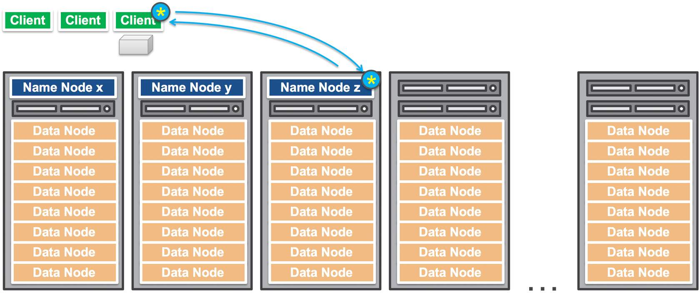

For each block, client performs I/O directly to that block.

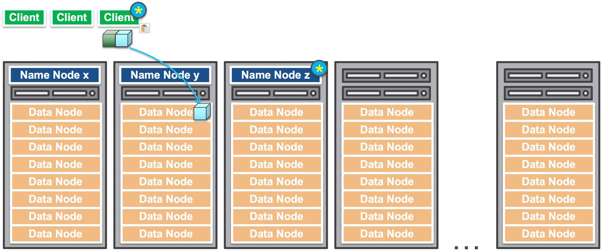

As soon as the client finishes writing the data block, the Data Node starts copying the data block to another Data Node for redundancy. Note that, client is not involved anymore, so the copying happens internally.

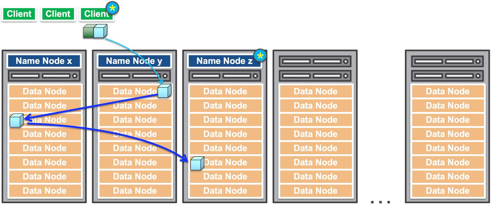

The name nodes will contain the mapping of all the data nodes where the particular data block resides.

Hadoop comprises 4 modules.

- HDFS - The Hadoop's native file system.
- Yet Another Resource Navigator (YARN) - a module for scheduling tasks in the Name Nodes.
- Hadoop Map Reduce - The main computing module that allows programs to break large data processing tasks into smaller ones and run them in parallel on multiple servers.
- Hadoop Common or Hadoop Core - The core java libraries

Hadoop provides the following features:

- It has built in security, runs encryption on data in transit and at rest.
- The map reduce module only has simple tasks, machine learning cannot run.
- Hadoop uses external memory, so integrates well with network based storage like AWS S3. This is provided in **AWS EMR (Elastic MapReduce)**
- Since Hadoop uses network memory access, usually slow, but capable to large amount of scaling.
- Hadoop is very affordable for processing big data.
- Hadoop is used with batch processing mostly.

#### Apache Spark

Spark works on the principle of accessing local memory in RAM instead of using network storage. Spark does not provide any native file system, you can integrate it with any distributed file system.

Spark has the following components:

- Spark Core contains basic functionalities like memory management, task scheduling, etc.
- Spark SQL allows you to process data in Spark's distributed storage.
- Spark streaming and Structured streaming allow Spark to stream data efficiently in real-time by separating data into tiny continuous blocks.
- Machine Learning Library (MLlib) provides built in machine learning algorithms with distributed algorithms.
- GraphX allows you to visualize and analyze data with graphs.

Following are the few features:

- Spark stores and process data on internal memory.
- Usually more expensive that Hadoop.
- Scaling is difficult, and requires vertical scaling by adding more RAM.
- Has built-in machine learning algorithm.
- Spark has only basic security, it is not opinionated about that.
- Processes data very fast, ideal for the real-time or near real-time processing workloads.

### Batch Data Processing

For batch data processing, we can use **AWS Elastic MapReduce (AWS EMR)** with Hadoop and Apache Spark integrated on top of it.

So, this could be one architecture for a data analytics solution.

The architecture diagram below depicts the same data flow as above but uses **AWS Glue** for aggregated ETL (heavy lifting, consolidated transformation, and loading engine). AWS Glue is a fully managed service, as opposed to Amazon EMR, which requires management and configuration of all of the components within the service.

### Stream Data Processing

For processing streaming data, AWS has a service group called **Kinesis**, it has multiple services inside the group. The entire Kinesis group of services is serverless in nature.

- **Amazon Kinesis Data Streams** \- is a service that collects and ingests gigabytes per second data and can send it to your processing services, like EMR or EC2 or AWS Lambda, etc.
  - Kinesis requires you to install a kinesis agent software in your source of data generation platform.
  - The configuration of the agent requires the URL of the Kinesis Data Stream created, and it publishes the event to the Data Streams.

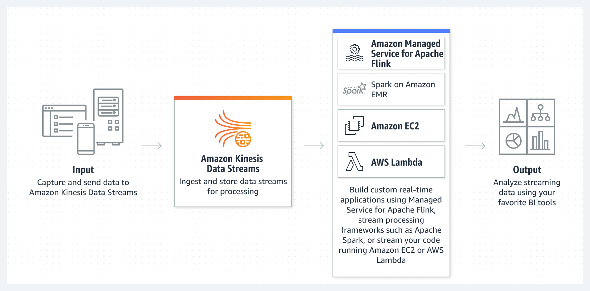

- **Amazon Kinesis Video Streams -** collects huge amount of streaming video from camera or other devices and sends them to proper processing services.
  - Used for video surveillance, self-driving car, smart home, etc.
  - Sends to custom Sagemaker endpoint, or AWS Rekognition, etc.

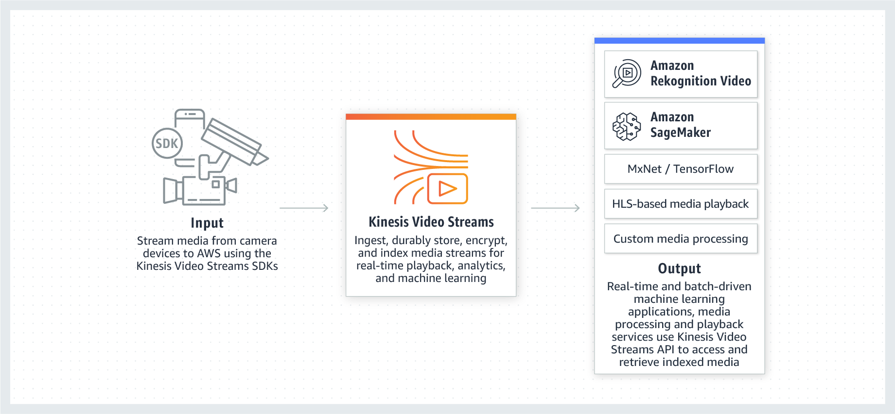

- **Amazon Kinesis Firehose -** is an ETL (Extract Transform Load) service that ingests the data similar to Kinesis streaming services, performs simple transformations / filters if necessary and directly stores them into a specific destination configured.
  - Its source can be some SNS topic, or some Kinesis Data Stream or direct PUT API using AWS SDK.
  - The destination can be AWS S3, Redshift, Opensearch, etc.
  - We can customize the transformations to apply ML models as well.
- **Amazon Managed Service for Apache Flink -** this is a managed service where without using any programming language or explicit coding, you can perform the transform operation using SQL statements.
  - Its source is a Kinesis Data Stream, or some S3 and the destination is similarly another Kinesis Data Stream or S3.
  - Useful for performing aggregation-type logic.

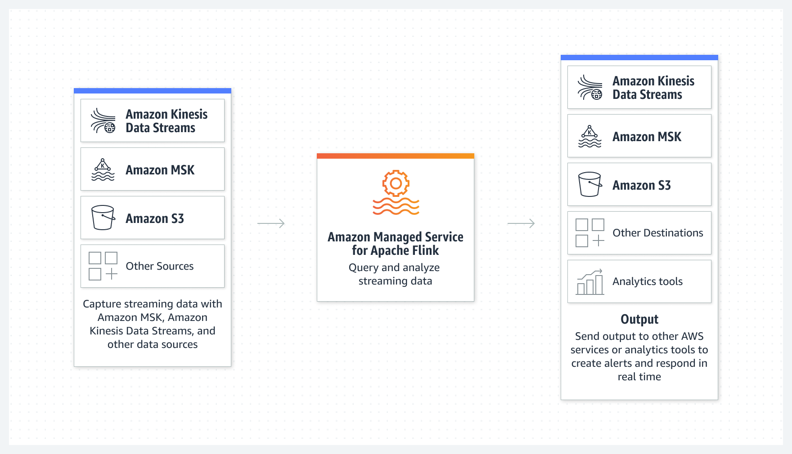

Another way to stream data is to use **Amazon Managed Service for Kafka (Amazon MSK).** This is similar to the broadcasting strategy by SNS topic, but serverless setup without self-managing the resources (consumer/producer) in the SNS.

- MSK is better in that it manages the partitions in SNS automatically. For instance, if you have 10 kinds of topics, then you need 10 SNS channels. Here, you need to set up one AWS MSK with a proper key partition.
- SNS is easier to use compared to MSK.

## Variety

When the data is coming from different sources, in many different formats, you have a variety problem.

All kinds of data can be summarized into 3 different types.

- **Structured Data** \- The data stored into rows and columns like a spreadsheet. The easiest to analyze. These are usually stored in RDBMS.
- **Semi-structured Data -** The data stored in JSON, CSV or XML files, in a specific format, but easily adaptable to whole bunch of different schemas. These are usually stored in NoSQL databases. (However, NoSQL does not mean that it cannot be queried by SQL, it simply means that it is not only SQL). These are usually stored in DynamoDB / specialized databases.
- **Unstructured Data -** The hardest to analyze. Could be anything from videos, images, documents, text files, logs, that does not have any specific standardized formats to be parsed. These are usually stored in S3.

### Data Storage and Efficiency

When storing structured data, there can be two competing interests. You need to do write fast / you need to do read fast. When the size of database is huge, you cannot do both efficiently, you need to sacrifice one for the other.

So we have 2 kinds of systems:

- OLTP (Online Transactional Protocol) system which says that the write should be fast. In these systems, the read queries are usually very simple GET, given a filter, find me this row.
  - In this case, we do row based partitioning and indexing.
  - These are optimized for random reads and writes
  - There can be only low or medium level compression of data.
  - It is best for returning the full row of data given a filter.
  - On disk, these values are stored in row by row, in consecutive physical memory addresses.
- OLAP (Online Analytical Protocol) system which says that data read should be fast. In these systems, the read queries are generally aggregate queries used for dashboarding.
  - We do column based partitioning or columnar storage based indexing.
  - These are optimized for sequential reads and writes.
  - It is best for returning data on aggregate level queries, only for a few important columns that are selected.
  - One can achieve high level of compression. Due to the nature of aggregate queries, compressed values can be fetched and the aggregation logic can be computed after uncompressing the data.
  - The data is stored on disk in a column by column manner.

### AWS Available Data Storage Services

Here is a list of different AWS services for data storage of different types.

| **Databases** | **Description** |
|---------------|------------------|
| **Amazon Aurora** | High-performance, highly available, scalable proprietary serverless relational database with full MySQL and PostgreSQL compatibility |
| **Amazon RDS** | Managed relational database service in the cloud with multiple engine options |
| **Amazon Redshift** | Cloud-based data warehouse with ML optimizations for best price–performance at any scale |
| **Amazon DynamoDB** | Fast, flexible, and highly scalable NoSQL database |
| **Amazon ElastiCache** | Fully managed, cost-optimized, highly scalable caching service for real-time performance |
| **Amazon MemoryDB for Redis** | Redis-compatible, durable, in-memory database for ultra-fast performance |
| **Amazon DocumentDB (MongoDB-compatible)** | Fully managed, scalable JSON document database |
| **Amazon Keyspaces (for Apache Cassandra)** | Serverless, scalable, highly available Cassandra-compatible database service |
| **Amazon Neptune** | High-availability, scalable, serverless graph database |
| **Amazon Timestream** | Fast, scalable, serverless time-series database |
| **Amazon QLDB** | Fully managed, cryptographically verifiable ledger database |
| **AWS Database Migration Service (DMS)** | Automated managed migration and replication service for moving databases and analytics workloads to AWS with minimal downtime and no data loss |

## Veracity

Vercity means to ensure the truthfulness of the data that it has not been tampered with. You must ensure that you maintain a high level of certainty that the data you are analyzing is trustworthy. Data integrity is all about making sure your data is trustworthy, the entire data chain is secure and free from compromise.

- A data analyst might be called to perform data integrity checks. During this process they look for potential sources of data integrity problems.
- Data can come from both internal and external sources.
  - It is highly unlikely that they will influence data generated outside of the organization. For these external sources of data, we might need to perform some ETL steps to identify issues (random entries, incomplete or inconsistent data, outliers, etc.) and cleanse the data.
  - However, within the organization, they might have the ability to make recommendations on improvements for the data sources they will be interacting with.
- Data analysts may need to determine the integrity of the data sources and make adjustments to account for any integrity deficiencies.

As opposed to the popular ETL approach, there is another approach called ELT (Extract Load and Transform). In modern cloud-based environments, the extract, load, and transform (ELT) approach loads data as it is. It then transforms it at a later stage, depending on the use case and analytics requirements.

Basically it means:

- Collect and extract the raw data.
- Load it into its natural storage type like a data lake or data warehouse.
- Transform the data from data storage as necessary later for business analytics requirements.
  - In this ELT process, the transformations happen in the target data warehouse system itself, not at the source or any other processing units.

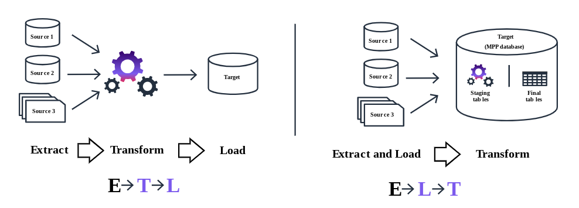

### Data Lifecycles

Data goes through various stages while performing data analytics. We need to ensure that the data integrity is remained throughout this data lifecycle stage.

- Creation
  - Data gets created at source
  - Needs to ensure data generated is correct
  - Means needs to run software-based audits.
- Aggregation
  - Stream data processing performs simple continuous aggregation
  - Errors are usually reduced due to aggregation methods used
  - However, data is generally misrepresented / wrong aggregation is performed.
  - Need to ensure correct data transformation and aggregation.
- Storage
  - The aggregated data gets stored in data storage for business decisions
  - Needs auditing, encryption at rest.
  - Needs proper data labelling so that schema information is correct.
- Access
  - Users access the aggregated data for their business intelligence needs.
  - Data should be read-only.
  - Monitoring for unusual access patterns.
- Sharing
  - This is the reporting phase.
  - This is where the most accuracy and veracity concern lies in
- Archiving
  - Once the data loses its immediate value, it should be archived.
  - Archival repository should have very restricted access and should be read-only.
  - Data security is of primary concern.
- Disposal
  - Data needs to be destroyed at some point for safety, compliance and regulations.
  - Prevents leakage of past sensitive information.

### AWS Services for Veracity

AWS has multiple services for ensuring that businesses meet their veracity needs.

- **AWS Glue** is a serverless data integration service:
  - It can discover the data present in data lake or AWS S3.
  - It manages the metadata and schema associated with the data stored in various storages.
  - The AWS Glue Data Catalog is your persistent metadata store for all your data assets, regardless of where they are located.
  - The Data Catalog contains table definitions, job definitions, schemas, and other control information to help you manage your AWS Glue environment.
  - It automatically computes statistics and registers partitions to make queries against your data efficient and cost-effective.
  - It also maintains a comprehensive schema version history so you can understand how your data has changed over time.
  - AWS Glue also has crawlers, that can crawl your data and automatically discover schemas of the data.
  - AWS Glue also performs data cleaning tasks. AWS Glue helps clean and prepare your data for analysis without you having to become an ML expert.
    - Its FindMatches feature deduplicates and finds records that are imperfect matches of each other. For example, use FindMatches to find duplicate records in your database of restaurants, such as when one record lists "Joe's Pizza" at "121 Main St." and another shows a "Joseph's Pizzeria" at "121 Main." FindMatches will ask you to label sets of records as either "matching" or "not matching."
    - The system will then learn your criteria for calling a pair of records a "match" and will build an ETL job that you can use to find duplicate records within a database or match records across two databases.
- You can manage data quality in datasets with **AWS Glue Data Quality**. This service analyzes your chosen dataset and recommends data quality rules that you can optimize.
  - You can use **Data Quality Definition Language (DQDL)** to add these quality checks and actions to your existing data pipeline, by adding them in AWS Glue Data Catalogue.

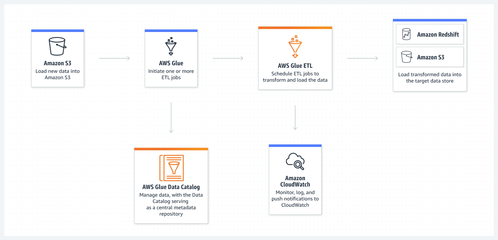

_Note: AWS Glue is a serverless data pipeline with lots of built-in tools, but it does not allow customized code. If you want to use custom code in ETL job, go with either Amazon EMR (for batch processing) or Amazon Kinesis (for stream processing loads)_

- **AWS Glue DataBrew** is a visual data preparation tool that can help you clean, normalize your dataset using an excel-like visual tool.
  - It has a diverse range of pre-built data transformation tools (over 250+), that can help you clean data without writing any code.
  - You can automate filtering anomalies, converting data to standard formats and correcting invalid values, and other tasks.
- **Amazon DataZone** is a data management service that makes it easier for an organization to catalogue discover, share and govern data stored across AWS, on-premise or 3rd party services.
  - This is an elaborate data-sharing tool, you can control who has access to what part of the data. Administrators and data stewards who oversee your organization's data assets can manage and govern access to data using fine-grained controls.
  - Govern and share data seamlessly across organizational boundaries.
  - Create a data access portal within your organization. An integrated analytics portal gives you a personalized view of all your data while enforcing your governance and compliance policies at scale.
  - Amazon DataZone provides the following features:
    - Search for published data and request access to work on projects.
    - Collaborate with project teams through data assets.
    - Manage and monitor data assets across projects.
    - Ensure the right data is accessed with a governed workflow.
    - Access analytics with a personalized view for data assets through a web-based application or API.

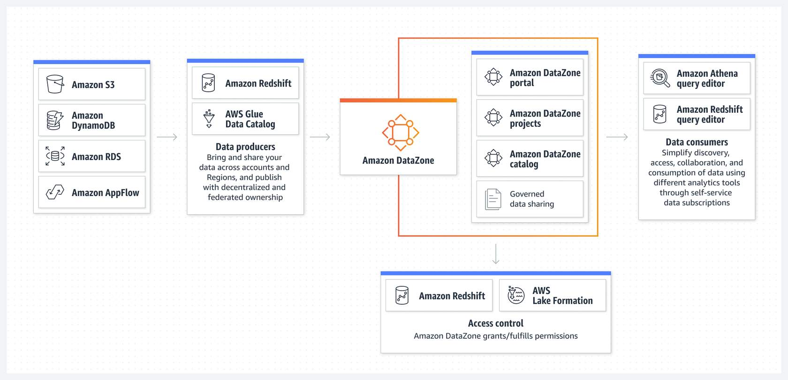

## Value

Before making business decisions, it is important to derive value from the data stored in the data warehouse.

There are two key ways to extract value from data:

- Query: Queries are the process of extracting, filtering and customizing your data.
- Report: Reports are the presentation of these query results in a form of actionable insights.
  - Reports can come in form of tables, charts and figures.
  - Visualization makes complex data more accessible and understandable, helping users quickly identify trends, patterns, and anomalies.
  - You can break reports into pages or views.
  - These pages should have a single theme for all the report elements within them. Provide filters that the report consumer can apply to either the whole page or to individual elements within the page.

There are 3 kinds of reports.

- Static: Reports presented in forms of PDF or Powerpoint slides, the data does not change.
- Interactive:
  - These types of reports generally fall under the heading of self-service business intelligence.
  - These reports often take on a print-based report style but have the advantage that consumers can apply filters to charts and graphs, change the scales, and even group and sort values within the reports.
  - A consumer can then tell their own story using the foundation laid by the report builder
- Dashboards:
  - This type of visualization is another very popular reporting tool.
  - Whether dashboards are interactive depends on the software used.
  - Consumers find the greatest benefit in dashboards when they focus on high-level roll-ups of key business factors.

### AWS Services for Value

To derive value from data present in a data warehouse, we have different services available.

- **Amazon QuickSight** is a generative business intelligence (BI) and analytics tool. (Similar to Power BI, but AWS specific).
  - Conveniently create interactive dashboards, paginated reports, email reports, embedded analytics, and use natural language queries.
  - Supports integration with several data sources, including Amazon S3, Amazon Redshift, Amazon RDS, Amazon Athena, and third-party databases.
  - Can connect to on-premise data sources.
  - Cleans, transforms and shapes data before creating the visualizations
  - Combine multiple visualizations into interactive dashboards.
  - Integrates with Amazon SageMaker to incorporate ML models directly into visualizations.
- **AWS Sagemaker** is a machine learning platform to build, train, test and deploy custom-made machine learning models.
  - SageMaker also provides tools to monitor the performance of deployed models, and track metrics, and set up alarms
  - It also has a range of built-in ML algorithms ready to be deployed and used. This service is called **AWS Sagemaker Jumpstart.**
  - Your model is deployed as a highly available and scalable endpoint.

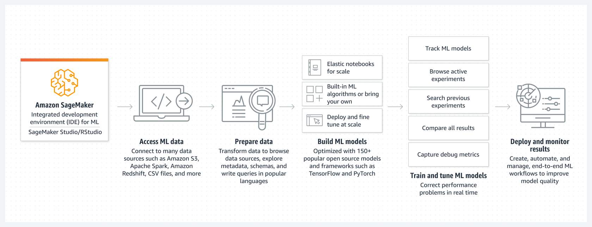

- **AWS Bedrock** is an API service to access foundational models for generative AI, including text-to-text and text-to-image models.
- **Amazon Athena** is a serverless analytics service that can query data stored in AWS S3 using SQL like language.
  - Provides a streamlined, flexible way to analyze petabytes of data without the need to set up and manage infrastructure
  - Athena is designed for interactive analytics, running queries, and getting results in real time. This is especially valuable for one-time queries and exploratory data analysis.
  - Saves query history and results, making it convenient to review past queries, analyze past performance, and troubleshoot discrepancies
  - Integrates out-of-the-box with AWS Glue
  - Controls access to data by using IAM policies